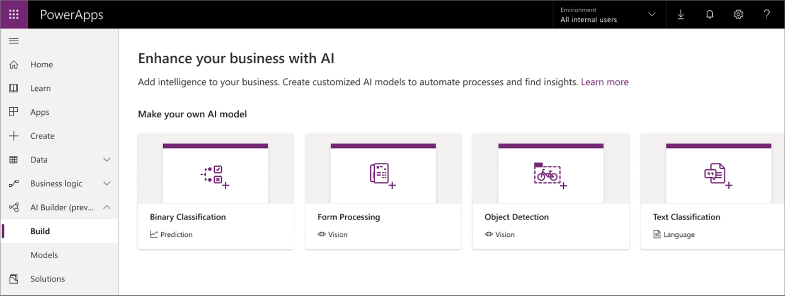

# Use AI Builder in PowerApps

AI Builder is a new Power Platform capability for teams with the business expertise to easily automate processes and predict outcomes to improve business performance. AI Builder is a turnkey solution that brings the power of Microsoft AI through a point-and-click experience and is directly integrated into PowerApps and Power Automate. More information: [What is AI Builder?](/ai-builder/)

You can build AI models by using the new **AI Builder** option in the left navigation pane of [make.powerapps.com](https://make.powerapps.com). More information: [AI model types](/ai-builder/model-types)

You can use AI models created using AI Builder in canvas and model-driven apps to add intelligence to your apps. More information: [Use AI Builder in PowerApps](/ai-builder/use-in-powerapps-overview)
