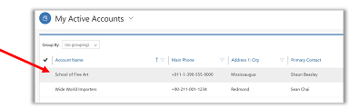
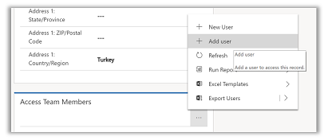
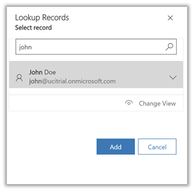
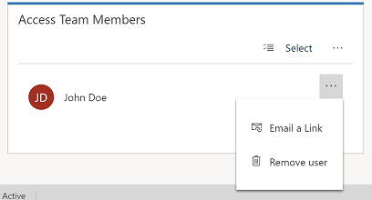

# Share rows using Access Team

Access Team grant access to rows via sharing rows. Access Team members have privileges defined by their individual security roles and by roles from the teams they are members of. 

> [!NOTE]
> Before you can share rows using Access Team, your admin will need to set-up an Access Team template. For more information, see [About team templates](/previous-versions/dynamicscrm-2016/admins-customizers-dynamics-365/mt812239(v%3dcrm.8)). 

1. To give a user permission to access a row, from the site map, select the row type. For example, **Accounts**.
2. From the list of rows, open the row that you want to provide another user access to.

  > [!div class="mx-imgBorder"]
  > 

3. In the **Access Team Members** section, select **More Commands** (**…**) > **Add User**.

  > [!div class="mx-imgBorder"]
  > 

 4. In the search box type in the user name to find the user and then select **Add**.
  
  > [!div class="mx-imgBorder"]
  >   
  
 
## Remove a user from Access Teams

 You can easily remove a user’s access to a row just as easily add you added them.
 
1.	Open the row that you want to remove the user from.
2.	Under **Access Team Members** sub-grid, select **Remove user**.

  > [!div class="mx-imgBorder"]
  >   
  
  

[!INCLUDE[footer-include](../includes/footer-banner.md)]