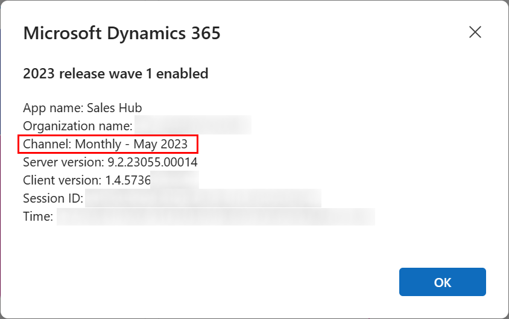

#  About Dialog for a model-driven app 

This article explains the various part of the About dialog for the model-driven apps.

## Channel

The channel attribute indicates the feature set the user is receiving. The channel values are ```Semi-annual``` and ```Monthly``` can be defined by admins in the Power Platform Admin Center or through API calls.

Semi-annual channel is the current twice a year release wave that is updated in April and October. The release for the semi-annual channel is shown at the top of the dialog like "2023 release wave 1 enabled."

Monthly channel is the new release cadence that comes once per month. The release for the monthly channel is shown after "Channel: Monthly" as a Month and Year.

> [!div class="mx-imgBorder"] 
>    

## Related links

* [Release Channel Overview](../maker/model-driven-apps/channel-overview.md)
* [Changing Release Channel](../maker/model-driven-apps/channel-change.md)

[!INCLUDE[footer-include](../includes/footer-banner.md)]
