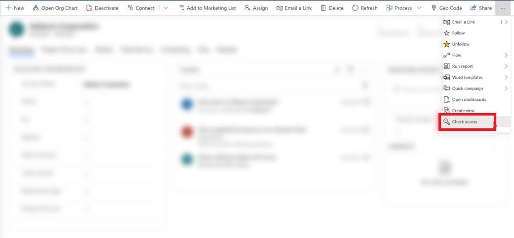

# Check your user access and permissions

Use the access checker to see what you security role is and what permissions your user account has. 

1. Open a record and on the command bar select the More button .
2. From the list of commands, select **Check access**.

    > [!div class="mx-imgBorder"]
    > 
  
  
