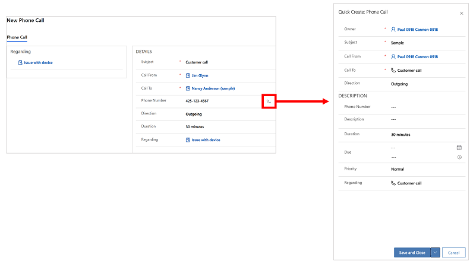
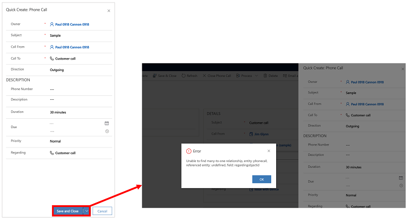

# Email FAQs and known issues

Find answers to common questions regarding the email experience features and functionality, configurations, and other key concepts.

## Email content is lost after entering text in the body of the message

**Issue**: Recent content added to the email may get lost if you enter text in the body of an email and immediately select **Save**, **Save and Close**, or **Send**. 

**Resolution**: To avoid this issue, wait a few seconds before you select **Save**, **Save and Close**, or **Send** after your enter text in the body of the email.

## The From column is read only or lookup isn't working

**Issue**: The **From** column in an email form is read-only or you can't look up rows and filter results by **User** or **Queue**.

**Resolution**: This happens when customization specifically have been applied on this column by your system administrator. To fix the issue, open a browser window and run the following two commands replacing the **environment URL** with the URL of your environment.

 - (replace with your environment URL)/api/data/v9.1/RemoveActiveCustomizations(SolutionComponentName='AttributeLookupValue',ComponentId=(25E9AF0C-2341-DB11-898A-0007E9E17EBD))
 - (replace with your environment URL)/api/data/v9.1/RemoveActiveCustomizations(SolutionComponentName='AttributeLookupValue',ComponentId=(26E9AF0C-2341-DB11-898A-0007E9E17EBD))
 
To find the URL, in the address bar the first part of the URL that starts with **https://** and ends with **.com** is your environment URL. For more information on how to find the environment URL, see [Get the environment UR](/power-platform/guidance/coe/setup-powerbi#get-the-environment-url).

## Error message: Unable to find many-to-one relationship,table: phonecall, referenced Table: undefined, column: regardingobjectid.

**Issue**: When you open an existing phone call activity row, and on the **Phone Number** column select the phone icon, the system opens a new **Quick Create: Phone Call** activity. 

> 

If you attempt to save the new phone call activity row, you will get this error, **Unable to find many-to-one relationship,table: phonecall, referenced Table: undefined, column: regardingobjectid**. 

> 

**Resolution**: Microsoft Dataverse does not support the option to create a phone call activity from within another phone call activity row.

## I've enabled an email form but it doesn't display.

If you've enabled an email form but it is doesn't display, you'll need to enable it in the **App Designer** by doing the following: 

1.	Go to **Settings** > **Advanced Settings**.

2.	Select **Settings**.

3.	In **Application** settings, select **Apps*.

4.	Select  **More Options** on **Customer Service Hub**.

5.	On the **App Designer** drop-down menu, select **Open**. 

6.	On the site map, select the edit feature. 

7.	Under the **Email** form selector, select the drop-down menu to display the **Email** forms you have enabled.

    If the form isn't displayed in the list, it hasn't been enabled.

8.	To enable a form, go to **Main Forms** and select the form. 

> [!Note] 
> You can't change the display order under **Main Form**. You must go back to the **Form Order** to change the display order.

9. Add the email template and signature link to the site navigation by going to the site map and doing the following:

    a. Go to **Settings** > **Advanced Settings**.
    
    b. Select **Settings**.
    
    c. In **Application settings**, select **App*.
    
    d. Select **More Options** on the **Customer Service Hub** tile.
    
    e. Select **OPEN IN APP DESIGNER**.
    
    
    
    f. Select the pencil icon to edit.
    
    
    
    g. When the site map opens, create a new group for templates by selecting **New subarea**.
    
    
    
    h. Select **email templates** or **email signature**.
    
    i. Add a title. (This is the name that will show instead of **New subarea** when saved.)
    
    j. Save and publish. A link is added to the site map.
    
    

[!INCLUDE[footer-include](../includes/footer-banner.md)]
