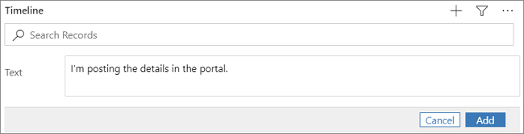
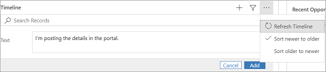
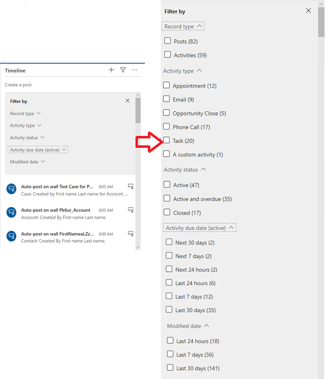
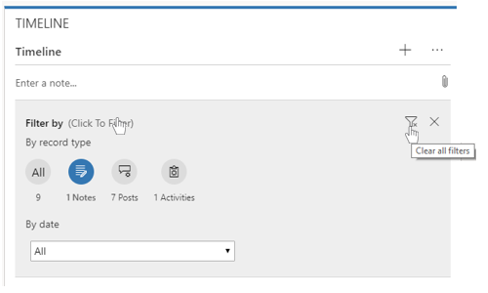
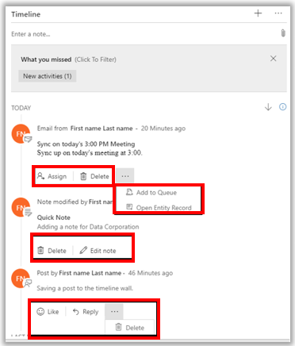

# Add an appointment, email, phone call, note, or task activity to the timeline 

Add **Activities** in the **Timeline** wall to keep track of all your communications with a customer or contact. For example, you can take notes, add posts, add a task, send email, add phone call details, or set up appointments. The system automatically timestamps every activity and shows who created it. You and other people on your team can scroll through the activities to see the history as you work with a customer. 

- Activities that you add from within a record appear in the **Timeline** wall of the record. 
- If the **Regarding** field of an activity is set, the activity appears in the record it is associated with. 
- You can also choose the filter pane to filter the activities by record type and date. 
- When a new activity is created, you will get a **What you missed** notification in the **Timeline** wall.

  > [!div class="mx-imgBorder"]
  >   
 
## Add an activity from the nav bar
 
The fastest way to add an activity is to use the shortcut on the nav bar and then link it to a record. For example, you can create a phone call activity and then link it to a contact in the system using the **Regarding** field.

1. On the nav bar, select the **plus sign** , and then select **Activities**. 

   > [!div class="mx-imgBorder"]
   >   
 
2. Choose the type of activity you want to add.

3. Fill in the required information. Use the **Regarding** field to associate the activity with a record.

4. When you're done, select **Save**.

 
## Add a phone call  
  
1. Open the record that you want to add the activity to. For example, a contact record.
  
2. In the **Timeline** wall, select  **plus sign** > **Phone Call**. 

   > [!div class="mx-imgBorder"]
   > 
  
3. Fill in the **Subject** of the call.

     In the **Notes** area, provide a summary of the conversation with the customer. 
  
     The **Call To** field is automatically populated with the record you added the phone call activity to. You can select a different record if needed.  
  
4. By default, the direction is set to **Outgoing**. You can change it to **Incoming** by selecting **Outgoing**. 
  
5. When you're done filling in the form, select **Save** to save the activity.  
  
## Add a task  
  
1. Open the record that you want to add the activity to. For example, a contact record.
  
2. In the **Timeline** wall, select  **plus sign** > **Task**.
  
3. The **Owner** field is set to the current user by default. If you want to reassign the task, select the lookup icon, and then select another user or team.  
  
4. When you're done filling in the form, select **Save** to save the activity. 
  
## Add an email  

To add an email activity to a record, you must first save the record you are adding the activity to.  
  
1. Open the record that you want to add the activity to. For example, a contact record.
  
2. In the **Timeline** wall, select  **plus sign** > **E-mail**. 

3. Fill in the subject of the email and use the space provided to write the email.
  
4. To add an attachment to the email, save the email. Then, in the **Attachments** section, select **+** to add an attachment.  
  
5. To use a template for the email body, on the command bar, click **Insert Template**, and then select the template.   
  
6. When you're done filling in the form, select **Send**. 
  
## Add an appointment  

To add an appointment activity to a record, you must first save the record you are adding the activity to.  
  
1. Open the record that you want to add the activity to. For example, a contact record.
  
2. In the **Timeline** wall, select  **plus sign** > **Appointment**.  
  
3. Use the tooltips to fill in the required information.
  
4. When you're done filling in the form, select **Save** to save the appointment.

## Add notes

You can also easily add notes in the activities area.
  
1. Open the record that you want to add the activity to. For example, a contact record.
  
2. In the **Timeline** wall, start entering your notes. Use **Add an attachment** to add any attachments to the note.

3. When you're done filling in the form, select **Add Note** to save the note.

   > [!div class="mx-imgBorder"]
   > 

Once the note has been added, you can delete or edit the note. You can also add a note using the **plus sign** in the upper section of the **Timeline** wall.

> [!div class="mx-imgBorder"]
> 

## Add a post 

1. Open the record that you want to add a post to. For example, a contact record.

2. In the **Timeline** wall, select  **plus sign** > **Post**. 

3. Enter your post in the text field 

4. When you're done filling in the form, select **Add** to save the post.

> [!div class="mx-imgBorder"]
> 
  
  Once you save the post, it will appear at the top of the timeline wall.
  
## Refresh the Timeline 

There maybe times when you will want to refresh the timeline wall to ensure you have the most up to date information displayed.  

To quickly refresh the pane, in the **Timeline** wall, select  and then select **Refresh Timeline**.

> [!div class="mx-imgBorder"]
> 

## Use the filter pane

Quickly filter activities, notes or posts in the timeline wall by record type or activity type and date using the filter pane.

1. In the **Timeline** wall, select  then select **Open Filter Pane**.

> [!div class="mx-imgBorder"]
> 

2. Once you're done viewing the filtered information, to clear the filter select **Clear all filters** funnel icon. This will reset the timeline wall to show all information.

> [!div class="mx-imgBorder"]
> 

## Manage Activities
Manage activities directly from the timeline wall including assigning an activity to another person, deleting or closing an activity, add an activity to a queue, opening an associated record or editing notes and posts.

> [!div class="mx-imgBorder"]
> 

