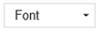
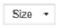
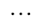

# Use timeline 

Timeline is a control that allows you to view information that is connected to a row in a table and occurs over time in a single stream. Some information that can be logged into the timeline are notes and posts in addition to displaying activities such as emails, appointments, phone calls, and tasks.

Timeline allows you to:
- Access the command bar to perform common actions quickly
- Filter and view important notes, posts, and activities using multiple filter options
- View and manage email conversation threads with ease

## Timeline functionality

The timeline section on the table form is intended to centralize access to information and streamline effort to accomplish actions. The following is an overview of how the timeline functionality works in each section on the table form. 

When enabled by your system administrator, you can use the icons that are displayed on the top-right navigation in the timeline for quick access to do the following:

- [Create a timeline row](#create-a-timeline-row)
- [Work with Filters](#work-with-filters)
- [Work with row](#work-with-rows)
- [Explore more commands](#more-commands)
- [Search row](#search-rows-on-timeline)
- [Add attachments](#add-an-attachment-to-a-note-in-timeline)

The timeline dashboard displays only the entities that are configured for the signed-in user. So, what you see on the timeline may differ from what another user will see. The signed-in user will see any rows they've followed if those rows are configured to display on the dashboard. For example, if only email and appointments are configured to display, then the signed-in user will only see email that relates to them, which can be email they've sent, email sent to them, and email they follow. The same would be true for appointments in this scenario. For more information on setting up timeline, see [Set up the timeline control](../maker/model-driven-apps/set-up-timeline-control.md).

> [!Note]
> The Notes feature is not available from the timeline. 

## Create a timeline row

When enabled by your system administrator, you can use the **Create a timeline record** feature to quickly create appointments, tasks, send emails, as well as make notes and posts and associate them with other rows. 

1. Select **Create a timeline record** icon.  
 

2. Select the type of row you want to create from the display options available.   

For information on timeline row configuration, [Set up the timeline control](../maker/model-driven-apps/set-up-timeline-control.md).
 

## Work with filters

When enabled by your system administrator, the timeline **Filter** further streamlines your productivity by allowing you to customize your experience and view data relevant to you. 

Legend:
1. The timeline **Filter**  icon is located in the top-right navigation on the timeline.
2. The filter pane displays when the filter icon is selected.
3. Use the carats to expand or minimize selections.
4. When enabled by your system administrator, row and activity types are displayed in the filter pane. Row and activity types can be filtered by selecting the corresponding box next to the item.
5. The  icon removes and clears all filter selections from the filter pane.

### Filter rows on timeline 

Filters are valuable for sorting data. You can easily filter through rows and activity types using multiple options to quickly see what matters to you. The filter is available for the activities, notes, posts, and custom entities that are present in timeline.

### Filter icon display

- When the **Filter** icon displays as a transparent , it means the filter pane is empty and nothing has been applied. 
- When the **Filter** icon displays as dark , it means filters are applied. 

### Filter options

The following category and sub-category options are available on the filer menu:

| Category              | Sub-category   |
|-----------------------|----------------|
| Row type           |<li>Notes</li><li>Posts</li><li>Activities</li>|
|Activity type         |<li>Appointment</li><li>Campaign Activity</li><li>Campaign Response</li><li>Email</li><li>Fax</li><li>Case Resolution</li><li>Letter</li><li>Opportunity Close</li><li>Order Close</li><li>Phone Call</li><li>Quote Close</li><li>Recurring Appointment</li><li>Social Activity</li><li>Task</li><li>Project Service Approval</li><li>Booking Alert</li><li>Conversation</li><li>Session</li><li>Customer Voice survey invite</li><li>Customer Voice survey response</li><li>Custom activities (as configured by your system administrator)</li> |
|Activity status            |<li>Active</li><li>Overdue</li><li>Closed</li>|               
|Activity due date (active) |<li>Next 30 days</li><li>Next 7 days</li><li>Next 24 hours</li><li>Last 24 hours</li><li>Last 7 days</li><li>Last 30 days</li> |
|Posts by                   |<li>Auto post</li><li>Users</li> |
|Modified date              |<li>Last 24 hours</li><li>Last 7 days</li><li>Last 30 days</li> |

## Work with rows  

When working with rows, you can view key information at a glance or expand rows to view more details. When you hover over a row, actions display that you can use.

### Expand all rows

When enabled by your system administrator, you can view timeline rows quickly in a collapsed format or expand a row to see more details for ease of use.

Legend
1. The **Expand all records**  icon is used to expand all rows listed on the timeline.
2. The carats in the bottom-right corner of rows allow you to expand (^) or minimize (v) display views.
3. Each row has a list of commands relevant to their row type that displays in the top right corner for ease of use. 
4. Row backgrounds change to grey when you hover over it, and it becomes transparent again when you move the mouse away.

## More commands

The **More commands** option contains refresh, sort, and email functionalities.

Legend
1. The **More commands**  icon, when expanded, provides additional functionality options.
2. The **Refresh timeline** command updates row details in the timeline.
3. The **Sort newer to older** or **Sort older to newer** command is used to sort rows.
4. The **Always show email as conversations** or **Always show email as individual messages** command is used to enable or disables threaded email views.

## Threaded email views in timeline

Use the threaded email view option to save valuable space when you have emails with multiple replies. This view consolidates email threads when collapsed.

**Collapsed threaded email view**

Legend
1. When enabled using the **Always show email as conversations** option under **More commands** , emails with multiple responses are grouped together into threaded emails.
2. The **Show more** link appears in the bottom-left corner of the last visible email in the thread to view the complete string of email responses. 

**Expanded threaded email view**

Legend
1. When expanded, the most recent 10 email responses in the thread will display. To display more, select **Show more** to expand the view again.
2. Emails in the same thread are displayed as being linked together.

### Enable threaded email views in timeline

Enabling the threaded email view is done via the timeline configuration in Power Apps. Threaded email views must be done in this setting for the specific entity, in the specific form, for each specific timeline.

Threaded email views can be enabled in timeline via two options:

**Option 1:**

You can enable the threaded email view using the **More Commands**  feature, located on the right-hand side of the timeline.

**Enable threaded email through the More Commands option**

Steps:
1. Use the **More commands**  icon on timeline which displays a flyout menu.
2. Select **Always show email as conversations** to thread and group all emails in that specific timeline. 

**Option 2:**

**Enable threaded email through Personal Options setting**

To enable threaded email via this option, go to the command bar and select **Settings**, then **Personalization Settings**. This will display the **Set Personal Options** dialog box so you can use  the following steps to enable threaded email view on timeline.

Steps:
1. Select the **Email** tab.
2. Select the **Show emails as conversation on Timeline** check box.
3. Select **OK**.

> [!Note]
> The **emails as conversation** view is based on the user's preference. Personal settings are tied to the user, not the form, which means when you enable the threaded email view, the setting is applied to all of your timeline views. 

## Search rows on timeline

When enabled by your system administrator, you can easily search for rows in the timeline. When you search for a phrase in the timeline, it searches in the title, subject of the row, body, or description fields of the row and displays the row for you.

Legend
1. The **Search** bar allows you to quickly find rows using keywords or phrases that the search feature will retrieve and display below the search bar.
2. Keywords that are used are highlighted.

## Work with notes and posts

Notes allow you to record richly formatted information and images for reference, summary, or investigation. You can easily add a mention to another user or a reference to a timeline row. The mention capability is available in timeline only when rich text notes and rich text posts are enabled. 

When you type the **@** symbol, the results you see are matches with the first name, last name or email address of system users starting with your search string. When you mouse over the profile image, you can view the user's detailed profile card and online presence status. More information: [View the profile card for a contact or user](profile-cards.md)

When you type the **#** symbol, the results you see are matches with the account and contact name table rows starting with your search string.

### Add a note or post to a row on timeline

When enabled by your system administrator, you can either add a note or a post to a row on timeline. Each note and post has a maximum size limit of 100,000 characters.

You can also enter a note and add it to a row, but you can only add one attachment per note. If note is not enabled by your system administrator, you can't add an attachment. 

**Note display view**

When enabled by your system administrator, the **Note** field is displayed under the **Search** feature on timeline.

> [!NOTE] 
> You can only add an attachment in a note.

**Post display view**

When enabled by your system administrator, the **Post** field is also displayed under the **Search** feature on timeline.

> [!NOTE] 
> You can't add an attachment in a post.

### Access the command bar to perform actions

When you hover your cursor on or expand an activity, post, or note, the command bar appears in the top-right corner of the row with the specific options that support that activity, such as assigning it to others, adding it to a queue, converting it to a case, liking or replying to a post, editing a note, or deleting an activity. However, not all rows can perform the same actions. 

**Command actions by row**

Legend
1. Only the actions associated with that row are displayed in the top-right command bar displayed in the row. 
2. Each row displays a different set of associated actions. Not all actions work on all rows.

The following is an overview of the command bar icons and the actions they support: 

| Icon | Name | Description |
|-----|------|-------------|
|  |Assign | Lets you assign a task.|
| |Close Activity| Lets you close the activity row.|
|  |Add to Queue| Lets you add a task to a queue.|
| |Open Row| Lets you open a row.|
| |Delete| Lets you delete the row.|
| |Reply| Lets you reply to an email. **Note**: This command is only available for Email.|
| |Reply All| Lets you reply to all for an email. **Note**: This command is only available on Email.|
| |Forward|Lets you forward an email. **Note**: This command is only available on Email.|
| |Like this post| Lets you like a post. **Note**: This command is only available on Posts.|
| |Edit this note|Lets you edit a note. **Note**: This command is only available on Notes.|

The following is an overview of the default command bars for frequently used activities, notes, and posts: 

| Activity | Command bar icons | Notes |
|-----|------|-------------|
| Email (draft) |Open Row, Delete | |
| Email | Reply, Reply All, Forward, Open Row | |
| Appointment | Assign, Close Activity, Add to Queue, Open Row, Delete | |
| Appointment (closed) | Assign, Add to Queue, Open Row, Delete | |
| Task | Assign, Close Activity, Add to Queue, Open Row, Delete | |
| Task (closed) | Assign, Add to Queue, Open Row, Delete | |
| Phone Call | Assign, Add to Queue, Open Row, Delete | |
| Note | Edit, Delete | |
| Post (user) | Like, Reply, Delete | Only the author of the post has the ability to delete it. The author always has the ability to delete regardless of user privilege. |
| Auto-post | Like, Reply, Delete | |

## Work with notes

The **Note** message box has a rich text editor that enables you to use rich text and create well-formatted content.

Legend
1. Note title field for adding headings and subjects.
2. Notes have a rich text editor so you can format and structure your messages.
3. The rich text editing tool expands to a full menu for quick access to formatting features.
4. The paperclip is used to attach files to your note.
5. Attached files are displayed at the bottom of the note.

> [!NOTE]
> - Only **Notes** have rich text capability, and it is only available in the timeline. 
> - You can only format the message body of a note, not the title.
> - The rich text editor is available only for Unified Interface.
> - If you create a rich text editor note in Unified Interface and then view the note in the web client, it will display in HTML syntax.
> 
### Add a mention or reference a team member in a note

Legend
1. Typing the @ sign in the **Note** field will display a flyout menu with a list of users that have been recently used.
2. If the user row is not displayed, typing the name after the @ sign refreshes the rows in the flyout menu using the **Quick Find** search engine that's operating in the background.
3. Switch views using **Advanced** to display the **Lookup Records** pane. In the **Lookup Records** pane, you can switch between the **Recent records** and **All records** view to search rows.

When you mouse over the profile image, you can view the user's detailed profile card and online presence status.

> [!NOTE]
> You can mention only a system user, i.e. a team member within your organization, in a note.

### Add an attachment to a note in timeline

When enabled by your system administrator, you can add an attachment, such as a file, to a note in timeline to share with users.

> [!NOTE]
> - The list of allowed attachments is configured by your system administrator.
> - On iOS and Android you can only select and attach a picture or video.

Select the paperclip  icon to attach a file to a note. 

### Edit Note

When you attach a file to your note, the **Edit note** screen displays, and attachments show at the bottom of the **Edit note** screen.

> [!IMPORTANT]
> You can only add one file attachment per note.

## Work with posts

When enabled by your system administrator, you can either add a post to a row or mention to another user or timeline.

### Add a mention or reference a team member in a post

Legend
1. Typing the @ sign in the **Post** field will display a flyout menu with a list of users that have been recently used.
2. If the user row is not displayed, typing the name after the @ sign refreshes the rows in the flyout menu using the **Quick Find** search engine that's operating in the background.
3. Switch views using **Advanced** to display the **Lookup Records** pane. In the **Lookup Records** pane, you can switch between the **Recent records** and **All records** view to search rows.

When you mouse over the profile image, you can view the user's detailed profile card and online presence status.

> [!NOTE]
> You can mention only a system user, i.e. a team member within your organization, in a post.

### Add references in a post in timeline rows

To add a reference such as links in a post to a timeline row, select the  icon and select **Post**, then follow the steps below:

Legend
1. Links can be added to a row by typing **#** which will display a flyout menu with a list of rows recently accessed. Type a keyword after the # tag and the display refreshes in the flyout menu via the **Quick Find** search engine that's operating in the background.
2. Rows displayed can be of any row type, such as accounts, contacts or leads.
3. The icons beside the row names in the flyout menu indicate the row types, which helps you determine which row to select.  
4. **Advanced** provides more options when a row cannot be located by allowing the user to  switch to a different view or create a new row.  

### Look up rows in posts in timeline

Legend
1. The **Lookup Records** pane provides users with options to switch between the **Recent records** and **All records** view to find a row.  
2. **Change View** to see rows from a different view.  
3. **New Record** allows you to create a new row if you can't find the row you need.

For more information on notes and post functionality and configuration, see:
[Set up the timeline control](../maker/model-driven-apps/set-up-timeline-control.md)

## Use the rich text editor toolbar
The rich text editor toolbar provides features and functionality that allows you to work with rich text format in notes.

### Formatting options
The following table describes the different formatting features and functionality options that are available in the rich text editor that you can use in notes.

> [!NOTE]
> You can access your browser's context menu by selecting **Ctrl + right-click**. This is useful if you need to use your browser's built-in spellchecker. Otherwise, you can right-click to provide contextual formatting for any element you are using.
  
|Icon | Name | Shortcut key | Description |
|----------------------|-------------------------|-----------------------------|-----------------------------|
|| Format Painter | Ctrl+Shift+C, Ctrl+Shift+V | Apply the look of a particular section to another section. |
| | Font | Ctrl+Shift+F | Select a font of your choice. The default font is Segoe UI.   **Note**: When you select any formatted content, the font name for that content displays. If your selection contains multiple fonts, the topmost font name of your selection is displayed. |
| | Font size | Ctrl+Shift+P | Change the size of your text. The default size is 9pt.   **Note**: When you select any formatted content, the font size for that content displays. If your selection contains multiple font sizes, the topmost font name of your selection is displayed.|
|| Bold | Ctrl+B | Make your text bold. |
|| Italic | Ctrl+I | Italicize your text. |
|| Underline | Ctrl+U | Underline your text. |
|| Text Highlight Color |  | Make your text stand out by highlighting it in a bright color. |
|| Font Color |  | Change the color of your text. |
|| Bullets |  | Create a bulleted list. |
|| Numbering |  | Create a numbered list. |
|| Decrease Indent |  | Move your paragraph closer to the margin. |
|| Increase Indent |  | Move your paragraph farther away from the margin. |
|| Block Quote |  | Apply a block-level quotation format in your content. |
|| Align Left | Ctrl+L | Align your content with the left margin. (Commonly used for body text to make it easier to read.) |
|| Align Center | Ctrl+E | Center your content on the page. (Commonly used for a formal appearance.) |
|| Align Right | Ctrl+R | Align  content to the right on the page. (Commonly used for a formal appearance.) |
|| Link |  | Create a link in your document for quick access to web pages and files.  Pasted or typed URL text is converted into a link. For example, "http://myexample.com" will become "<a href="http://myexample.com">http://myexample.com</a>".   In the **Link** dialog box, choose the type of link you'd like to insert.  The **Link Info** tab allows you to choose the link type as well as set the link protocol and URL.  The **Target** tab is only available for the URL link type. It specifies the location where the link will open after you select it. |
|| Unlink |  | Delete a link in your email or document.  When you place the cursor on a link, the **Unlink** button on the toolbar becomes active. Select the button to remove the link and make it plain text. |
|| Superscript |  | Type small letters just above the line of text. |
|| Subscript |  | Type  small letters just below the line of text. |
|| Strikethrough |  | Cross out text by drawing a line through it. |
|| Insert Image|	|You can insert an image by directly copying and pasting it inline in the editor, dragging and dropping it from your desktop or local folder directly into the editor, or by typing a URL. The following formats are supported: .PNG, .JPG., or .GIF.  To insert an image inline in your article:  1. Drag and drop the image or copy and paste it directly into the article.  2. Drag any corner of the image to resize it.  To insert an image using a URL or navigating to the local image: 1. Choose Insert Image. 2. In the **Image** property dialog, choose from the following options: <ul><li>Select **Browse** to navigate to the image on your computer.</li><li>Or specify the web address of the image, and properties to define how the image will appear in the email or article.</li> **Note:**<ul><li>If the image is located on the external server, use the full absolute path. </li><li>If the image is located on a local server, you can use a relative path. </li><li>If you want the image to be linked to a target, add a URL for the image.</li><li>You can also specify if you want the targeted page to open in a new window, topmost window, same window, or parent window.</li></ul>
|| Left to Right |  | Change the text to left-to-right for content such as a paragraph, header, table, or list. Commonly used for bi-directional language content. This is the default setting.|
|| Right to Left |  | Change the text to right-to-left for content such as a paragraph, header, table, or list. Commonly used for bi-directional language content. The default setting is left-to-right. |
|| Undo Typing |  | Undo changes you made to the content. |
|| Redo Typing |  | Redo changes you made to the content. |
|| Clear All Formatting |  | Remove all formatting from a selection of text, leaving only the normal, unformatted text. |
|| Add a Table |  | Add a table to your content.   After adding a table, you can do any of the following: <ul><li>Resize table columns by clicking and dragging your mouse to resize to the columns to the desired width.</li><li>Select one or several cells within a table and apply specific formatting, add links to the selection, or cut, copy, or paste entire rows or columns.</li><li>Right-click to access the properties. This supports features such as cell type, width and height, word wrapping, alignment, merging and splitting cells horizontally and vertically, inserting or deleting rows and columns, row and column span, and cell and border color.</li></ul>|
|| Expand Toolbar |  | Appears when the toolbar is collapsed. Click to expand the toolbar and make all options visible. |

The rich text editor is enabled by default. Your system administrator can enable or disable the editor for you.

For more information, see [Rich text editor control configurations](../maker/model-driven-apps/rich-text-editor-control#rich-text-editor-control-configuration-options).

## See also

[Set up timeline control](../maker/model-driven-apps/set-up-timeline-control.md)

[FAQs for timeline control](../maker/model-driven-apps/faqs-timeline-control.md)

[FAQs about Activities and the Timeline Wall](faq-for-timeline-and-activity.md)

[!INCLUDE[footer-include](../includes/footer-banner.md)]
