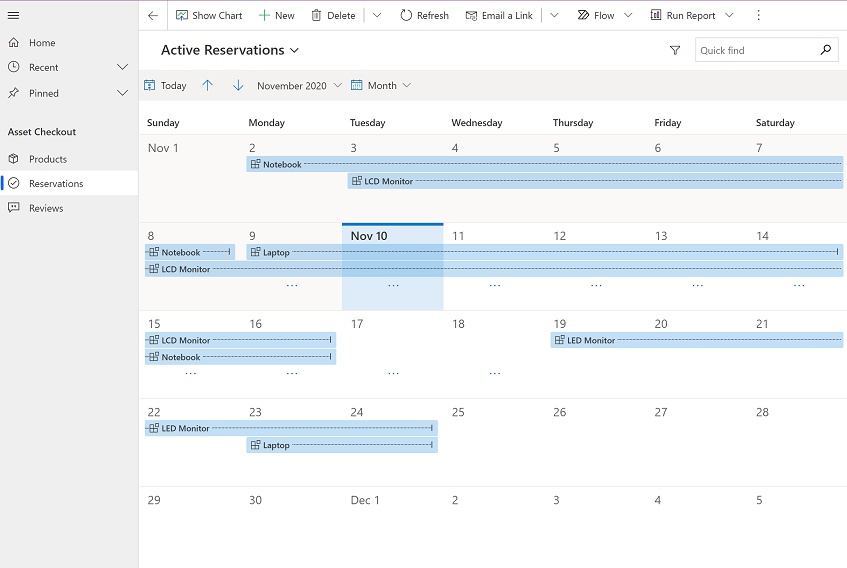

# Add an appointment, email, phone call, note, or task activity to the timeline 

Add **Activities** in the **Timeline** wall to keep track of all your communications with a customer or contact. For example, you can take notes, add posts, add a task, send email, add phone call details, or set up appointments. The system automatically timestamps every activity and shows who created it. You and other people on your team can scroll through the activities to see the history as you work with a customer. 

- Activities that you add from within a row appear in the **Timeline** wall of the row. 
- If the **Regarding** column of an activity is set, the activity appears in the row it is associated with. 
- You can also choose the filter pane to filter the activities by row type and date. 
- When a new activity is created, you will get a **What you missed** notification in the **Timeline** wall.
- An email with an attached image will be shown inline with the body of the email.

  > [!div class="mx-imgBorder"]
  > 

Legend:

  1. Search Rows
  2. Take notes
  3. Add info and activities
  4. Filter
  5. More commands
  6. Activity status
  7. Activity icons
  8. Date and time

## Add an activity from within a row

1. Open the row that you want to add an activity to.
2. In the **Timeline** section, select **Add info and activities** .
3. Select the type of activity that you want to add.

   > [!div class="mx-imgBorder"]
   >  

### Add a phone call  
  
1. Open the row that you want to add the activity to. 
  
2. In the **Timeline** section, select **Add info and activities**  > **Phone Call**. 

   > [!div class="mx-imgBorder"]
   > 
  
3. Fill in the **Subject** of the call.

     In the **Description** area, provide a summary of the conversation with the customer. 
  
     The **Call To** column is automatically populated with the row you added the phone call activity to. You can select a different row if needed.  
  
4. By default, the direction is set to **Outgoing**. You can change it to **Incoming** by selecting **Outgoing**.
  
5. When you're done filling in the form, select **Save and Close** to save the phone call activity.  

> [!NOTE]
> When you open an existing phone call activity, and on the **Phone Number** column select the phone icon, the system will open a new **Quick Create: Phone Call** activity. If you attempt to save the new phone call activity row, you will get this error, **Unable to find many-to-one relationship,table: phonecall, referenced Table: undefined, column: regardingobjectid**. This happens because Microsoft Dataverse does not support the option to create a phone call activity from within another phone call activity row. For more information, see [Known issues for activities](activities-known-issues.md).
  
### Add a task  
  
1. Open the row that you want to add the activity to. 
  
2. In the **Timeline** section, select **Add info and activities**  > **Task**.
  
3. The **Owner** column is set to the current user by default. If you want to reassign the task, select the lookup icon, and then select another user or team.  
  
4. When you're done filling in the task information, select **Save and Close** to save . 
  
### Add an email  

To add an email activity to a row, you must first save the row you are adding the activity to.  
  
1. Open the row that you want to add the activity to. 
  
2. In the **Timeline** section, select **Add info and activities**  > **Email**. 

3. Fill in the subject of the email and use the space provided to write the email.
  
4. To add an attachment to the email, save the email. Then, on the command bar select **Attach File** > **Choose File** and then select the file that you want to attach to the email.

   > [!NOTE]
   > - To use the spell checker, on your keyboard press Control + right click. 
   > - An email with an attached image will be shown inline with the body of the email.
  
5. To use a template for the email body, on the command bar, select **Insert Template**, and then select the template. For more information on inserting an email template, see [Insert an email template](insert-email-template.md). 
  
6. When you're done composing in the email, on the command bar select **Send**. 

#### List emails in a conversation view

1. To list emails in a conversation view, go to **Settings** > **Personalization Settings**.

   > [!div class="mx-imgBorder"]
   > 

2. on the **Email** tab and select **Show email as a conversation on Timeline**. For more information on personal settings, see [Set personal options](https://docs.microsoft.com/powerapps/user/set-personal-options#email-tab-options). Once enabled, you can open any form that has a timeline and your emails will be grouped into conversation threads with the latest email at the top.
   
   > [!div class="mx-imgBorder"]
   > 

  
### Add an appointment  

To add an appointment activity to a row, you must first save the row you are adding the appointment activity to.  

> [!NOTE]
> Recurring appointments are not supported on the [Dynamics 365 App for Outlook](https://docs.microsoft.com/dynamics365/outlook-app/overview), [Dynamics 365 for phones app](https://docs.microsoft.com/dynamics365/mobile-app/user-guide-mobile-app), and when you run the model-driven apps web client on your mobile phone web browser.
  
1. Open the row that you want to add the activity to. 
  
2.  In the **Timeline** section, select **Add info and activities**  > **Appointment**.  
  
3. Fill in the **Subject** of the appointment and set the **Start Time** and **End Time**.
  
4. When you're done filling in the appointment details, select **Save and Close** to save the appointment.

### Add notes

You can also easily add notes in the activities area.
  
1. Open the row that you want to add the activity to. 
  
2. In the **Timeline** section, select the **Enter a note** area.

3. Add a title for the note and add the notes details.

4. To add attachments to the note select **Add an attachment**.

3. When you done, select **Add Note** to save it.

   > [!div class="mx-imgBorder"]
   > 

> [!NOTE]
> You can also add a note by selecting **Add info and activities**   > **Note**.

#### Edit or delete a note

- To edit or delete the note once it has been created, select the note and then select **Edit this note** or **Delete note**. 

  > [!div class="mx-imgBorder"]
  > 

### Add a post 

1. Open the row that you want to add a post to. 

2. In the **Timeline** section, select **Add info and activities**  > **Post**. 

3. Enter details of the post in the text column.

4. When you're done, select **Add** to save the post.

   > [!div class="mx-imgBorder"]
   > 
  
  Once you save the post, it will appear at the top of the timeline wall.
  
## Refresh the Timeline 

You can refresh the timeline wall to see the most up to date information.

In the **Timeline** section, select  and then select **Refresh Timeline**.

  > [!div class="mx-imgBorder"]
  > 

## Use the filter pane

Quickly filter activities, notes or posts in the timeline wall by row type or activity type and date using the filter pane. You can select multiple filters and filter options at the same time. You can filter and see activity due date, modified date, or by the status of the activity.

- In the **Timeline** section, select **Open Filter Pane** and select how you want to filter the activities.

 > [!Note]
 > When you zoom out in the browser, the filter pane and the timeline rows are displayed in two columns. 
 > When the timeline is displayed on more than one column, the filter pane is displayed as a column alongside the timeline rows. To learn more, see [Filter pane appears in two column mode](../maker/model-driven-apps/faqs-timeline-control.md#why-my-agents-see-the-filter-pane-even-when-the-expand-filter-pane-by-default-check-box-is-cleared). 

  > [!div class="mx-imgBorder"]
  >  

## Manage Activities
Manage activities directly from the timeline wall including assigning an activity to another person, deleting or closing an activity, add an activity to a queue, opening an associated row or editing notes and posts.

  
  
  
  

## See activities in List or Calendar view

You can see the activities in the following views:

- **List**: Shows a list of all activities.

  > [!div class="mx-imgBorder"]
  >  

- **Calendar**: Shows a calendar with a list of the day's scheduled activities and the associated deals.

  > [!div class="mx-imgBorder"]
  >  

- **New Calendar**: Shows an interactive calendar with a list of the day's scheduled activities and the associated deals. More information: [Work with rows in the new calendar view](calendar-view.md)

    > [!div class="mx-imgBorder"]
    >  

## See also

[Set up timeline control](../maker/model-driven-apps/set-up-timeline-control.md)

[FAQs for timeline control](../maker/model-driven-apps/faqs-timeline-control.md)

[FAQs about Activities and the Timeline Wall](faq-for-timeline-and-activity.md)

[!INCLUDE[footer-include](../includes/footer-banner.md)]