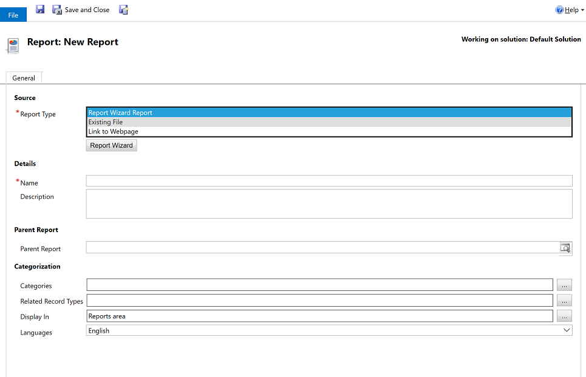
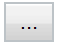

# Add a report from outside Power Apps

If you’ve created a custom report outside of the system, you can easily add it to Power Apps.

For information about how to create a custom report, see [Reporting and Analytics Guide](/dynamics365/customer-engagement/analytics/get-started-writing-reports).

1. From the left navigation pane, select the reports area. 
2. On the command bar select **New**.
  
   **Add a file created in another application**  
  
   1. In the **Source** section, in the **Report Type** box, select **Existing File**.  
   
     > [!div class="mx-imgBorder"]
     > 
  
   2. In the **File Location** box, enter the path and file name of the file to add, or choose **Browse** to locate the file. 
   
      You can can upload many other file types such as an excel file but for this to run like a SQL Server Reporting Services report or Report Wizard created report, the file needs to be an .RDL file. For more information, see [Report writing environment using SQL Server Data Tools](/dynamics365/customer-engagement/analytics/report-writing-environment-using-sql-server-data-tools).
  
      -OR  
  
   **Add a link to a webpage**  
  
   1.  In the **Source** section, in the **Report Type** box, select **Link to Webpage**.  
  
   2.  In the **Webpage URL** box, enter the URL of the webpage.  
  
3. Specify the properties for the report.
  
   1.  In the **Details** section, specify a meaningful name and description for the report.  
  
   2.  The **Parent Report** text box displays the parent report of the current report, if one exists.  
  
   3. **Categories**. Choose the **Select or change the values for this column**  button, and then specify the categories to include in this report.  
  
   4. **Related Row Types**. To have the report appear in the Reports list on a page for specific row types, choose the **Select or change the values for this column**  button, and then select row types.  
  
   5. **Display In**. To specify where reports should be visible, choose the **Select or change the values for this column**  button, and then select one or more of the options.  
  
        If no values are selected, the report won’t be visible to end users.  
  
4. Choose **Save** or **Save and Close**.  

### See Also
[Work with reports](work-with-reports.md) 

[Create a report using the Report Wizard](create-report-with-wizard.md)

[Edit report filter](edit-report-filter.md)

[Troubleshoot problems with data not displaying in a report](troubleshoot-reports.md)

[!INCLUDE[footer-include](../includes/footer-banner.md)]