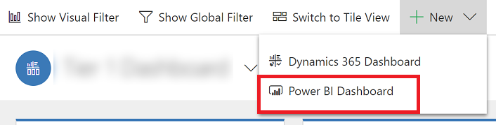
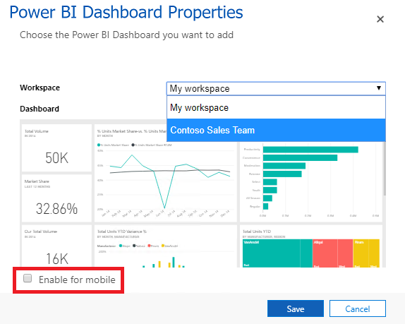
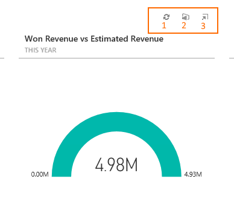
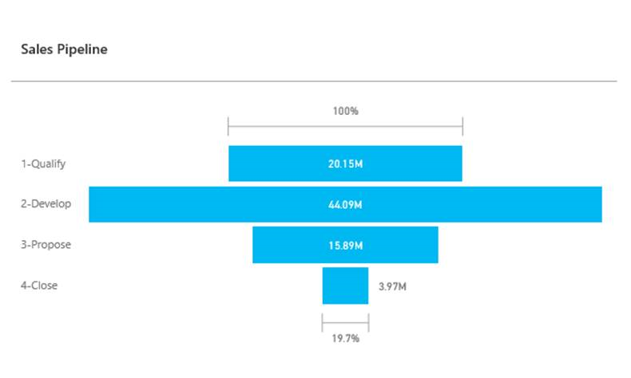

# Add or edit Power BI visualizations on your dashboard

Create rich, interactive reports and real-time visualizations in Common Data Service with [!INCLUDE[pn_power_bi_for_office_365_short](../includes/pn-power-bi-for-office-365-short.md)] dashboards and  tiles that you add  to your personal dashboards.  
  
> [!NOTE]
> To add [!INCLUDE[pn_power_bi_for_office_365_short](../includes/pn-power-bi-for-office-365-short.md)] visualizations to personal dashboards in your model-driven app, you must:  
> 
> - Enable [!INCLUDE[pn_power_bi_for_office_365_short](../includes/pn-power-bi-for-office-365-short.md)] visualizations for your organization in **Settings** > **Administration** > **System Settings** > **Reporting** tab > **Allow Power BI visualization embedding**.  
> - Have a [!INCLUDE[pn_power_bi_for_office_365_short](../includes/pn-power-bi-for-office-365-short.md)] account and have access to at least one [!INCLUDE[pn_power_bi_for_office_365_short](../includes/pn-power-bi-for-office-365-short.md)] dashboard. [!INCLUDE[proc_more_information](../includes/proc-more-information.md)] [Introduction to reporting and analytics](../analytics/reporting-analytics-with-dynamics-365.md)  
> - Avoid adding [!INCLUDE[pn_power_bi_for_office_365_short](../includes/pn-power-bi-for-office-365-short.md)] visualizations to system dashboards; it's not supported.
  

## Create a personal Power BI dashboard
  Follow these steps to add a [!INCLUDE[pn_power_bi_for_office_365_short](../includes/pn-power-bi-for-office-365-short.md)] dashboard to your model-driven app. If you are connecting to the [!INCLUDE[pn_power_bi_for_office_365_short](../includes/pn-power-bi-for-office-365-short.md)] service, you need an account and to have selected your Common Data Service instance as a data source. For more information about registering and connecting data sources, see [Microsoft Power BI](https://powerbi.microsoft.com/).  

1. Open you app and go to **Dashboards**.
  
2. Select **New** and then select **Power BI Dashboard**.  

   
    > [!div class="mx-imgBorder"] 
    >  

3. In the **Power BI Dashboard Properties** dialog select the workspace and then select the [!INCLUDE[pn_power_bi_for_office_365_short](../includes/pn-power-bi-for-office-365-short.md)] dashboard that you want to embed in your dashboard. Select **Enable for mobile** if you want to make the dashboard available for [!INCLUDE[pn_moca_full](../includes/pn-moca-full.md)] and [!INCLUDE[pn_Microsoft_Dynamics_CRM_Mobile](../includes/pn-dyn-365-phones.md)].

    
    > [!div class="mx-imgBorder"] 
    >  

4. Select **Save** to save your dashboard.
 
## Embed  Power BI tiles on your personal dashboard  
 Follow these steps to add one or more [!INCLUDE[pn_power_bi_for_office_365_short](../includes/pn-power-bi-for-office-365-short.md)] tiles to your personal dashboard. If you are connecting to the [!INCLUDE[pn_power_bi_for_office_365_short](../includes/pn-power-bi-for-office-365-short.md)] service, you need an account and to have selected your Dynamics 365 Customer Engagement (on-premises) instance as a data source. For more information about registering and connecting data sources, see [Microsoft Power BI](https://powerbi.microsoft.com/).  
  
1. In you app, go to **Dashboards**. 
  
2. Select an existing personal dashboard or select **New** to create one.  
  
3. On the dashboard, select an area  where you want the tile to appear, and then select **Power BI Tile** on the toolbar.  
  
4. In the Add Power BI Dashboard dialog, select the workspace and then select the [!INCLUDE[pn_power_bi_for_office_365_short](../includes/pn-power-bi-for-office-365-short.md)] tile that you want to display on your dashboard. Select **Enable for mobile** if you want to make the tile available for [!INCLUDE[pn_moca_full](../includes/pn-moca-full.md)] and [!INCLUDE[pn_Microsoft_Dynamics_CRM_Mobile](../includes/pn-dyn-365-phones.md)].  
  
     Select another area of the dashboard and repeat this step to add another [!INCLUDE[pn_power_bi_for_office_365_short](../includes/pn-power-bi-for-office-365-short.md)] tile, or other component, such as a chart or list, to your dashboard.  
  
5. Select **Save** to save your dashboard.  
  
  
### Things you can do with Power BI embedded tiles on Common Data Service personal dashboards  
 To show the features available with a [!INCLUDE[pn_power_bi_for_office_365_short](../includes/pn-power-bi-for-office-365-short.md)] visualization, hover over the upper-right of the visualization to reveal the following capabilities.  
  
   > [!div class="mx-imgBorder"] 
   >  
  
1. Select the **Refresh** button  to refresh the tile’s underlying report data.  
  
2. Select the **Open in Power BI** button  to open the [!INCLUDE[pn_power_bi_for_office_365_short](../includes/pn-power-bi-for-office-365-short.md)] dashboard that contains the visualization  in a new browser tab.  
  
3. Select the **Enlarge** button  to expand the visualization and increase the viewing area for the visualization, like the Sales Pipeline tile displayed here.  
  
    > [!div class="mx-imgBorder"] 
    >  
  
 
## Share a personal dashboard that contains Power BI visualizations  
 To share your personal dashboard that contains [!INCLUDE[pn_power_bi_for_office_365_short](../includes/pn-power-bi-for-office-365-short.md)] visualizations you must configure sharing in both Common Data Service and [!INCLUDE[pn_power_bi_for_office_365_short](../includes/pn-power-bi-for-office-365-short.md)],  and the user or group must have the same credentials and appropriate level of access  in both services. To share your personal dashboard in your app go to, **Dashboards**. In the list of dashboards, select the personal dashboard you want, and then click **SHARE DASHBOARD**. For more information about sharing a dashboard in [!INCLUDE[pn_power_bi_for_office_365_short](../includes/pn-power-bi-for-office-365-short.md)], see [Power BI: Share a dashboard with colleagues and others](https://powerbi.microsoft.com/documentation/powerbi-service-share-unshare-dashboard/).  
  
   
## Privacy notice  
[!INCLUDE[cc_privacy_powerbi_tiles_dashboards](../includes/cc-privacy-powerbi-tiles-dashboards.md)]
  

