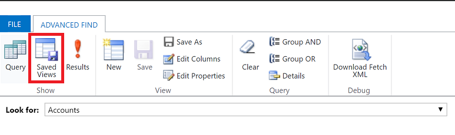
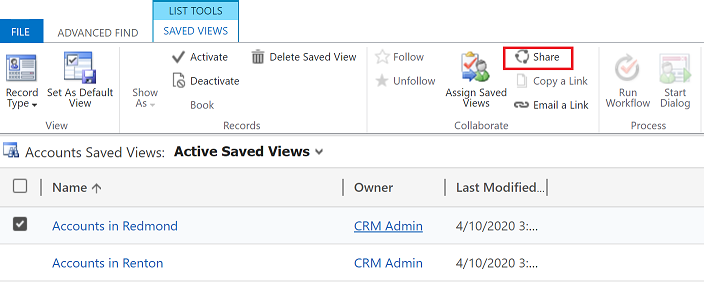
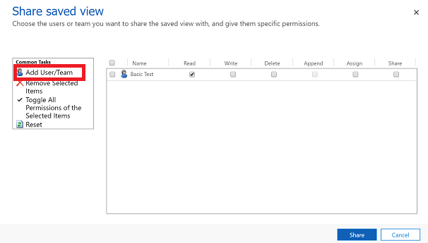
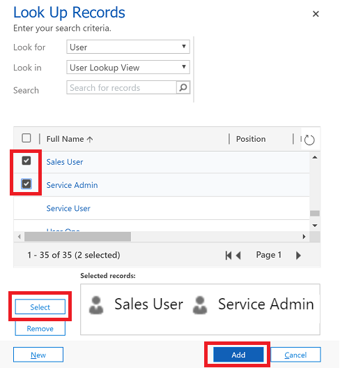
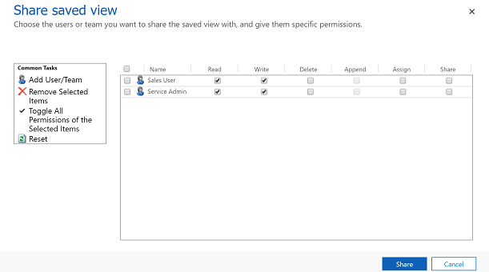

# Create, edit, or save an Advanced Find search

Find the rows you want in your app by using the Advanced Find search option. You can also use Advanced Find to prepare data for export to Office Excel so that you analyze, summarize, or aggregate data, or create PivotTables to view your data from different perspectives.  

  
1. On the command bar, the select **Advanced Find** button .
  
2. Specify what to search for.  
  
   1.  In the **Look for** list, select a row type.  
  
   2.  Choose **Select** to define search criteria: column (for example, Account Name or City), the query relational operator (part of an expression such as "is equal to" or "contains" that defines how a specified column should be compared with a value.), and the values to locate (for example, "Seattle" or "Email").  
  
       You can select columns from the current row type, or from related rows. For example, an account might have many related contact rows.  
  
       At the bottom of the **Select** list, the **Related** section shows related row types. For example, most row types have a related Notes row type. To select columns from a related row type, select column and a new **Select** link appears.  

3. Specify the columns to include in the search results.  
  
   1.  Select **Edit Columns**, and then select **Add Columns**.  
  
   2.  Select the row type that includes the columns you want to add.  
  
   3.  Select the columns you want to add, and then select **OK**.  
  
4. Specify the sort order.  
  
   1.  Select **Edit Columns**.  
  
   2.  Select **Configure Sorting**.  
  
   3.  Specify the column to sort on, specify the sort order, and then select **OK**.  
  
   4.  Select **OK**.  
  
5. Select **Results**.

To save the results, select **Save As** and name the personalized view. 

## Share a personal view

Before you can share a personal view, it must be saved.

1. On the command bar, select the **Advanced Find** button.
2. On the Advanced Find tab, select **Saved Views**.

   > [!div class="mx-imgBorder"] 
   > 
   
3. From the list of saved views, select a view and then select **Share**.

   > [!div class="mx-imgBorder"] 
   > 
   
4. In the **Share saved view** screen, select **Add User/Team**.

   > [!div class="mx-imgBorder"] 
   > 

5. Use the look up to find the users or team that you want to share the view with.
6. When you find the user or team, select their name and then choose **Select** and then **Add**.

   > [!div class="mx-imgBorder"] 
   > 
    
7. Select each user’s permission and then select **Share**.

   > [!div class="mx-imgBorder"] 
   > 

[!INCLUDE[footer-include](../includes/footer-banner.md)]