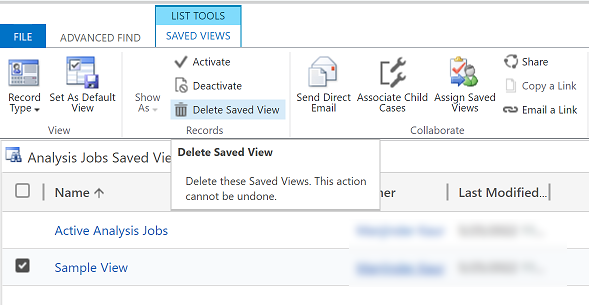

# Advanced find in model-driven apps

The topic covers the various different ways to use the advanced find experience.

## Search for rows and create personal views with modern advanced find

When your administrator enables the [modern advanced find experience](/power-platform/admin/settings-features), it lets you search for rows and create personal views in your app. Depending on how search is setup for your app, the search experience might look a little different. Your administrator can turn on Dataverse search or disable it.

1. To start a search, choose one of the following:

   - **Dataverse search enabled**: If your administrator has enabled Dataverse search, you will see a search bar at the top. Select the search box and then select **Search for rows in a table using advanced filters** to see the list of tables to choose from.

     > [!div class="mx-imgBorder"] 
     > 

     > [!TIP]
     > **Search for rows in a table using advanced filters** option appears at the bottom of the search drop-down menu, only when you have not entered a search term. Once you start typing, you will see results for the search term, with an option to see more search results.

   - **Dataverse search disabled**: If your administrator has not enabled Dataverse search, then you will see the **Search** button and the **Advanced Find** button  on the command bar. Select the **Advanced Find** button, to see the list of tables to choose from.

     > [!div class="mx-imgBorder"] 
     > 
 
 2.  Select a table and choose **Continue** to access the table. The tables in the filter must meet the following requirements: 

     - [Part of the model-driven app](../maker/model-driven-apps/add-edit-app-components.md#add-a-table)

     - Enabled for Unified Interface

     - Valid for advanced find

3. You will be navigated to the table's grid page, with the default view for the table selected and the rows displayed in a read-only grid. The  [**Edit filters**](grid-filters-advanced.md) panel will be opened, so you can filter the data on that table. For more information, see [create and manage personal views for that table.](grid-filters-advanced.md)

For more information on creating and managing system views, see [Create and edit public or system views.](../maker/model-driven-apps/create-or-edit-model-driven-app-view.md)

## Create, edit, or save a view using legacy advanced find

If your administrator has not enabled the modern advanced find experience, you can find the rows you want by using the legacy Advanced Find search option. You can also use Advanced Find to prepare data for export to Office Excel so that you analyze, summarize, or aggregate data, or create PivotTables to view your data from different perspectives. 

> [!NOTE]
>  To use the modern advanced find in model-driven apps, see [Create and manage personal views on a grid page ](grid-filters-advanced.md).
  
1. On the command bar, select **Advanced Find** button .
  
2. Specify what to search for.  
  
   1.  In the **Look for** list, select a row type.  
  
   2.  Choose **Select** to define search criteria: column (for example, Account Name or City), the query relational operator (part of an expression such as "is equal to" or "contains" that defines how a specified column should be compared with a value.), and the values to locate (for example, "Seattle" or "Email").  
  
       You can select columns from the current row type, or from related rows. For example, an account might have many related contact rows.  
  
       At the bottom of the **Select** list, the **Related** section shows related row types. For example, most row types have a related Notes row type. To select columns from a related row type, select column and a new **Select** link appears.  

3. Specify the columns to include in the search results.  
  
   1.  Select **Edit Columns**, and then select **Add Columns**.  
  
   2.  Select the row type that includes the columns you want to add.  
  
   3.  Select the columns you want to add, and then select **OK**.  
  
4. Specify the sort order.  
  
   1.  Select **Edit Columns**.  
  
   2.  Select **Configure Sorting**.  
  
   3.  Specify the column to sort on, specify the sort order, and then select **OK**.  
  
   4.  Select **OK**.  
  
5. Select **Results**.

To save the results, select **Save As** and name the personalized view. 

### Share a personal view

Before you can share a personal view, it must be saved.

1. On the command bar, select the **Advanced Find** button.
2. On the Advanced Find tab, select **Saved Views**.

   > [!div class="mx-imgBorder"] 
   > 
   
3. From the list of saved views, select a view and then select **Share**.

   > [!div class="mx-imgBorder"] 
   > 
   
4. In the **Share saved view** screen, select **Add User/Team**.

   > [!div class="mx-imgBorder"] 
   > 

5. Use the look up to find the users or team that you want to share the view with.
6. When you find the user or team, select their name and then choose **Select** and then **Add**.

   > [!div class="mx-imgBorder"] 
   > 
    
7. Select each user’s permission and then select **Share**.

   > [!div class="mx-imgBorder"] 
   > 

### Delete a personal view

1. On the command bar, select the **Advanced Find** button.
2. On the Advanced Find tab, select **Saved Views**.

   > [!div class="mx-imgBorder"] 
   > 
   
3. From the list of saved views, select the view that you want to delete and then select **Delete Saved View**.

   > [!div class="mx-imgBorder"] 
   > 

[!INCLUDE[footer-include](../includes/footer-banner.md)]
