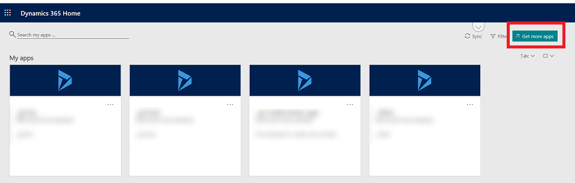

# Discover apps via AppSource
The apps you build and publish with Power Apps are discovered and used in Dynamics 365 on the web. It displays all of your apps--the apps that you've chosen to use (that is, by launching from a share email or opening from AppSource) or that an admin has provisioned for you. This includes all of your apps from Power Apps, and Dynamics 365 applications from Microsoft. You can search for apps, filter by environment, and pin the apps you use most frequently to the top of the page.

  

## Find apps via the AppSource organization gallery
Microsoft AppSource is now embedded in the Microsoft 365 apps (https://www.office.com/apps) home page and throughout the common navigation. It now includes a private gallery of apps available to you within your company. Select **Get more apps** from the home page or task pane, and navigate to the **My Organization** tab to see apps that are available to you.

Apps built with Power Apps and shared with a security group or the entire company with **User** permission appear here, instead of cluttering your home page by default. When you get an app from AppSource, it will then appear on the home page and be easily accessible throughout the experience.

  

[!INCLUDE[footer-include](../includes/footer-banner.md)]
