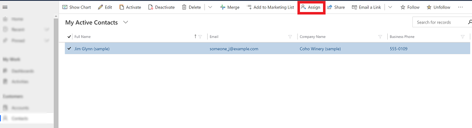
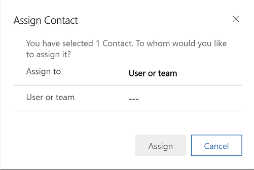
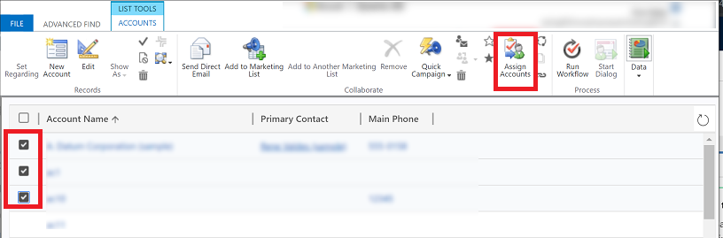

# Assign or share records

If you would like another person in your organization to handle a customer record, you can assign the record to that person. You can also assign a record to a team, or to yourself.  

Use the **Share** option if you want to keep ownership of the record but let someone else work on it with you. 

1. From the left navigation pane, select a record type. For example, **Contacts**.

2. From the list of records, select the record that you want to reassign.  
  
3. On the command bar, select **Assign**.

   > [!div class="mx-imgBorder"]
   > 

   > [!NOTE]
   > If you want to keep ownership of the record but let someone else work with it, select **Share**. Then use the tooltips to guide you through the **Share** option. 
   
4. In the assign dialog box, in the **Assign to** area, choose **Me** or **User or Team**.

   > [!div class="mx-imgBorder"]
   > 
  
   If you select **User or Team**, in the **Look for Records** box, enter the name of the user or team. If you need to create a new record, select **+ New**.
  
5. When you're done, select **Assign**.

## Use advanced find to reassign records

Use advanced find to search for records and then reassign them to someone else. For more information on advanced find, see [Create, edit, or save an Advanced Find search](advanced-find.md).

1. On the command bar, select **Advanced Find**.

   > [!div class="mx-imgBorder"]
   > 
   
2. From the list of records, select the records that you want to reassign and then select the assign option.

   > [!div class="mx-imgBorder"]
   > 
   
 
 ## Reassign all records (for admins)
 
 A admin can reassign all record for a user from the admin Setting area.
 
 1. Go to **Settings** > **Security**.
 2. Select **Users** and select a user name to open the user's profile.
 3. On the command bar, select **REASSIGN RECORDS**.
 
   > [!div class="mx-imgBorder"]
   > 
   
 4. On the **Reassign Records** dialog box choose how to want to reassign all the records and then select **OK**.
 
  > [!NOTE]
   > The **Reassign Records** option will reassign all records regardless of their status. Inactive and active records will be reassigned to the other user or team. This will also deactivate all activated processes including business rules and workflows when the record is reassigned to another user or team. The new owner must active the processes which must be used.
 
   > [!div class="mx-imgBorder"]
   > 
 

