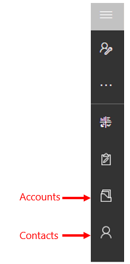

# Assign or share records

If you would like another person in your organization to handle a customer record, you can assign the record to that person. You can also assign a record to a team, or to yourself.  

Use the **Share** option if you want to keep ownership of the record but let someone else work on it with you. 

You can assign and share **Contact** records, but you can only share **Account** records.
  
1. From main menu on the left, go to **Accounts** or **Contacts**. 

   > [!div class="mx-imgBorder"]
   > 

2. In the list of records, select the record that you want.  
  
3. On the command bar, select **Assign**.

   > [!NOTE]
   > If you want to keep ownership of the record but let someone else work with it, select **Share**. Then use the tooltips to guide you through the **Share** option. Remember, you can only share **Account** records—there is no assign option.
  
4. In the **Assign Customer** dialog box, in the **Assign to** area, choose **Me** or **User or Team**.
  
   If you select **User or Team**, in the **Look for Records** box, enter the name of the user or team. If you need to create a new record, select **+ New**.
  
5. When you're done, select **Assign**.
 

