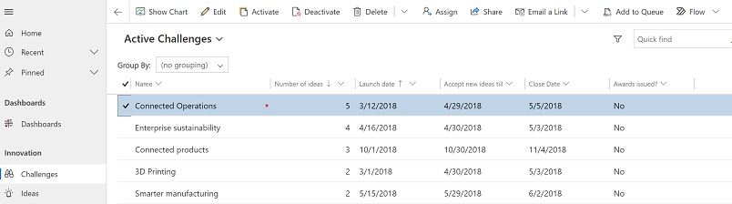
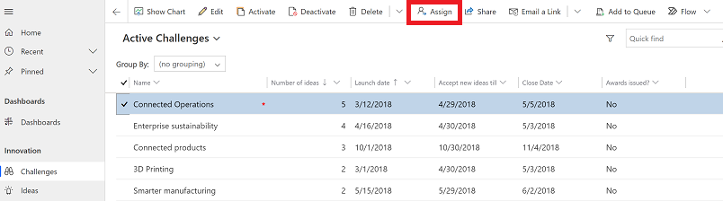
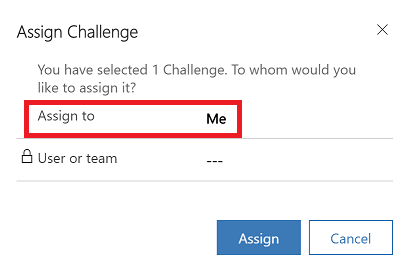
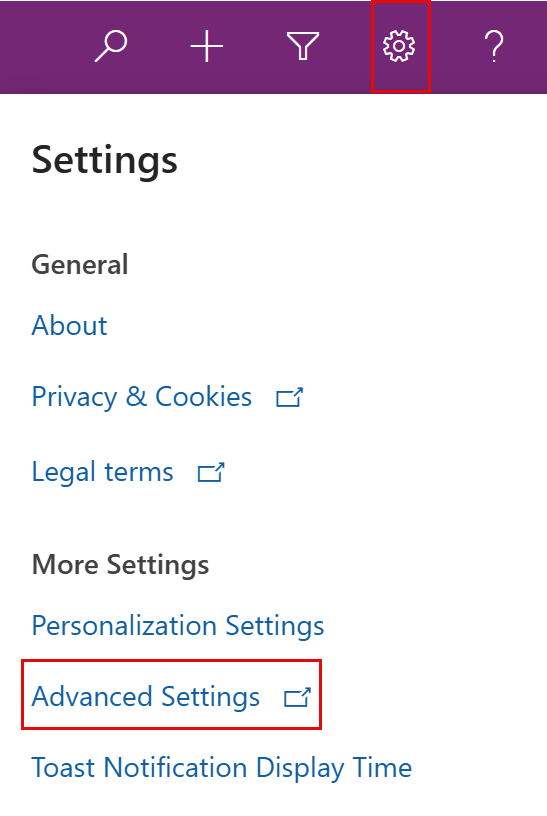
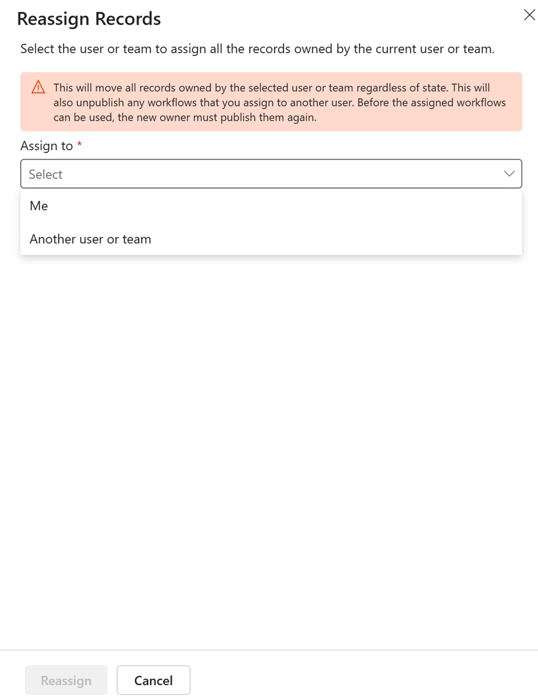
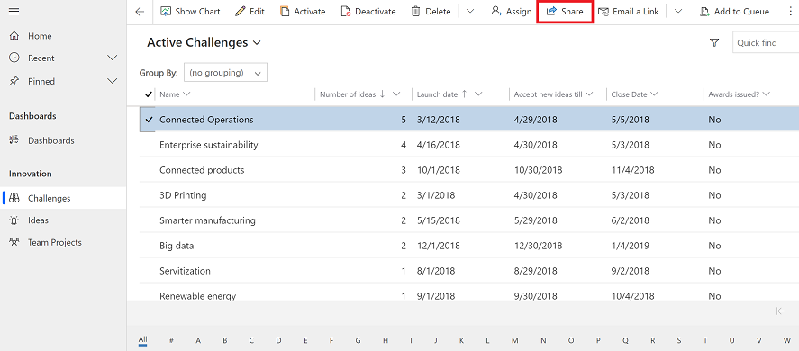
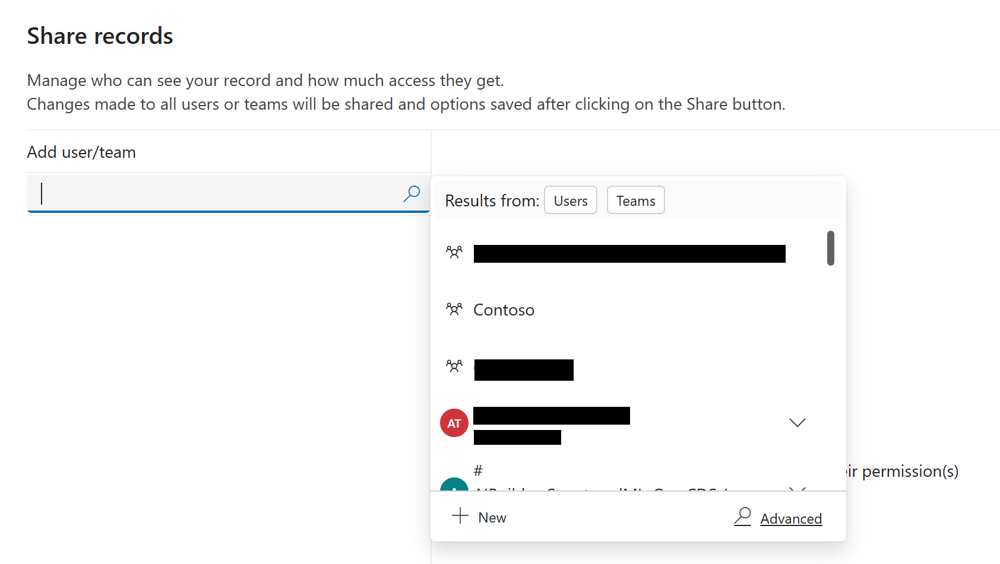
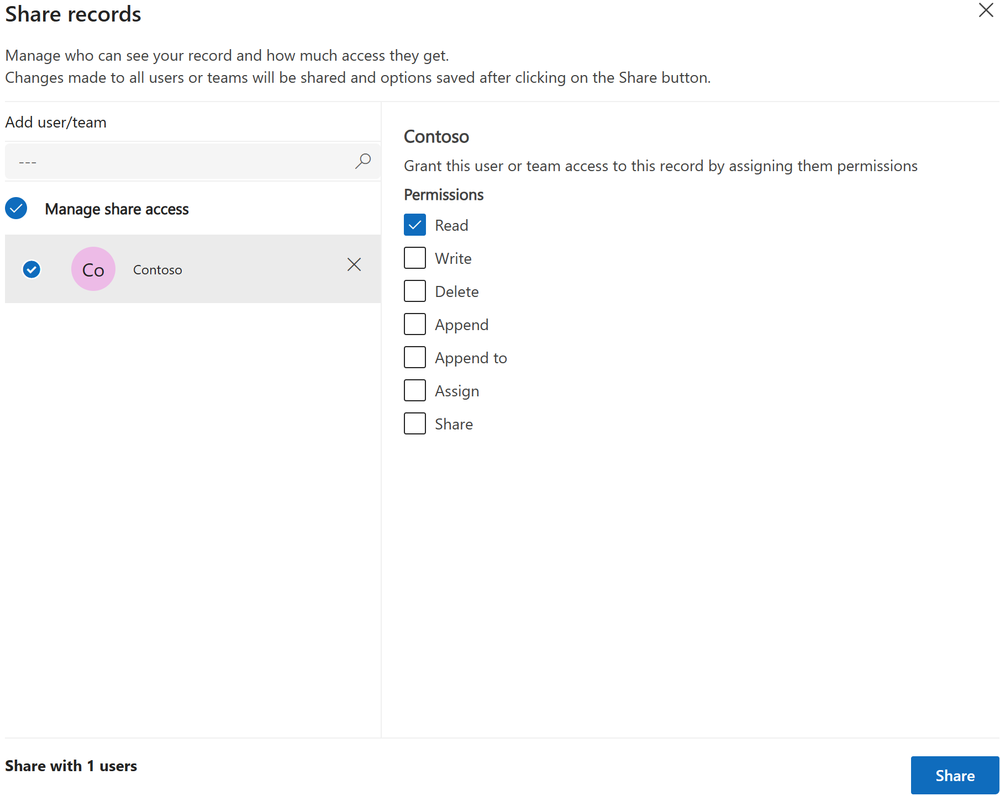

# Assign or share a row 

When you create a row, you're the owner of the row. If you want another person in your organization to take ownership of the row, assign the row to that person. You can assign a row to a user or team. You can also assign a row to yourself when another user owns it, but you need system administrator privilege to do this.

If you want to keep ownership of the row but let someone else work on it with you, then use the **Share** option to share the row. For more information, see [Share a row](share-row.md).

For more information on how privileges and access works, see [How access to a row is determined](/power-platform/admin/how-record-access-determined).

## Assign a row to a user or team

1. From a list of rows, select the row that you want to assign to someone else. You can select multiple rows.

   > [!div class="mx-imgBorder"]
   > 

1. On the command bar, select **Assign**. 

   > [!div class="mx-imgBorder"]
   > 

  
1. In the assign dialog box, select the **Assign to** column, and choose one of the following options:
    - Select **Me** to assign the row to yourself and then select **Assign**. Remember only a system administrator can assign a row that belongs to someone else to themselves.
    
      > [!div class="mx-imgBorder"]
      > 
    
    - Select **User or Team** and then enter the name of the user or team or use the lookup to find them. Or, select **+ New** to create a new user or team row. When you're done select **Assign**.

## Use advanced find to reassign rows

Use advanced find to search for rows and then reassign them to someone else. For more information on advanced find, see [Create, edit, or save an Advanced Find search](advanced-find.md).

1. On the command bar, select **Advanced Find**.

   > [!div class="mx-imgBorder"]
   > 
   
1. Use the [advanced find search](advanced-find.md) to find rows that you want to assign to someone else. For example, to look for active row types that are **Challenges**, in **Look for:** enter **Challenges** and status equals **Active**. Then select **Apply** to run the query.

1. Select the rows that you want to assign and then select **Assign**.

 1. In the assign dialog box, select the **Assign to** column and choose one of the following options:
 
    - Select **Me** to assign the row to yourself and then select **Assign**. Remember only a system administrator can assign a row that belongs to someone else to themself.
    
    - Select **User or Team** and then enter the name of the user or team or use the lookup to find them. Or, select **New Row** to create a new user or team row. When you're done select **Assign**.
    
 
 ## Reassign all rows (for admins)
 
 When a user leaves your organization or when ownership needs to change from one user to another, an administrator can reassign the rows.
 
 1. Go to **Settings** > **Advanced Settings**.
 
    > [!div class="mx-imgBorder"]
    > 
 
 1. In the navigation pane, select **Security (Preview)**.
 
 1. Under **Security (Preview)**, select **Users**.
 
 1. The users list open in Power Platform admin center. From the list of users, select a user name to open the user's profile.

 1. Under **Manager**, select **Reassign record**.
   
 1. On the **Reassign Rows** dialog box, choose how you want to reassign all the rows and then select **Reassign**.
 
    > [!div class="mx-imgBorder"]
    > 
 
   > [!NOTE]
   > - The **Reassign Rows** option reassigns all rows regardless of their status. Inactive and active rows are reassigned to the other user or team. This action deactivates all activated processes, including business rules and workflows, when the row is reassigned to another user or team. The new owner must activate the processes that were deactivated when the row is reassigned.  
   > - When you reassign a large number of rows, the system might take a while to process. 
   > - If an issue occurs during the reassignment process, such as the user that the rows are being reassigned to doesn't have the required privileges, the **Reassign Rows** process stops. The rows that are processed before the issue are updated and saved. For the rows that aren't saved, you need to reassign the rows again by using the **Reassign Rows** option.
   
 
## Share a row with someone else
 
 If you want to keep ownership of a row but let someone else work on the row with you, use the share option.
 
 > [!NOTE]
 > For users on [early access](/power-platform/admin/opt-in-early-access-updates), the sharing feature is updated for 2021 release wave 2. For more information, see [Share a row with someone else](share-row.md).
 
 
1. From a list of rows, select the row that you want to share with someone else. You can select multiple rows.

   > [!div class="mx-imgBorder"]
   > 

1. On the command bar, select **Share**. 

   > [!div class="mx-imgBorder"]
   > 
   
 1. On the share dialog box, select search icon.  

 1. On the dialog box, choose **User** or **Team**.
 
    > [!div class="mx-imgBorder"]
    > 
    
 1. Select the name from the list.
 
     
 1. On the share dialog box, select the type of permissions the user or team has for the row. When you're done, select **Share**.   
 
     > [!div class="mx-imgBorder"]
     > 
 
 
 ### Remove someone from a shared row
 
 When you're the assigned owner of a row, you can remove another user from the shared row.
 
 1. From a list of rows that you own, select the row that you want to remove someone from the shared row.
 1. On the command bar, select **Share**.
 1. On the share dialog box, select the user or team who you want to remove sharing from.
 1. Select the **Share** button.

[!INCLUDE[footer-include](../includes/footer-banner.md)]
