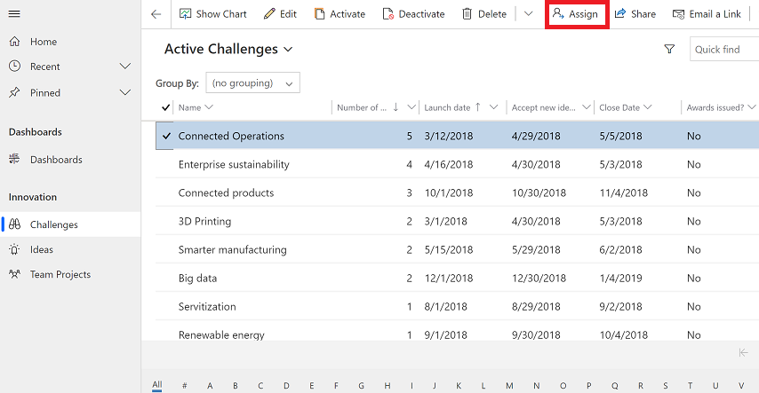
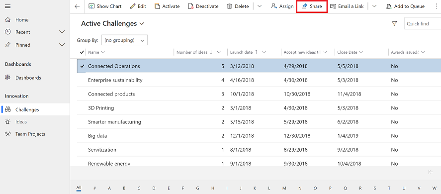
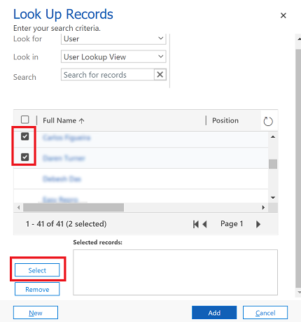
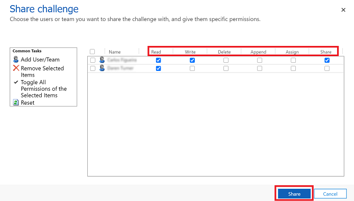

# Assign or share rows

When you create a row, you are the owner of the row. If you would like another person in your organization to take ownership of the row, then you can assign the row to that person. You can assign a row to a user or team. You can also assign a row to yourself that another user owns but you need to have system administrator privilege to do this.

If you want to keep ownership of the row but let someone else work on it with you, then use the **Share** option to share the row. 

For more information on how privileges and access works, see [How access to a row is determined](/power-platform/admin/how-record-access-determined).

## Assign a row to a user or team

1. From a list of rows, select the row that you want to assign to someone else. You can select multiple rows.

   > [!div class="mx-imgBorder"]
   > 

2. On the command bar, select **Assign**. 

   > [!div class="mx-imgBorder"]
   > 

  
3. In the assign dialog box, select the **Assign to** column, and choose one of the following options:
    - Select **Me** to assign the row to yourself and them select **Assign**. Remember only a system administrator can assign a row that belongs to someone else to themself.
    
      > [!div class="mx-imgBorder"]
      > 
    
    - Select **User or Team** and then enter the name of the user or team or use the lookup to find them. Or, select **New Row** to create a new user or team row. When you're done select **Assign**.

      > [!div class="mx-imgBorder"]
      > 

## Use advanced find to reassign rows

Use advanced find to search for rows and then reassign them to someone else. For more information on advanced find, see [Create, edit, or save an Advanced Find search](advanced-find.md).

1. On the command bar, select **Advanced Find**.

   > [!div class="mx-imgBorder"]
   > 
   
2. Use the [advanced find search](advanced-find.md) to find rows that you want to assign to someone else. For example, to look for active row types that are **Challenges**, in **Look for:** enter **Challenges** and status equals **Active**. Then select **Results** to run the query.

    > [!div class="mx-imgBorder"]
    > 

3. Select the rows that you want to assign and then select **Assign (page name)**

   > [!div class="mx-imgBorder"]
   > 
   
 4. In the assign dialog box, select the **Assign to** column and choose one of the following options:
 
    - Select **Me** to assign the row to yourself and them select **Assign**. Remember only a system administrator can assign a row that belongs to someone else to themself.
    
    - Select **User or Team** and then enter the name of the user or team or use the lookup to find them. Or, select **New Row** to create a new user or team row. When you're done select **Assign**.
    
      > [!div class="mx-imgBorder"]
      > 
   
 
 ## Reassign all rows (for admins)
 
 When you have a user that leaves your organization or ownership needs to change from one user to another the rows can be reassigned by an administrator.
 
 1. Go to **Settings** > **Advanced Settings**.
 
    > [!div class="mx-imgBorder"]
    > 
 
 2. From the top menu navigate from **Settings** > **Security**.
     > [!div class="mx-imgBorder"]
     > 
 
 3. Under **Security** select **Users**.
 
 4. From the list of users, select a user name to open the user's profile.

 5. On the command bar, select **REASSIGN ROWS**.
 
    > [!div class="mx-imgBorder"]
    > 
   
 4. On the **Reassign Rows** dialog box choose how to want to reassign all the rows and then select **OK**.
 
    > [!div class="mx-imgBorder"]
    > 
 
   > [!NOTE]
   > - The **Reassign Rows** option will reassign all rows regardless of their status. Inactive and active rows will be reassigned to the other user or team. This will also deactivate all activated processes including business rules and workflows when the row is reassigned to another user or team. The new owner must activate the processes that was deactivated when the row is reassigned.  
   > - When there is a large amount rows to reassign, the system may take a while to process. 
   > - If there is an issue during the reassignment process such as the user that the rows are being reassigned to doesn't have the required privileges then the **Reassign Rows** process will stop. The rows that are processed before the issue will be updated and saved. For the rows that were not saved, you will need reassign the rows again using the **Reassign Rows** option.
   
 
 ## Share a row with someone else
 
 If you want to keep ownership of a row but let someone else work on the row with you then use the share option.
 
 
1. From a list of rows, select the row that you want to assign to someone else. You can select multiple rows.

   > [!div class="mx-imgBorder"]
   > 

2. On the command bar, select **Share**. 

   > [!div class="mx-imgBorder"]
   > 
   
 3. On the share dialog box, select **Add User/Team**.  

    > [!div class="mx-imgBorder"]
    > 
   
 4. On the **Look up Rows** dialog box, select the **Look for** menu and choose **User** or **Team**.
 
    > [!div class="mx-imgBorder"]
    > 
    
 5. Use the lookup to find the user or team and select the name and then choose **Select**.
 
     > [!div class="mx-imgBorder"]
     > 
     
 6. Select **Add**. 
 
     > [!div class="mx-imgBorder"]
     > 
     
 7. On the share dialog box, select the type of permissions the user or team has for the row. When you're done, select **Share**   
 
     > [!div class="mx-imgBorder"]
     > 
 
 
 ## Remove someone from a shared row
 
 When you are the assigned owner of a row, you can remove another user the row is shared with.
 
 1. From a list of rows that you own, select the row that you want to remove someone from the shared row.
 2. On the command bar, select **Share**.
 3. On the share dialog box, select the user or team who you want to remove sharing from.
 4. Select the **Remove Selected items**.
 5. Select the **Share** button.

 

[!INCLUDE[footer-include](../includes/footer-banner.md)]