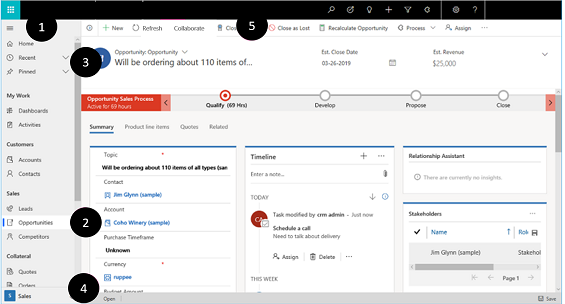
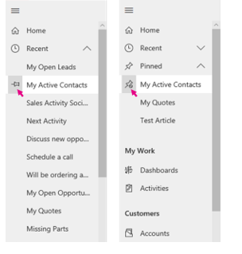

#  Basic navigation in a model-driven app

Model-driven apps use the Unified Interface - this means the basic navigation  of any model-driven app is the same. 

1. Sitemap is expanded and persists by default.
2. The sub area that you are currently in is highlighted to indicate where in the app.
3. **Recent** and **Pinned** items are at top for easy access. 
4. Use the Area switcher to switch between apps.
5. Command bar background color is associated with the area you are in.
6. There are unique colors for icons on the command bar to show differentiation between commands.
  
### Get back to recent records, items, or view

You probably work with the same records all the time. For example, you may access the same contact or account on a regular basis. Or you may work with the same lists (views) of data over and over. You can quickly get back to recently used records or views from the Site Map. You can also pin records and views to make them easier to find. 
  
1. From the **Site Map**, click **Recent**.
  
2. Under **Recent**, choose the record, item, or view you want to go back to. 

#### Pin or unpin records, items, or view

1. To pin an item or record, from the **Site Map**, click **Pinned**.
2. Select the pin icon next to the item in the recent list, and it will be added to the pinned list.
3. To unpin, select the unpin icon next to the item in the pinned list, and it will drop off from the list.

