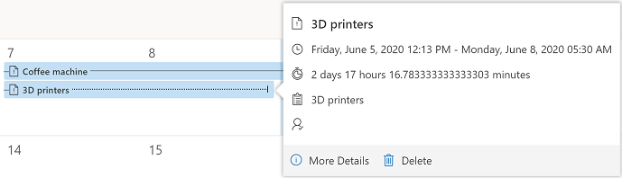

# Work with rows in the new calendar view

The new calendar view displays scheduled activities and their associated details. You can view, create, and delete your activities in a day, week, or month view. For the new calendar view to be visible, the **Calendar Control V2** control must be added to a table view by a system customizer or a system administrator. For more information, see [Add the calendar control to tables](https://docs.microsoft.com/powerapps/maker/model-driven-apps/add-calendar-control). The **Calendar Control V2** control can be added to any table.

By default, rows are displayed in a read-only grid. 

> [!div class="mx-imgBorder"]
>  

When the **Calendar Control V2** control is added to a table and then the default view is changed to the calendar view. Rows associated with the table are displayed in an interactive calendar.

> [!div class="mx-imgBorder"]
>  

## Switch between calendar view and grid view

When the calendar view is turned on, it is the default view for the table. However, you can still switch between the grid view or the calendar view.

1. To switch between views, on the left navigation pane, select the table that has the calendar view turned on.

   > [!div class="mx-imgBorder"]
   >  

2.  On the command bar, select the **More commands** icon, and then select **Show As** and choose either **Calendar Control V2** or **Read Only Grid**.

    > [!div class="mx-imgBorder"]
    >  

    The activities are displayed in the new calendar view.

    > [!div class="mx-imgBorder"]
    >  

## Change the calendar view

You can choose from these calendar views:

- **Month**: View the entire month.
- **Week**: View the week from Sunday through Saturday, by default. You can change the first day of the week in system settings.
- **Day**: View the current day.

**To change the view**

1.  On the navigation bar of the calendar, select the view you're currently in: **Month**, **Day**, or **Week**.

    > [!div class="mx-imgBorder"]
    >  

2.  Select the view you want to change to.

    > [!div class="mx-imgBorder"]
    >  

If you want to set a calendar view as the default view, you do that through personalization settings.

## View details of a calendar item

You can view a summary of a row by selecting it in the calendar. A pop-up window opens and displays the summary information.

**Row details for an activity**

> [!div class="mx-imgBorder"]
>  

**Row details for an opportunity**

> [!div class="mx-imgBorder"]
>  

If you want to view complete details about the row, select **More Details** in the pop-up window.

> [!NOTE]
> This view is not customizable. If you would like to customize this view, add your suggestion [here](https://ideas.powerapps.com).

## Create and delete rows from the calendar

The new calendar view allows you to create and delete rows from the calendar.

**To create a row**

1.  In the calendar, double-click a date tile (in **Month** view) or select a time slot (in **Day** or **Week** view) in which you want to create a row.

    > [!div class="mx-imgBorder"]
    > 

    > [!div class="mx-imgBorder"]
    >  

    Depending on the table on which the calendar control was added, an appropriate **New** form is opened. For example, if you're viewing leads, a form to create a new lead is opened. If you're viewing opportunities, a form to create a new opportunity is opened.

    > [!NOTE]
    > - When you add the new calendar control on the Activity table, an appointment is created when you create a row from the calendar. The start and end times are filled-in automatically as per the selected date tile or time slots. By default, the duration is set to 30 minutes.
    > - When you add the new calendar control on a table other than Activity, the corresponding table row is created when you create a row from the calendar.
    > - You can also create a new row by selecting and dragging across time slots in **Day** or **Week** view.

2.  Enter the detail, and then save the row. 

**To delete a row**

1.  On the calendar, select the row you want to delete.

2.  Select **Delete** in the pop-up window.

    > [!div class="mx-imgBorder"]
    > 

## Search through rows

You can use the Search box to filter the rows in the calendar based on a search term. For example, when you enter the keyword **Meeting**, it refreshes the calendar view to show only the rows where the title begins with **Meeting**.

> [!div class="mx-imgBorder"]
> 

### See also

[Add the calendar control to tables](../maker/model-driven-apps/add-calendar-control.md)
