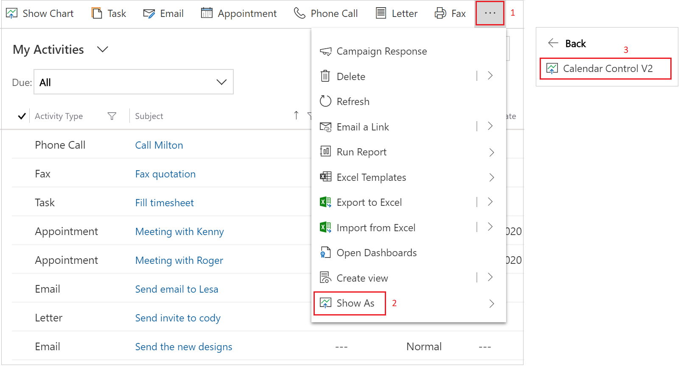
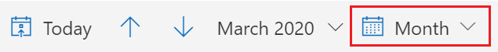
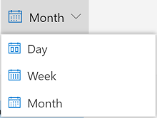
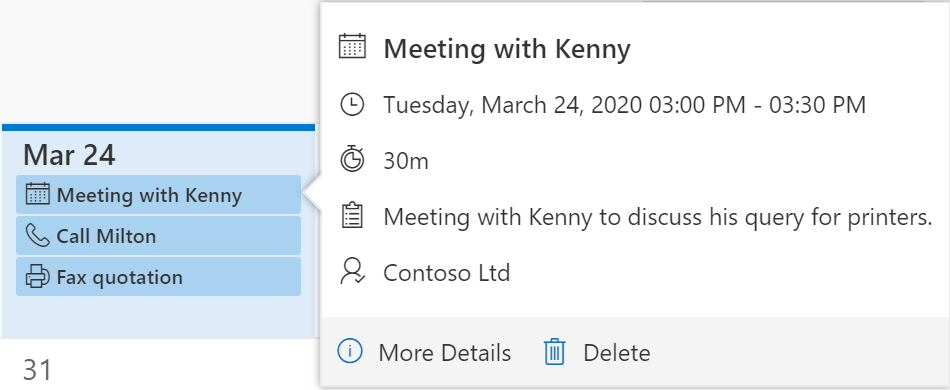
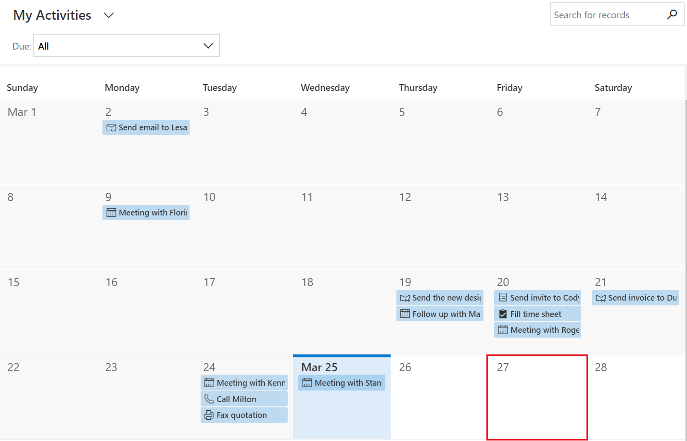
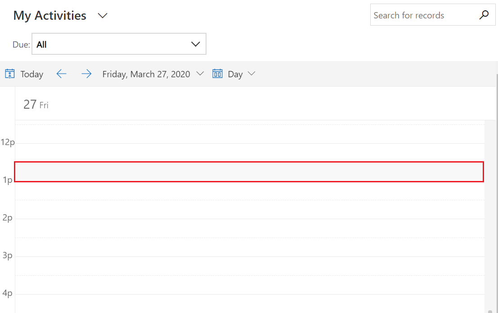
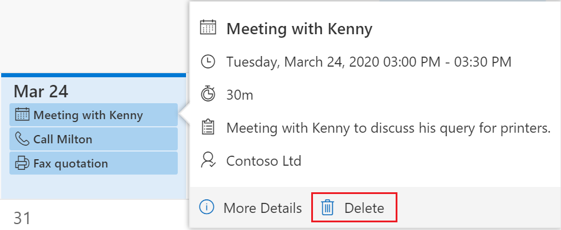

# Work with records in the new calendar view

The new calendar view displays scheduled activities and their associated details. You can view, create, and delete your activities in a day, week, or month view. For the new calendar view to be visible, the **Calendar Control v2** control must be added to an entity view by a system customizer or a system administrator. The **Calendar Control v2** control can be added to any entity.

By default, records are displayed in a read-only grid. When the **Calendar Control v2** control is added to an entity and the view is changed to the calendar view, records associated with the entity will be displayed in an interactive calendar.

## Switch to the new calendar view

The calendar view is made available when the calendar control is added to an entity view. If the calendar view isn't visible, contact your system customizer or a system administrator.

**To switch to the new calendar view**

1.  In the site map, select an item. For example, **Activities**.

2.  On the command bar, select the **More commands** icon, and then select **Show As** > **Calendar Control v2**.

    > [!div class="mx-imgBorder"]
    >  

    The activities are displayed in the new calendar view.

    > [!div class="mx-imgBorder"]
    >  

## Work with the new calendar view

Using the new calendar view, you can:

- [Change the calendar view](#change-the-calendar-view).
- [View details of a calendar item](#view-details-of-a-calendar-item).
- [Create and delete records from the calendar](#create-and-delete-records-from-the-calendar).
- [Search through records](#search-through-records).

### Change the calendar view

You can choose from these calendar views:

- **Month**: View the entire month.
- **Week**: View the week from Sunday through Saturday, by default. You can change the first day of the week in system settings.
- **Day**: View the current day.

**To change the view**

1.  On the navigation bar of the calendar, select the view you're currently in: **Month**, **Day**, or **Week**.

    > [!div class="mx-imgBorder"]
    >  

2.  Select the view you want to change to.

    > [!div class="mx-imgBorder"]
    >  

If you want to set a calendar view as the default view, you do that through personalization settings.

### View details of a calendar item

You can view a summary of a record by selecting it in the calendar. A pop-up window opens and displays the summary information.

> [!div class="mx-imgBorder"]
>  

If you want to view complete details about the record, select **More Details** in the pop-up window.

### Create and delete records from the calendar

The new calendar view allows you to create and delete records from the calendar.

**To create a record**

1.  In the calendar, select a date tile (in **Month** view) or a time slot (in **Day** or **Week** view) in which you want to create a record.

    > [!div class="mx-imgBorder"]
    > 

    > [!div class="mx-imgBorder"]
    >  

    Depending on the entity on which the calendar control was added, an appropriate **New** form is opened. For example, if you're viewing leads, a form to create a new lead is opened. If you're viewing opportunities, a form to create a new opportunity is opened.

    > [!NOTE]
    > - When you add the new calendar control on the Activity entity, an appointment is created when you create a record from the calendar.
    > - When you add the new calendar control on an entity other than Activity, the corresponding entity record is created when you create a record from the calendar.
    > - You can also create a new record by selecting and dragging across time slots in **Day** or **Week** view.

2.  Enter the detail, and then save the record. 

**To delete a record**

1.  On the calendar, select the record you want to delete.

2.  Select **Delete** in the pop-up window.

    > [!div class="mx-imgBorder"]
    > 

### Search through records

You can use the Search box to filter the records in the calendar based on a search term. For example, when you enter the keyword **Meeting**, it refreshes the calendar view to show only the records where the title begins with **Meeting**.

> [!div class="mx-imgBorder"]
> 

### See also

[Add the calendar control to entities](../maker/model-driven-apps/add-calendar-control.md)
