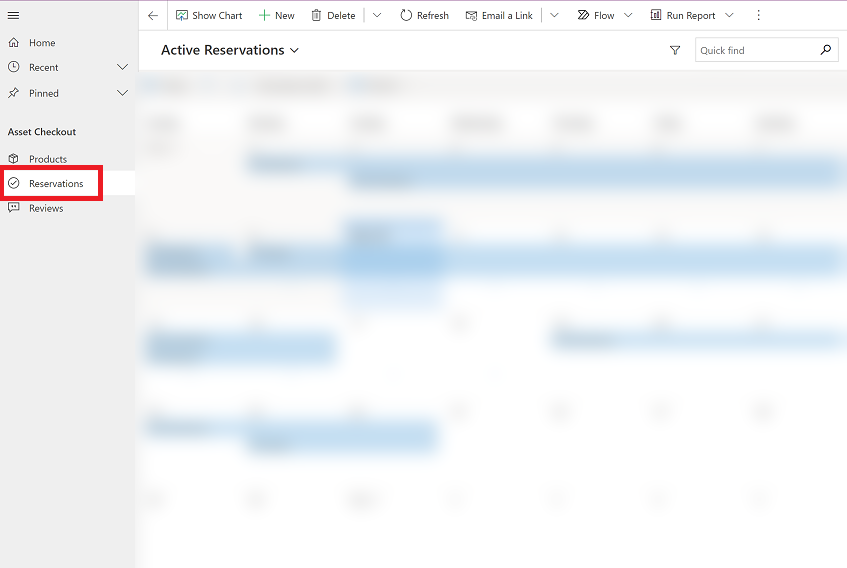
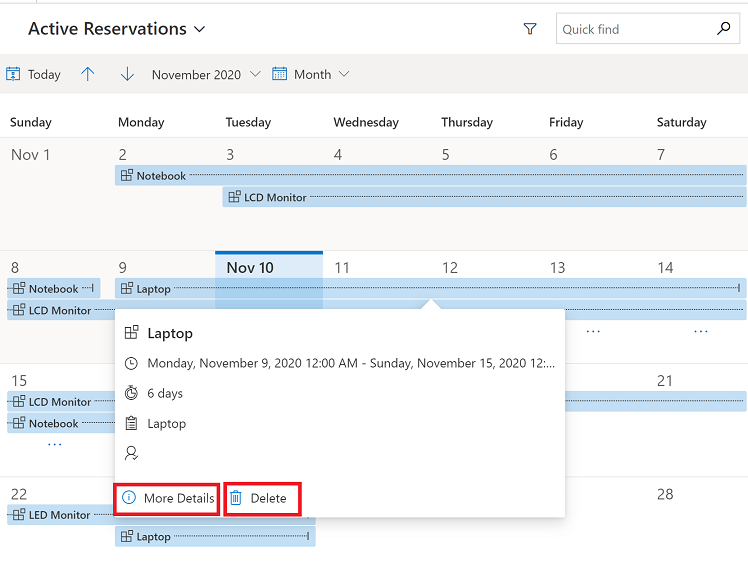
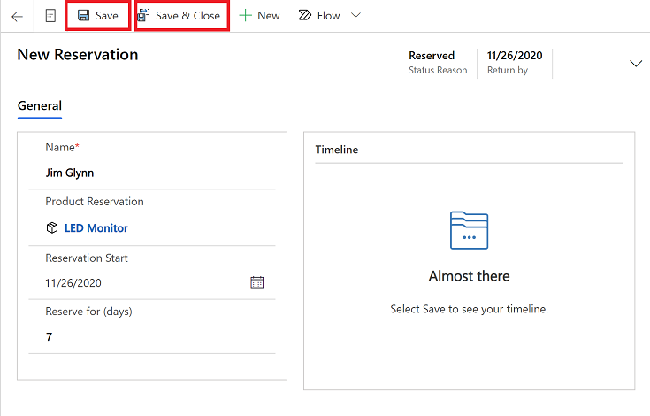
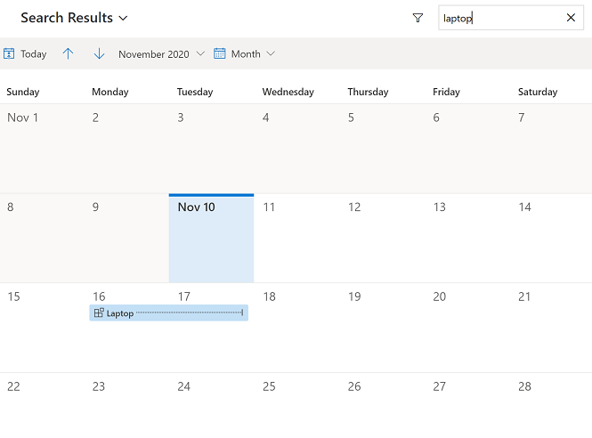

# Work with rows in the calendar view

The calendar view displays scheduled activities and their associated details. You can view, create, and delete your activities in a day, week, or month view. For the new calendar view to be visible, the **Calendar Control V2** control must be added to a table view by a system customizer or a system administrator. For more information, see [Add the calendar control to tables](../maker/model-driven-apps/add-calendar-control.md). The **Calendar Control V2** control can be added to any table.

By default, rows are displayed in a read-only grid. 

> [!div class="mx-imgBorder"]
>  

When the **Calendar Control V2** control is added to a table and then the default view is changed to the calendar view. Rows associated with the table are displayed in an interactive calendar.

> [!div class="mx-imgBorder"]
>  

> [!NOTE]
> The **Calendar Control V2** control is not supported in mobile offline. For more information about mobile offline, see [Work offline on your mobile device](/dynamics365/mobile-app/work-in-offline-mode).

## Switch between calendar view and grid view

When the calendar view is turned on, it is the default view for the table. However, you can still switch between the grid view or the calendar view.

1. To switch between views, on the left navigation pane, select the table that has the calendar view turned on.

   > [!div class="mx-imgBorder"]
   >  

2.  On the command bar, select the **More commands** icon, and then select **Show As** and choose either **Calendar Control V2** or **Read Only Grid**.

    > [!div class="mx-imgBorder"]
    >  

    When you select the **Calendar Control V2** view activities are displayed in a calendar view.

    > [!div class="mx-imgBorder"]
    >  

## View the calendar by Day, Week, or Month

You can choose from these calendar views:

- **Day**: View the current day.
- **Week**: View the week from Sunday through Saturday, by default. You can change the first day of the week in system settings. To view the week numbers, ask your admin to enable displaying the week numbers in the calendar view for your environment. Follow the steps in [Customize regional options](/power-platform/admin/customize-regional-options-admins) and select **Show week numbers on Calendar views**.
- **Month**: View the entire month.

To change the calendar format, on the calendar select the drop-down menu and then select **Day**, **Week**, or **Month**.

 > [!div class="mx-imgBorder"]
 >  

If you want to set a calendar view as the default view, you can do this through personalization settings. For more information, see [Set personal options](./set-personal-options.md#activities-tab-options).

## View details of a calendar item and take action

You can view a summary of a row by selecting it in the calendar. A pop-up window opens and displays the summary information.

- To view complete details about the row, select **More Details** in the pop-up window.

- To delete the row, select **Delete** in the pop-up window.

  > [!div class="mx-imgBorder"]
  >  

> [!NOTE]
> This view is not customizable. If you would like to customize this view, add your suggestion [here](https://ideas.powerapps.com).

## Create a new row from the calendar

The calendar view allows you to easily create a new row.

1.  Depending on your calendar view, do one of the following:

    - On the **Month** view, double-click a date tile, in which you want to create a new row.
    
      > [!div class="mx-imgBorder"]
      > 

    - On the **Day** or **Week** view, select a date and time in which you want to create a row.
   
      > [!div class="mx-imgBorder"]
      >  
    
    - You can also create a new row by selecting and dragging across time slots in **Day** or **Week** view.
    
       > [!div class="mx-imgBorder"]
       >  

2. A new form will open. In this example, a **New Reservation** form is opened. Enter the details, and then select **Save** or **Save & Close**. 

    > [!div class="mx-imgBorder"]
    >  

    > [!NOTE]
    > - If your form has start and end times columns, they are filled-in automatically as per the selected date tile or time slots. By default, the duration is set to 30 minutes.
    > - When you add the new calendar control on a table other than Activity, the corresponding table row is created when you create a row from the calendar.
    

## Search through rows

You can use the search box to search for data in the view you're in. For example, when you enter the keyword **laptop**, it refreshes the calendar view to show only the rows where the title begins with **laptop**. For more information, see [Use search on a grid](./grid-filters.md#use-search-on-a-grid).

> [!div class="mx-imgBorder"]
> 

### See also

[Add the calendar control to tables](../maker/model-driven-apps/add-calendar-control.md)

[!INCLUDE[footer-include](../includes/footer-banner.md)]