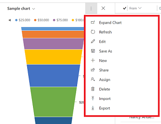

# View charts on a page or in a row 

You can view charts on a page that has a list of rows. You can also open a row and view a chart in the row. 

Only an administrator can add charts to a row. For information, go to [Add a chart to a form](../maker/model-driven-apps/add-chart-to-form.md).

## View charts on a page

1. On the left navigation pane, select a page.
2. On the command bar, select **Show Chart**.

   > [!div class="mx-imgBorder"]
   >  

3. Select the drop-down menu to choose a view. 

   > [!div class="mx-imgBorder"]
   >  

4. Select the chart view drop-down menu to choose between a system or personal view. 

  - **My Charts**: Personal charts that can only be seen by the user who created the chart. The user can also share their personal chart with other users if the user has sharing privileges for their security role.
  - **System Charts**: Created by your administrator. By default, these charts are visible to all users. 

    > [!div class="mx-imgBorder"]
    >  

## Commands on a chart view

Use the **More Commands** button    to access commands such as create a new chart, import, export, and more. The chart commands options are different for system charts and personal charts.

| Commands on my (personal) charts  | Commands on system charts |
|---------|---------|
|      |        |

## Grid filter on charts

Grid home page provides multiple filter options for a user to filter the grid data such as quick find, advanced find, grid column filter, and jump bar. For more information, go to [How to use grid filters](./grid-filters.md).

When a chart is shown together with grid, the grid filter option that you select will filter both chart and grid. 

Legend:

1. **Sort**: Sorts rows. Use **Filter by** to filter both grid and chart data based on the filter criteria.
2. **Open advanced filtering panel**: See which filters were applied to the current view. For more information, go to [See the current view definition](./grid-filters-advanced.md#see-the-current-view-definition).
3. **Search this view**: Search for data in the view you're in.
4. **Jump bar**: The page jump bar uses the first sorted column. If no change has been made to the sort order, the jump bar uses the primary column.

### Drill-down in the chart data

You can drill down into a segment on a chart and filter the data for that segment. When a chart is shown together with grid, the drill-down option that you select will filter both chart and grid as shown in this illustration. 

For more information on how to use the drill-down feature, go to [Drill-down in a chart](./track-your-progress-with-dashboard-and-charts.md#drill-down-in-a-chart).

[!INCLUDE[footer-include](../includes/footer-banner.md)]