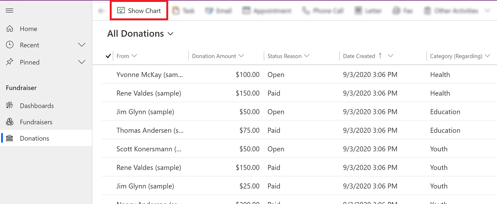
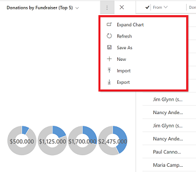

# View charts for a page or in a record 

You can view charts on a page that has a list of records. You can also open a record and view a charts in the record. 

Only an administrator can add charts to a record, for information see, [Add a chart to a form](https://docs.microsoft.com/powerapps/maker/model-driven-apps/add-chart-to-form).

## View charts on a page

1. On the left navigation, select a page.
2. On the commbar bar, select **Show Chart**.

   > [!div class="mx-imgBorder"]
   >  

3. Select the drop-down menu to choose a view. 

   > [!div class="mx-imgBorder"]
   >  

4. Select the chart view drop-down menu to choose between a system or personal view. 

  - **My Charts**: My charts are personal charts which can only be seen by the user that created the chart. The user can also share their personal chart with other users if the user has sharing privileges for their security role.
  - **System Charts**: System charts are craete by your dministrator. By default, these charts are visible to all users. 

    > [!div class="mx-imgBorder"]
    >  

## Commands on a chart view

Use the **More Commands** button    to access commands such as, create a new chart, import, export, and more. The chart commands options are different for system charts and personal charts.

| Commands on my (personal) charts  | Command on syetem charts |
|---------|---------|
|      |        |

