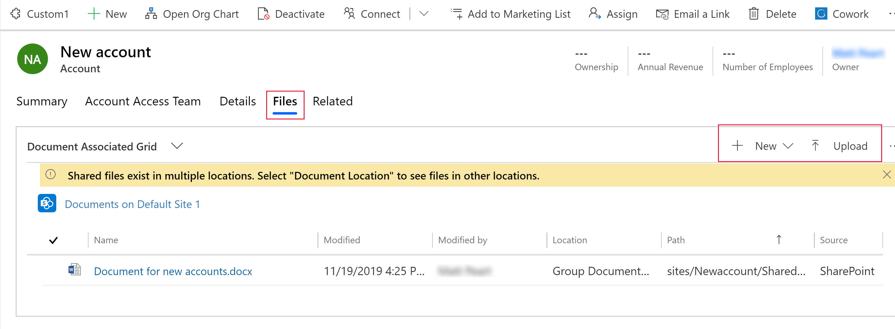
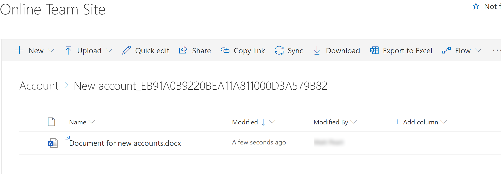

# Collaborate using SharePoint 

Manage common document types, such as Word, Excel, and PowerPoint and create folders to save and manage those documents that are seamlessly stored in SharePoint from within a model-driven app. 

> [!NOTE]
> This feature requires that your system administrator has enabled SharePoint document management. More information: [Manage your documents using SharePoint](/power-platform/admin/manage-documents-using-sharepoint)

For account and contact records, a default document location folder is automatically created on SharePoint the first time you go to the **Files** tab. For other standard or custom entity records, go to the **Related** > **Documents** tab. The name of the document location is in this format: <record_name>_<record_id>.

By default, the location is set to Documents on Default Site 1.

## Add a document
1.	Open an account or contact record and select the **Files** tab. For other standard or custom entities that are enabled for document management, select the **Related** tab, and then select **Documents**.
2.	Choose from the following options. 
    - To create a new document, select **New**, select the document type you want, such as Word, Excel, or OneNote, and then enter a name. Select **Save**. The blank document opens in a new tab. 
    - To add an existing document, select **Upload**, select **Choose File**, browse to and select the file you want, and then select **Open**. Select **OK**. 

The document file appears in the **Document Associated Grid** view. 

The document also appears on the SharePoint site folder location. 

## Manage SharePoint locations
You can create new or edit existing SharePoint locations from a model-driven app.

1. In the **Files** list on the command bar, select **Open Location**, and then select the location.
2. To edit the location, on the command bar, select **Edit Location** <location name>.
The **Edit Location** dialog box appears.
3. The display name, parent site, and folder name are automatically populated. Enter details about the new location, and then select **Save**.
4. To add a location, on the command bar, select **Add Location**.
5. The **Add Location** dialog box appears.
6. The display name, parent site, and folder name are automatically populated. Change the details if required, and then select **Save**.

## Actions on documents
When you select one or more documents in the Documents list, you can take the following other common SharePoint actions on the documents:
- Edit
- Delete
- Check in
- Check out
- Discard check out
- Edit properties
