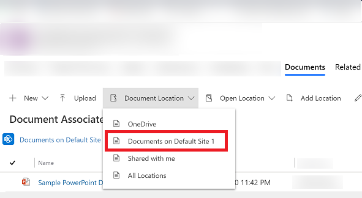
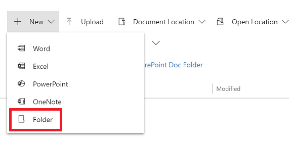
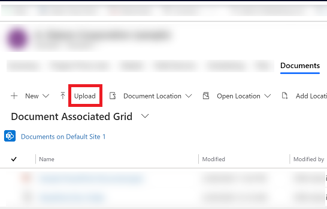
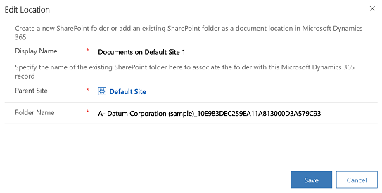
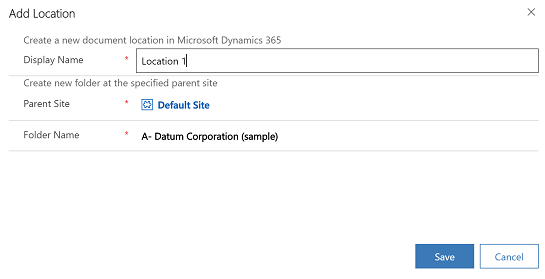

# Collaborate using SharePoint 

With Microsoft Dataverse, you can store your documents on SharePoint and manage them from within your app. The documents that you create in your app are stored on SharePoint, and are automatically synced to your desktop and mobile devices.

Before you can use SharePoint to store documents, it must be enabled by your system administrator. More information:

-   [Find your administrator or support person](find-admin.md)  

-   [Manage your documents using SharePoint](/power-platform/admin/manage-documents-using-sharepoint)  

> [!IMPORTANT]
> SharePoint managed documents that are deleted using a Power Apps or Dynamics 365 customer engagement app are permanently deleted from both the app and the SharePoint site. 

## Where do you access the documents from?

1. For row types that support document management, open the row, select the **Related** tab, and then select **Documents**.

   > [!div class="mx-imgBorder"]
   > 

2. Select **Document Location** > **Documents on Default Site 1**. When SharePoint is enabled, the location is set to  **Documents on Default Site 1** by default.

   > [!div class="mx-imgBorder"]
   > 

## Create a new document and save it to SharePoint

1. Open a row and go to the **Document Associated Grid** view. For example, open a contact row.

2. On the open row, select the **Related** tab, and then select **Documents**.
 
    > [!div class="mx-imgBorder"]
    > 

2. Select **Document Location**, and change the location to **Documents on Default Site 1**.

3. Select **New**, and then choose a document type such as Word, Excel, or PowerPoint.

    > [!div class="mx-imgBorder"]
    > 

4. Enter a document name, and then select **Save**.  

## Create a new folder in the default SharePoint site location

1. Open a row and go to the **Document Associated Grid** view. For example, open a contact row.

2. On the open row, select the **Related** tab, and then select **Documents**.
 
    > [!div class="mx-imgBorder"]
    > 

2. Select **Document Location**, and change the location to **Documents on Default Site 1**.

3. Select **New**, and then choose **Folder**.

    > [!div class="mx-imgBorder"]
    > 
    
 4. Enter a folder name, and then select **Save**.  
 
 
 ## Upload an existing document to SharePoint from your app

1. Go to the row you want to create the document for, select the **Related** tab, and then select **Documents**.
 
2. Select **Upload.**

   > [!div class="mx-imgBorder"]
   > 

3. Choose the file you want to upload. You can choose only one file at a time.

   The document is created in the current document location you're in.

   > [!Note]
   > You can upload a file of up to 50 MB. If your internet connection is slow, you might get an error while uploading large files.

4. If files with the same name exist in SharePoint, select whether you want to overwrite the files.

5. Select **OK**.

## Manage SharePoint locations

You can create new or edit existing SharePoint locations from your app in Dataverse.

### Edit a location

1. Open a row, select the **Related** tab, and then select **Documents**.

2. Select **Edit Location**, and then select a SharePoint site location.

   The **Edit Location** dialog box appears.

   > [!div class="mx-imgBorder"]
   > 

3. The display name, parent site, and folder name are automatically populated. Enter details about the new location, and then select **Save**.

### Add a new location

1. Open a row, select the **Related** tab, and then select **Documents**.

2. Select **Add Location**. 

   The **Add Location** dialog box appears.

   > [!div class="mx-imgBorder"]
   > 

3. The display name, parent site, and folder name are automatically populated. Change the details if required, and then select **Save**.

## Files tab FAQ

*Why was the location to access documents moved?* 
- We moved the command to make documents easier to find with fewer clicks.

*Has the Documents tab gone away?*
- No, it hasn’t gone away. Users can still access the documents associated with the row in question the old way, simply by selecting the **Related** menu and then the **Documents** link.

*With the change, will subfolders in SharePoint still be created automatically?*
- Yes. The behavior is similar to that of the **Documents** link under the **Related** menu. When a user selects the **Files** tab for the first time, the corresponding SharePoint subfolder is created by the system. 

*Is there a way to add the Files tab to other tables, or remove it?*
- Yes. To add or remove the **Files** tab, follow the steps in this article: [Add the SharePoint documents tab to the main form for a table](../maker/model-driven-apps/add-documents-tab-entity-main-form.md)  

[!INCLUDE[footer-include](../includes/footer-banner.md)]