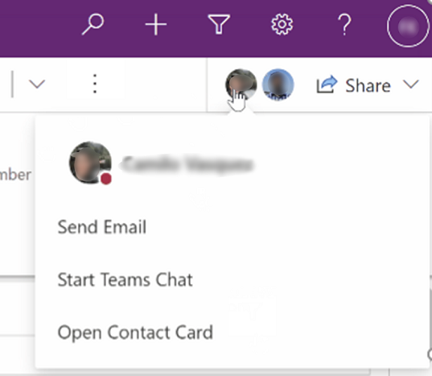
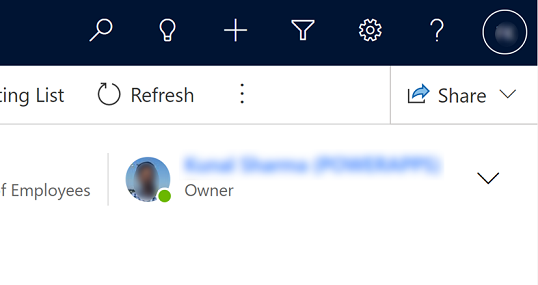

# Collaborate with others in model-driven apps (preview)

[This topic is pre-release documentation and is subject to change.]

Collaborate with colleagues and share links in model-driven Power Apps the same way as in Microsoft Office.

> [!NOTE]
> This is currently a preview feature.  To enable it, the environment adminstrator needs to turn on the Collaboration feature in environment settings, Features.

> [!NOTE]
> During the preview preriod, these features are only available in the **Opportunity**, **Account**, **Contact** and **Case** tables that are in customer engagement apps such as [Dynamics 365 Sales](/dynamics365/sales-professional/help-hub.md), [Dynamics 365 Customer Service](/dynamics365/customer-service/help-hub.md) or stand-alone Power Apps.

### Multiplayer apps
When you're working on a record such as an **Opportunity**, **Account**, **Contact** or **Case** you can also see other users that are working on the same record.

You can also select a user's picture to see their online status, send them an email, or start a Teams chat.

> [!div class="mx-imgBorder"]
> 

### View a user's status and picture

App users, such as the record owner, are displayed with their picture and on-line status.

> [!div class="mx-imgBorder"]
> 

> [!NOTE]
> This feature will be extended to user lookups and grid user columns. 

### Sharing 

Easily share direct links, by clicking on the **Share** button. Select **Copy link** and then paste it in another app to share the link. 

> [!div class="mx-imgBorder"]
> 

