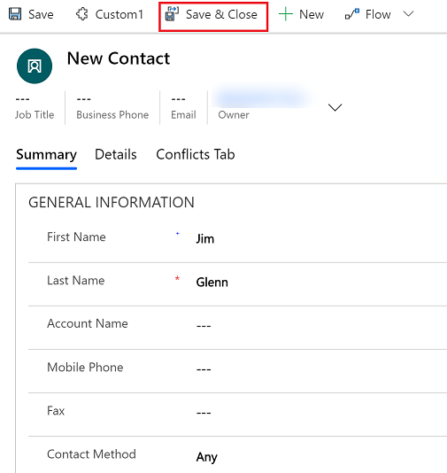

# Create a new record

## Create a new record using the + option on the command bar

The **Create a new record** command or **Quick create** makes it fast and easy to enter almost any type of information into the system. The command is on the nav bar, so it’s available whenever you need to enter new information into the system. You can also save a record and create a new one directly from the **Quick create** form.

> [!NOTE]
> The **Quick create** option is only available for records that are enabled by your admin.
    
1. On the navigation bar, select the **plus sign** , and then select the item you want.  

    > [!div class="mx-imgBorder"] 
    > 
  
2.  Fill in the fields, and then select **Save and Close**. Or, to save and create another record, select the down arrow and then select  **Save & Create New**.

     > [!div class="mx-imgBorder"] 
     > 
  
> [!NOTE]
> An asterisk  next to the field on the screen means the field is required. If you select **Save and Close** before entering required fields an error message will be displayed or if you have entered information and select **Cancel** a warning will be displayed.
>   
> A plus sign  next to the field on the screen means your organization recommends that you fill in the field.  

## Create a new record using the New button 

1. From the left navigation pane, select a record type. For example, select **Contacts** to create a new contact record.
2. On the command bar, select **+New**.

    > [!div class="mx-imgBorder"] 
    > 
  
3. Fill in the appropriate details for new contact and then select **Save and Close**.

    > [!div class="mx-imgBorder"] 
    > 

    
