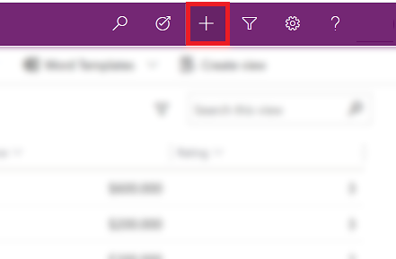
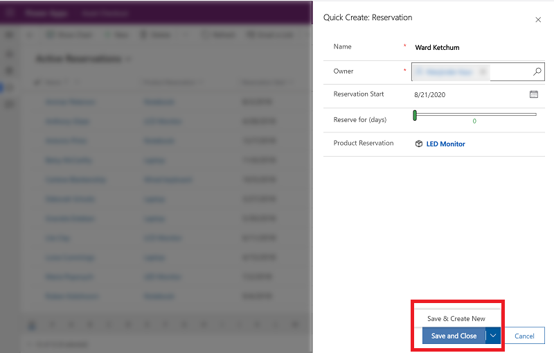
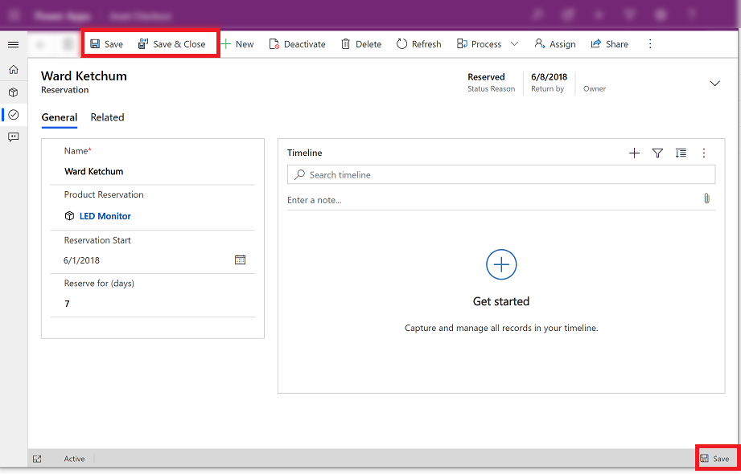

# Create a new row

The **New** command or **Quick create** makes it fast and easy to enter almost any type of information into the system. The command is on the navigation bar, so it’s available whenever you need to enter new information into the system. You can also save a row and create a new one directly from the **Quick create** form.

> [!NOTE]
> The **Quick create** option is only available for rows that are enabled by your admin.
    
1. On the navigation bar, select the **plus sign** , and then select the item you want.  

    > [!div class="mx-imgBorder"] 
    > 
  
2.  Fill in the columns, and then select **Save and Close**. Or, to save and create another row, select the down arrow and then select  **Save & Create New**.

     > [!div class="mx-imgBorder"] 
     > 
  
> [!NOTE]
> An asterisk  next to the column on the screen means the column is required. If you select **Save and Close** before entering required columns an error message will be displayed or if you have entered information and select **Cancel** a warning will be displayed.
>   
> A plus sign  next to the column on the screen means your organization recommends that you fill in the column.  

## Create a new row using the New button 

1. From the left navigation pane, select a table type. 

    > [!div class="mx-imgBorder"] 
    > 
    
2. On the command bar, select **+New**.

    > [!div class="mx-imgBorder"] 
    > 
  
3. Fill in the columns and then on the command bar, select **Save** or **Save & Close**. The **Save** option is still available on the bottom right corner.

    > [!div class="mx-imgBorder"] 
    > 

   > [!NOTE]
   > If you have unsaved changes and try to go to another row, a **Unsaved changes** dialog box will pop-up. If you select **Save and continue**, it will attempt to save your information and open the page you wanted to go to. If you choose to save and continue and there is an error on a column, the dialog will close and you will remain on the page to fix the error before you can navigate away.

 

[!INCLUDE[footer-include](../includes/footer-banner.md)]