# Create a report using the Report Wizard

Use the Report Wizard to create reports with charts and tables that allow you to easily analyze your data. 

All reports that are created using the Report Wizard are Fetch-based reports. Note that all reports generated with the Report Wizard print in landscape mode.

## Create a new report

1. From the left navigation pane, select the reports area.  
2. On the command bar select **New**.

    > [!div class="mx-imgBorder"]
    > 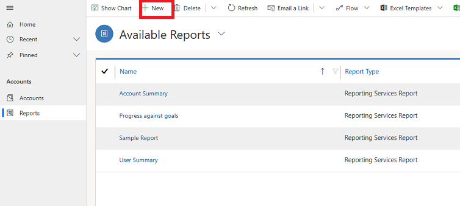
  
3. A **Report:New Report** screen will appear. For **Report Type** leave the default selection to, **Report Wizard Report** and select the **Report Wizard** button. 

    > [!div class="mx-imgBorder"]
    > 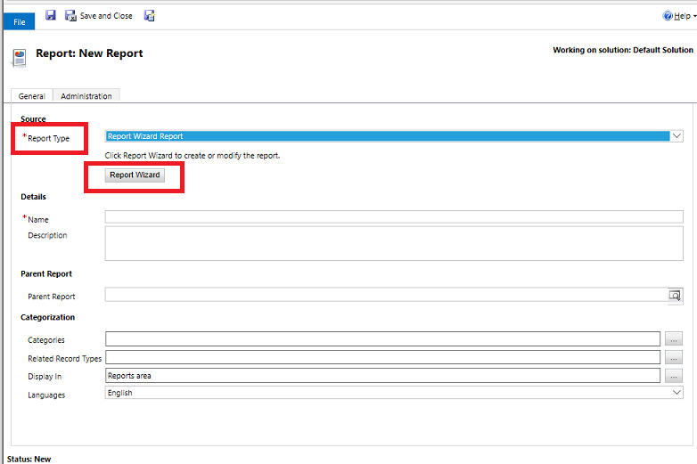
  
4. In the next screen, leave the default selections and then select **Next**.
 
    > [!div class="mx-imgBorder"]
    > 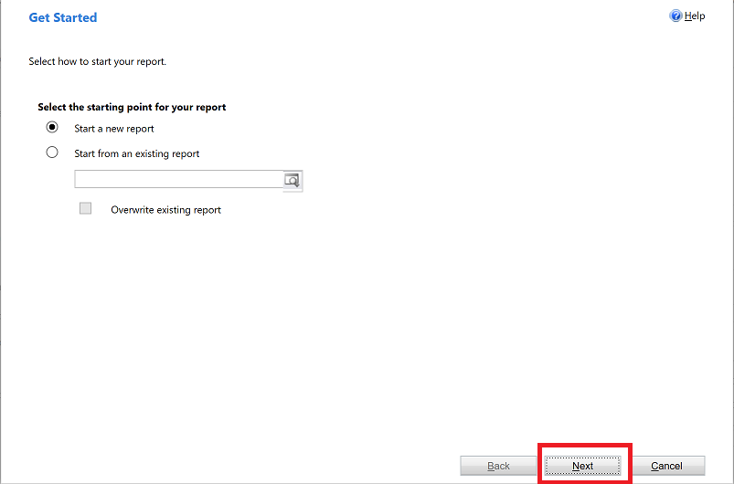
   
4. On the **Report Properties** screen, enter a name for the report and then choose the record to include in the report and then select **Next**.
 
    > [!div class="mx-imgBorder"]
    > 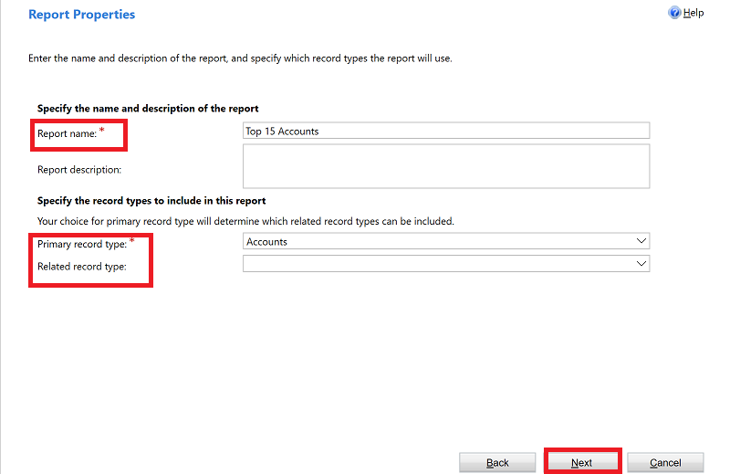
  
5.  On the **Select Records to Include in the Report** screen choose the filters to determine which records are included in your report. For example, if you only want to see results for records modified in the last 60 days, you can set that filter in this screen. If you don’t want the data filtered, select **Clear**.

    > [!div class="mx-imgBorder"]
    > 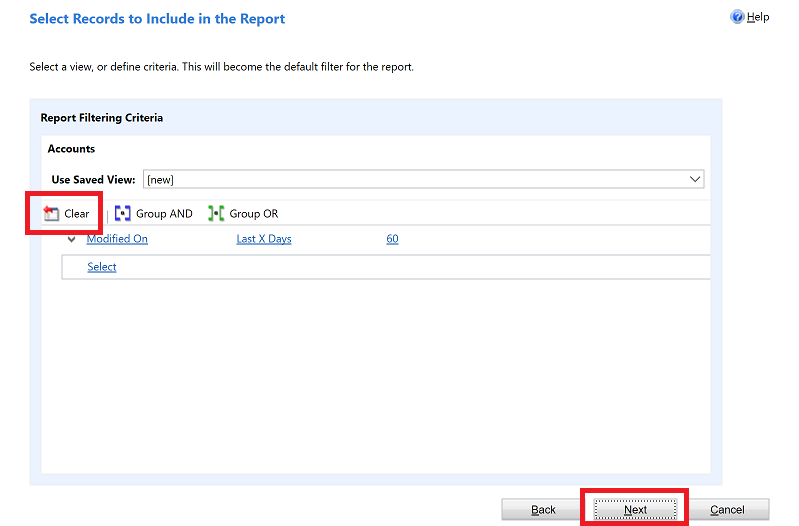
  
6. On the **Lay out Fields** screen, choose the layout of your report. Select **Click here to add a grouping** and choose how you want your data grouped.

    > [!div class="mx-imgBorder"]
    > 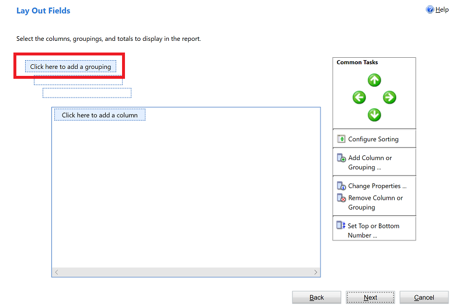

7. Select the **Record type** and the **Column** for the data you want to have grouped in the report. When you are done with your selections, select **OK**.

    > [!div class="mx-imgBorder"]
    > 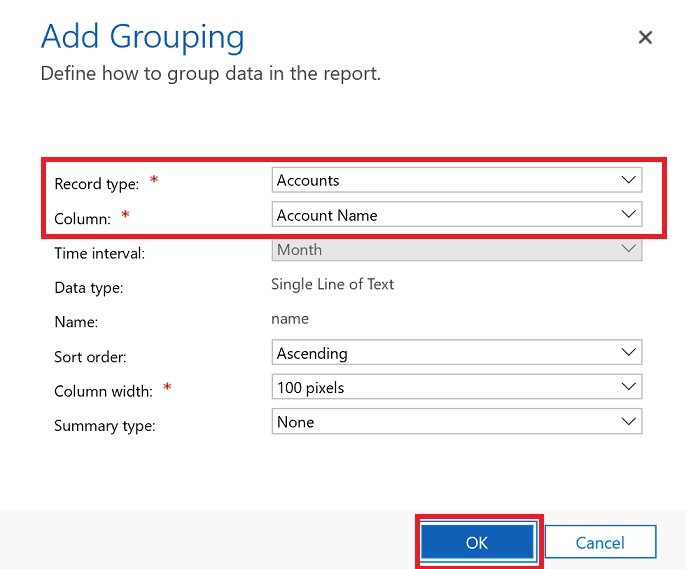
  
8. Select **Click here to add a column** to columns of data related to the record type you chose in the previous step.  

    > [!div class="mx-imgBorder"]
    > 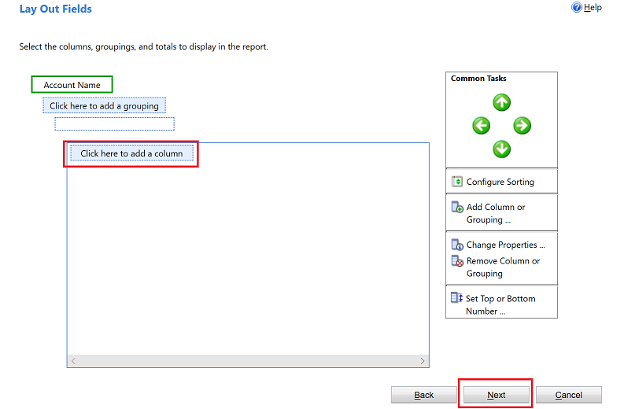

9. On the **Add Column** screen choose the data you want to have displayed for the column and then select **OK**. 

    > [!div class="mx-imgBorder"]
    > 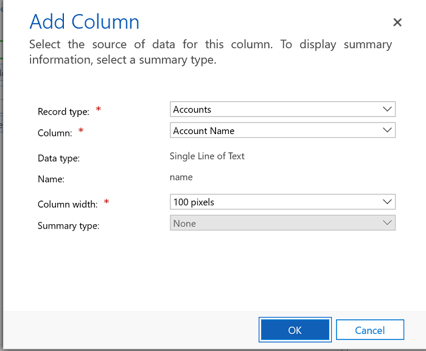
  
10. Repeat the previous step for any additional columns that you want to add. When you are done, on the **Lay Out Fields** screen, slect **Next**.
 
    > [!div class="mx-imgBorder"]
    > 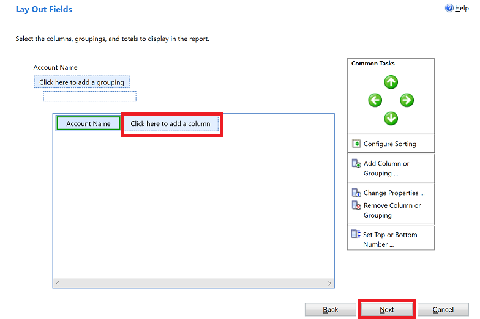
  
11. On the **Format Report** screen choose how to format your report and then select **Next**.
 
    > [!div class="mx-imgBorder"]
    > 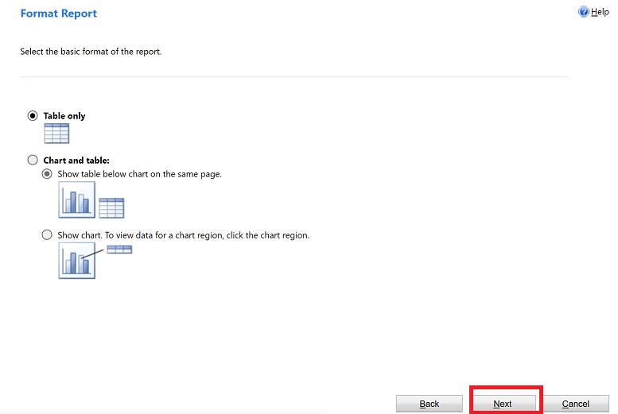

12. Review the summary of your report and select **Next** and then select **Finish**. You can now see this report in the list of report in the system.

    > [!div class="mx-imgBorder"]
    > 

### See Also
[Work with reports](work-with-reports.md) 

[Add a existing report](add-existing-report.md)

[Edit report filter](edit-report-filter.md)

[ Troubleshoot problems with data not displaying in a report ](troubleshoot-reports.md)

