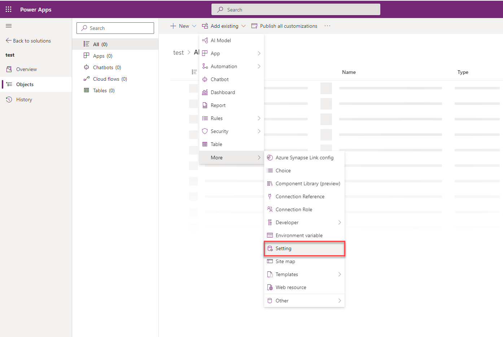
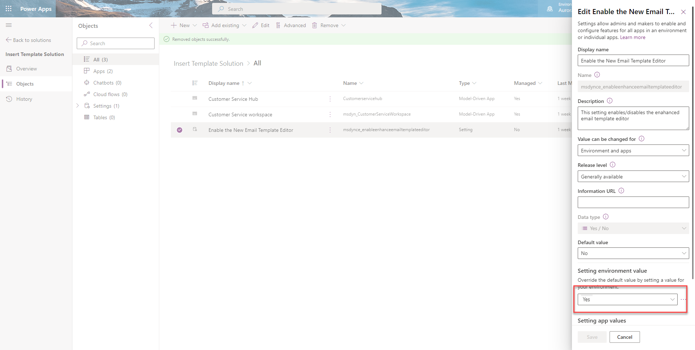

# Configure the enhanced email template editor page

You can configure the enhanced email template editing experience for apps across your organization. If you need to, you can turn off the enhanced email template page for a specific app. And then, the users of the app see the default email template editor page.

> [!NOTE]
> - You must have an active subscription to **Dynamics 365 Customer Service Enterprise** to use the enhanced email template editor.
> - In Customer Service workspace and Customer Service Hub, the enhanced email template dialog is enabled by default as an early access feature. 

### Enable the enhanced email template editor

1. In [Power Apps](https://make.preview.powerapps.com/), select the environment that contains your solution.
1. Select **Solutions** on the left navigation pane, and then select the solution where you want to turn on the enhanced template editing experience. [!INCLUDE [left-navigation-pane](../includes/left-navigation-pane.md)]
   > [!NOTE]
   > Don't select the default solution to configure the template.
1. Select **Add Existing** > **More** > **Setting**.

   > 
1. On the **Add existing Setting Definition** pane, select the **Enable the New Email Template Editor** option and then select **Next**.
1. Select **Add** on the **Selected Setting Definition** to add the **Enable the New Email Template Editor** option to your solution. 
1.  Go to **Add Existing** > **App** > **Model-driven app**> **Add existing model-driven apps** pane.
1. Select the **Enable the New Email Template Editor** option. The **Edit Enable the New Email Template Editor** pane appears.
1. Set the **Setting environment value** option to **Yes** on the **Edit Enable the New Email Template Editor** pane.
   > 
1. Select **Publish All Customizations**.

## Disable the enhanced email template editor for an app

For an app to display the default email template selection dialog, you must disable the enhanced email template selection option. To disable the option for a specific app, you must add the app to the Solution in which you've added the email template selection option. Perform the following steps:

1. Open the **Power Apps** environment.
1. Select **Solutions** on the left navigation pane. [!INCLUDE [left-navigation-pane](../includes/left-navigation-pane.md)]
1. Open the Solution in where you've added the email template selection option.
1. Go to **Add Existing** > **App** > **Model-driven app**> **Add existing model-driven apps** pane. Select the app for which you want to disable the enhanced insert email template selection dialog. The app is added to the solution. 
1. Select the **Enable the New Email Template Editor** option in the solution.
1. On the **Edit Enable the New Email Template Editor**, in the **Setting app value** section, the selected app is displayed. 
1. Select **New app value** for the app, and select **No** for the specified app. 
1. Select **Save** and **Publish All Customizations**.

### See also

[How to create an email template  in model-driven apps](/power-apps/user/email-template-create)  
[Customize an email template using the template editor](/power-apps/user/cs-template-options)

[!INCLUDE[footer-include](../includes/footer-banner.md)]
