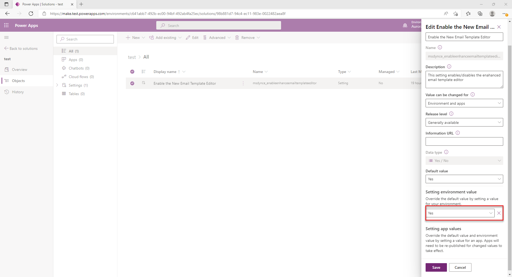

# Enable the enhanced email template editor page

Turn on the enhanced email template editing experience in apps across your organization. If you need to, you can turn off the enhanced email template page for a specific app. Users of that app see the default email template editor page.

## Enable the enhanced email template editor across all apps

1. In [Power Apps](https://make.preview.powerapps.com/) select the environment the environment that contains your solution.
2. Select **Solutions**, and then select the solution in which you want to turn on the enhanced template editing experience.
   > [!NOTE]
   > Don't select the default solution to configure the template.
4. Select **Add Existing** > **More** > **Setting**.

   > 
1. On the **Add existing Setting Definition** pane, select the **Enable the New Email Template Editor** option and then select **Next**.
   > 
1. Select **Add** on the **Selected Setting Definition** to add the **Enable the New Email Template Editor** option to your solution. 
1. Select the **Enable the New Email Template Editor** option. The **Edit Enable the New Email Template Editor** pane appears.
1. Set the **Setting environment value** option to **Yes** on the **Edit Enable the New Email Template Editor** pane.
   > 
1. Select **Publish All Customizations**.

## Disable the enhanced email template for an app

To force app to display the default email template editor page, turn off the enhanced template editing experience in that app. First, you'll need to add the app to the solution to which you've added the enhanced email template editing experience.

1. In [Power Apps](https://make.preview.powerapps.com/), select **Solutions**, and then select the solution to which you've added the enhanced email template editing experience.
2. Select **Solutions**.
1. On the **Solutions** page, select the Solution in which you've added the the email template selection option.
1. Go to **Add Existing** > **App** > **Model-driven app**> **Add existing model-driven apps** pane. Select the app for which you want to disable the enhanced insert email template selection page. The app is added to the solution. 
   > 
1. Select the **Enable the New Email Template Editor** option in the solution.
1. On the **Edit Enable the New Email Template Editor**, in the **Setting app value** section, the selected app is displayed. 
1. Select **New app value** for the app, and select **No** for the specified app.
   > 
1. Select **Save** and **Publish All Customizations**.

After you publish the customizations, the app uses the default email template editor.

### See also

[How to create an email template  in model-driven apps](email-template-create.md)  
[Customize an email template using the template editor](cs-template-options.md)

[!INCLUDE[footer-include](../includes/footer-banner.md)]
