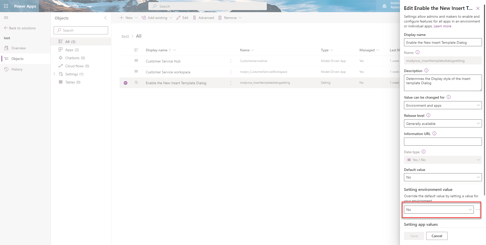
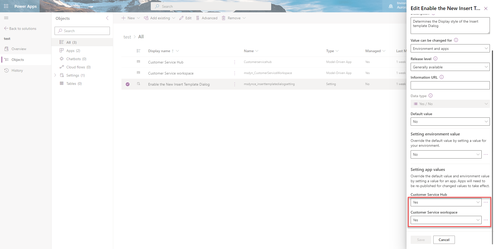

# Enable the enhanced insert email template selection dialog

You can configure and enable the enhanced email template  in the Customer Service Hub and Customer Service workspace apps. If you need to, you can turn off this option for these apps. And then, the users of the app will see the default email template selection window. 

### Enable the enhanced email template editor for Customer Service apps

   
1. In [Power Apps](https://make.preview.powerapps.com/), select the environment the environment that contains your solution.
2. Select **Solutions**, and then select the solution in which you want to turn on the enhanced template editing experience.
   > [!NOTE]
   > Don't select the default solution to configure the template.
4. Select **Add Existing** > **More** > **Setting**.

   > 
1. On the **Add existing Setting Definition** pane, select the **nable the New Insert Template Dialog** option and then select **Next**.
1. Select **Add** on the **Selected Setting Definition** to add the **Enable the New Email Template Editor** option to your solution. 
1.  Go to **Add Existing** > **App** > **Model-driven app**> **Add existing model-driven apps** pane. Select the Customer Service workspace and Customer Service Hub apps.
1. Select the **Enable the New Insert Template Dialog** option. The **Edit Enable the New Insert Template Dialog** pane appears.
1. Set the **Setting environment value** option to **No** on the **Edit Enable the New Insert Template Dialog** pane.
   > 
1. On the **Enable the New Insert Template Dialog**, in the **Setting app value** section, the Customer Service Hub and workspace apps are displayed. 
1. Select **New app value** for the app, and select **Yes** for the specified app.
   > 
1. Select **Publish All Customizations**.

   > [!NOTE]
   > If this setting is set to **No** for the apps, the default email template editor is displayed.

### See also

[Set up enhanced email](/power-platform/admin/system-settings-dialog-box-email-tab) 
[Understand the email experience](view-create-email.md)                                                    

[!INCLUDE[footer-include](../includes/footer-banner.md)]
