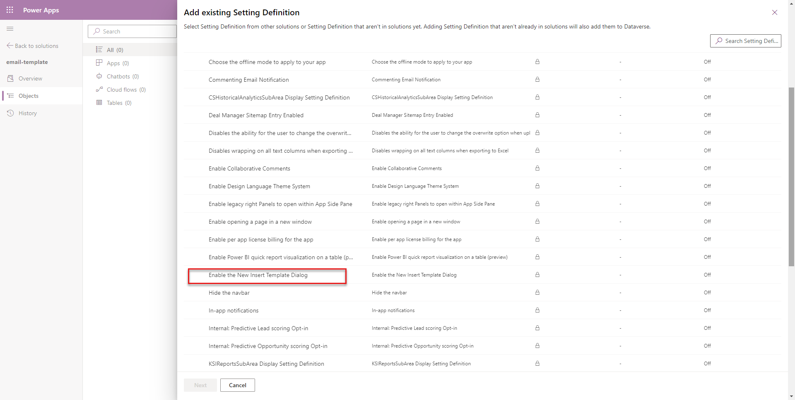
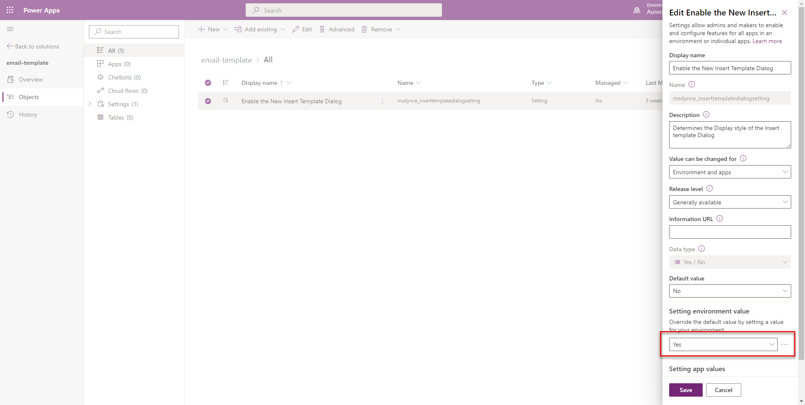
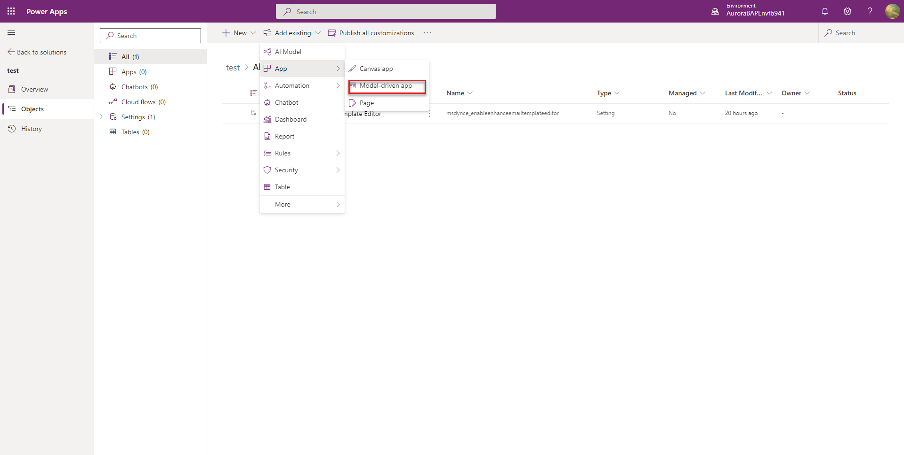
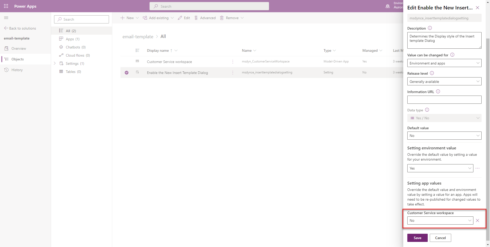

# Enable the enhanced insert email template selection dialog
 
You can configure and enable the enhanced email template for apps across the organization. You can disable the enhanced email template dialog for a specific app. The app displays the default email template selection dialog if you disable this option.

## Enable the enhanced email template across all apps

To configure the enhanced email template for apps across the organization, perform the following steps:

1. Go to **Power Apps** instance and select the environment in which you you want to configure the template.
2. Select **Solutions**.
3. On the **Solutions** page, select the solution in which you want to configure the template.
   > [!NOTE]
   > Don't select the default solution to configure the template.
4. Select **Add Existing** > **More** > **Setting**.
    >   
1. On the **Add existing Setting Definition** pane, select the **Enable the New Insert Template Dialog** option and then select **Next**.
    > 
1. Select **Add** on the **Selected Setting Definition**. The **Enable the New Insert Template Dialog** option is added to your solution. 
1. Select the **Enable the New Insert Template Dialog** option. The **Edit Enable the New Insert Template Dialog** pane appears.
1. Set the **Setting environment value** option to **Yes** on the **Edit Enable the New Insert Template Dialog** pane.
  > 
1. Select **Publish All Customizations**.

## Disable the enhanced email template for an app

For an app to display the default email template selection dialog, you must disable the enhanced email template selection option. To disable the option for a specific app, you must add the app to the Solution in which you've added the the email template selection option. Perform the following steps:

1. Go to **Power Apps** instance.
2. Select **Solutions**.
1. On the **Solutions** page, select the Solution in which you've added the the email template selection option.
1. Go to **Add Existing** > **App** > **Model-driven app**> **Add existing model-driven apps** pane. Select the app for which you want to disable the enhanced insert email template selection dialog. The app is added to the solution. 
  > 
1. Select the **Enable the new Insert Template Dialog** option in the solution.
1. On the **Edit Enable the New Insert Template Dialog**, in the **Setting app value** section, the selected app is displayed. 
1. Select **New app value** for the app, and select **No** for the specified app. 
  >           
1. Select **Save** and **Publish All Customizations**.

### Example

To disable the enhanced insert email template dialog in the Customer Service Workspace app, perform the following steps:

1. Select the Solution where you've enabled the **Enable the New Insert Template Dialog** option.
2.  Add the Customer Service Workspace app to the Solution. Go to **Add Existing** > **App** > **Model-driven app**>**Add existing model-driven apps** and select the Customer Service Workspace app.
3.  Select the **Enable the New Insert Template Dialog** option. 
4.  On the **Edit Enable the New Insert Template Dialog** pane, the Customer Service Workspace option is displayed. 
5.  Select **New app value** and then select **No**. 
Once you publish the customizations, the Customer Service Workspace app displays the default email insert template dialog.

[!INCLUDE[footer-include](../includes/footer-banner.md)]
