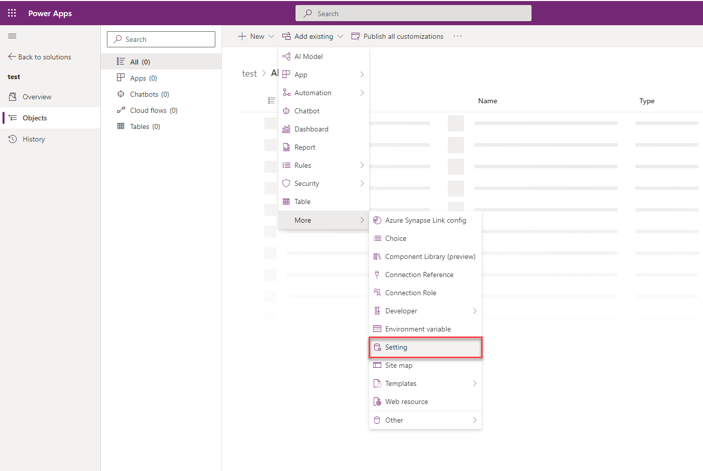

# Configure the enhanced insert email template selection dialog

Turn on the enhanced email template selection experience for apps across your organization. If you need to, you can turn off the enhanced email template selection dialog for a specific app. And then, the users of the app see the default email template editor page.

### Enable the enhanced email selection dialog

1. In [Power Apps](https://make.preview.powerapps.com/), select the environment the environment that contains your solution.
2. Select **Solutions**, and then select the solution in which you want to turn on the enhanced template editing experience.
   > [!NOTE]
   > Don't select the default solution to configure the template.
4. Select **Add Existing** > **More** > **Setting**.

   > 
1. On the **Add existing Setting Definition** pane, select the **Enable the New Insert Template Dialog** option and then select **Next**.
1. Select **Add** on the **Selected Setting Definition**. The **Enable the New Insert Template Dialog** option is added to your solution. Select **Edit**.
1. Set the **Setting environment value** option to **Yes** on the **Edit Enable the New Insert Template Dialog** pane.
   > 
1. Select **Publish All Customizations**.

## Disable the enhanced email selection dialog for an app

For an app to display the default email template selection dialog, you must disable the enhanced email template selection option. To disable the option for a specific app, you must add the app to the Solution in which you've added the email template selection option. Perform the following steps:

1. Go to **Power Apps** instance.
2. Select **Solutions**.
1. On the **Solutions** page, select the Solution in which you've added the email template selection option.
1. Go to **Add Existing** > **App** > **Model-driven app**> **Add existing model-driven apps** pane. Select the app for which you want to disable the enhanced insert email template selection dialog. The app is added to the solution. 
1. Select the **Enable the New Insert Template Dialog** option in the solution.
1. On the **Edit Enable the New Insert Template Dialog**, in the **Setting app value** section, the selected app is displayed. 
2. Select **New app value** for the app, and select **No** for the specified app. 
4. Select **Save** and **Publish All Customizations**.

### See also

[How to create an email template  in model-driven apps](/power-apps/user/email-template-create)  
[Customize an email template using the template editor](/power-apps/user/cs-template-options)

[!INCLUDE[footer-include](../includes/footer-banner.md)]
