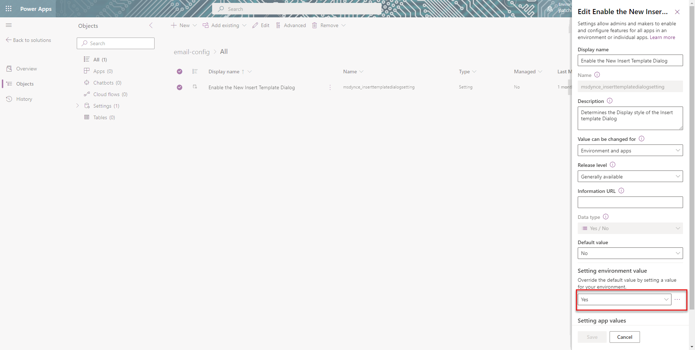

# Enable the enhanced insert email template selection dialog
 
You can configure and enable the enhanced email template for apps across the organization. For a specific app, you can disable this option to display the default email template selection window. 

## Enable the enhanced email template across all apps

To configure the enhanced email template for apps across the organization, perform the following steps:

1. Go to [Power Apps](https://make.preview.powerapps.com/) instance and select the environment in which you you want to configure the template.
2. Select **Solutions**.
3. On the **Solutions** page, select the solution in which you want to configure the template.
   > [!NOTE]
   > Don't select the default solution to configure the template.
4. Select **Add Existing** > **More** > **Setting**.
   > 
1. On the **Add existing Setting Definition**, select the **Enable the New Insert Template Dialog** option and then select **Next**.
   > 
1. Select **Add** on the **Selected Setting Definition**. The **Enable the New Insert Template Dialog** option is added to your solution. Select **Edit**.
1. Set the **Setting environment value** option to **Yes** on the **Edit Enable the New Insert Template Dialog**.
   > 
1. Select **Publish All Customizations**.

## Disable the enhanced email template for an app

To disable the enhanced email template selection window and display the default email template for an app, perform the following steps:

1. Go to Power Apps instance.
2. Select **Solutions**.
1. Select the solution created for the email template selection option.
1. Go to **Add Existing** > **App** > **Model-driven app** and select the app.
   > 
1. Select the **Enable the new Insert Template Dialog** option.
1. On the **Edit Enable the New Insert Template Dialog**, in the **Setting app value** section, specify **No** for the specified app.
   > 
1. Select **Save** and **Publish All Customizations**.

### See also

[Set up enhanced email](/power-platform/admin/system-settings-dialog-box-email-tab) 
[Understand the email experience](view-create-email.md)                                                    

[!INCLUDE[footer-include](../includes/footer-banner.md)]
