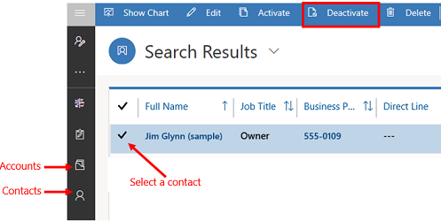
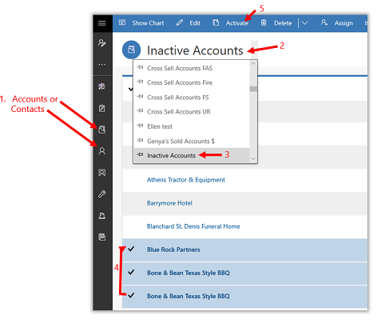

# Deactivate or activate an account or contact

In a model-driven app, you can deactivate an account or contact rather than deleting it. This ensures the integrity of the audit trail associated with that row.  
  
A deactivated account or contact becomes inactive, which means it cannot be edited or used in establishing new relationships with other rows. However, all relationships created with the deactivated item are still available.  
  
If later you need to reactivate a deactivated account, it's easy to do so.   
  
## Deactivate an account or contact 
  
1.  From the menu on the left, go to **Accounts** or **Contacts**.  
  
2.  Select the active account or contact that you want to deactivate, on the command bar select **Deactivate**, and then confirm the deactivation.

    > [!div class="mx-imgBorder"]
    > 

## Activate an account or contact  
  
1.  From the menu on the left, go to **Accounts** or **Contacts**. 
  
2.  Go to the **System Views** list.

3.  Select **Inactive Accounts** or **Inactive Contacts**.  
  
4.  Select the inactive accounts or contacts you want to activate.

5.  Select **Activate**, and then confirm the activation.  

    > [!div class="mx-imgBorder"]
    >   

[!INCLUDE[footer-include](../includes/footer-banner.md)]
