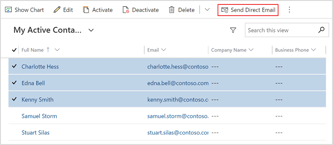
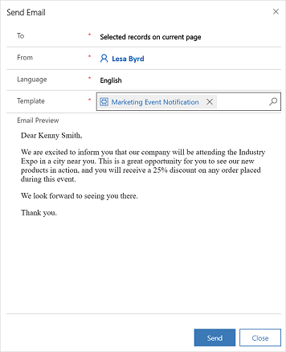

# Send email to multiple recipients

You can send an email to multiple recipients using email templates. This is known as *direct* or *bulk* emailing. By default, the direct email feature is disabled. An administrator must enable the direct email feature by selecting **Yes** for **Enable Send Direct Email Action in Unified Interface for Send Email enabled entities** on the **Email** tab under System Settings. More information: [System Settings Email tab](https://docs.microsoft.com/power-platform/admin/system-settings-dialog-box-email-tab)

**To send email to multiple recipients**
  
1. In the model-driven app's sitemap, select an entity to which an email is to be sent. For example, **Contacts**.  
  
2. In the list of records, select the contacts you want to send an email to.  
  
3. On the command bar, select **Send Direct Email**.  

    

4. In the **Send Email** pane, select an email template from the **Template** list.

5. Select **Send**.

    