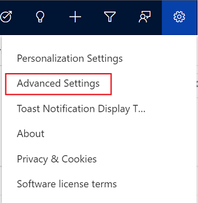

# Send email to multiple recipients

You can send an email to multiple recipients by using email templates. This is known as *direct* or *bulk* emailing. By default, the direct email feature is disabled. An administrator must enable the direct email feature by selecting **Yes** for **Enable Send Direct Email Action in Unified Interface for Send Email enabled tables** on the **Email** tab in the **System Settings** dialog box. More information: [System Settings Email tab](/power-platform/admin/system-settings-dialog-box-email-tab)

**To send email to multiple recipients**
  
1. In the site map for the model-driven app, select a table to which you want to send email. For example, **Contacts**.  
  
2. In the list of rows, select the contacts you want to send an email to.  
  
3. On the command bar, select **Send Direct Email**.  

    > [!div class="mx-imgBorder"]
    > 

4. In the **Send Email** pane, select an email template from the **Template** list.

    > [!NOTE]
    > - If you have multiple rows that span multiple pages, you can select one of following options from the **To** list:
    >   - **All rows on current page**: Sends the email to all rows displayed on the current page.
    >   - **All rows on all pages**: Sends the email to all the stored rows.
    > - If a few rows don't have an email address or they have an invalid email address, those rows will be skipped from sending the email.

5. Select **Send**.

    > [!div class="mx-imgBorder"]
    > 

## Check the status of bulk email action

You can check the status of bulk email action on the **System Jobs** page. You can see whether the bulk email job has failed or succeeded. If a job has failed, you can open the failed job to see its details.

**To check the bulk email status**

1. In your app, select the **Settings** icon, and then select **Advanced Settings**.

    > [!div class="mx-imgBorder"]
    >  

    The **Business Management** page opens in a new browser tab.

2.  On the navigation bar, select **Settings**, and then under **System**, select **System Jobs**.
    
    A list of system jobs is displayed.

    > [!div class="mx-imgBorder"]
    >  

3. In the grid header, select **Filter** .

4. In the **System Job Type** column header, select the down arrow, select **Bulk Email**, and then select **OK**.

    > [!div class="mx-imgBorder"]
    >  

    Bulk email jobs are displayed with their corresponding status.

    > [!div class="mx-imgBorder"]
    >  

5. Double-click the failed job to see its details.

### See also

[System Settings Email tab](/power-platform/admin/system-settings-dialog-box-email-tab)

[!INCLUDE[footer-include](../includes/footer-banner.md)]