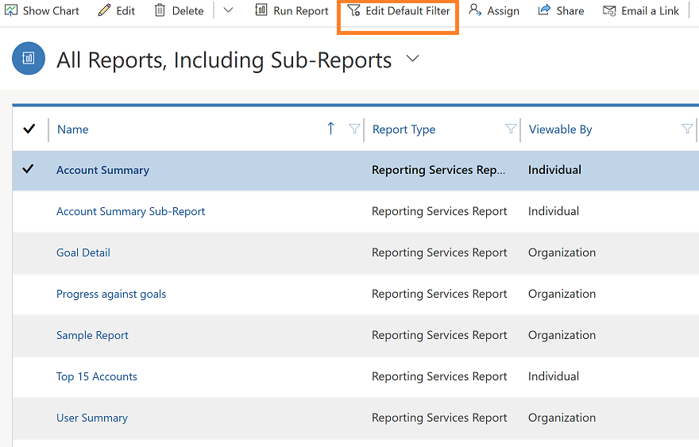

# Edit the default filter of a report

When a report is a SQL Server Reporting Services report, is enabled for prefiltering, and has a default filter, you can change the default filter to display the data you expect to see in the report. This filter is used each time any user runs the report.

1. From the left navigation pane, select the reports area
2. Choose a report and on the commbar bar, select **Edit Default Filter**.

     > [!div class="mx-imgBorder"]
     > 
  
3. Modify the filter criteria.  
  
   The criteria are grouped by row types that you can use in the filter, such as **Accounts** or **Contacts**.  
  
   ### To edit an existing row
   1. Select the query relational operator and select an operator, or Select the underlined value and enter a new value.  
  
   2. Select the query relational operator, and select an operator.  
  
   To add a criteria row:  

   1.  Select **Select**, and specify the column to filter on.  

   2.  Select the query relational operator, and select an operator.  

   3.  Select **Enter Value**, and enter a value to filter on. For some values, you can select the **Select or change the values for this column** button  to open the **Select Values** dialog box and select the value you want.  

   ### To group criteria
   You must select two or more rows for the same row type. However, rows with column values from different row types, such as **Account** and **Contact** row types, cannot be grouped.  

   1.  For each row you want to group, in detailed mode, select the **Options menu** button for that row, and then choose **Select Row**.  

   2.  On the Filter toolbar, select **Group AND** or **Group OR**.  

   3.  To remove a row from a group, select the **Options menu** button for that row, and then select **Delete**.  

   4.  To select a group, select the **Options menu** button for that group, and then select **Select Group**.  

   5.  To add a criteria clause to a group, select the **Options menu** button for that group, select **Add Clause**, and then select the column, query relational operator, and value.  

   6.  To unselect a group that has been previously selected, select the **Options menu** button for that group, and then select **Deselect Group**.  

   7.  To ungroup a group, select the **Options menu** button for that group, and then select **Ungroup**.  

   8.  To change a **Group AND** group to a  **Group OR** group, or a **Group OR** group to a **Group AND** group, select the **Options menu** button for that group, and then select **Change to OR** or **Change to AND**.  

   > [!TIP]
   > - To clear all criteria and start over, on the Filter toolbar, select **Clear**, and then select **Confirm**.  
   > - To delete a row, select the **Options menu** button for that row, and then select **Delete**.  
  
4. When you are done, select **Save Default Filter**.

### See Also
[Work with reports](work-with-reports.md) 

[Create a report using the Report Wizard](create-report-with-wizard.md)

[Add a existing report](add-existing-report.md)

[Troubleshoot problems with data not displaying in a report](troubleshoot-reports.md)

[!INCLUDE[footer-include](../includes/footer-banner.md)]