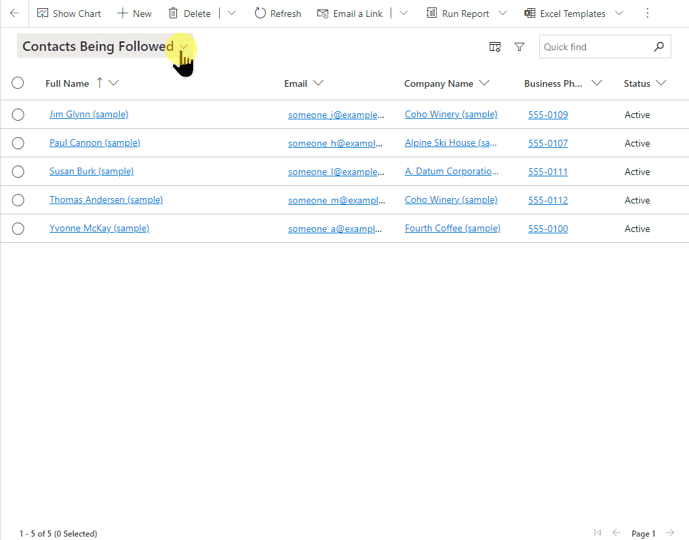
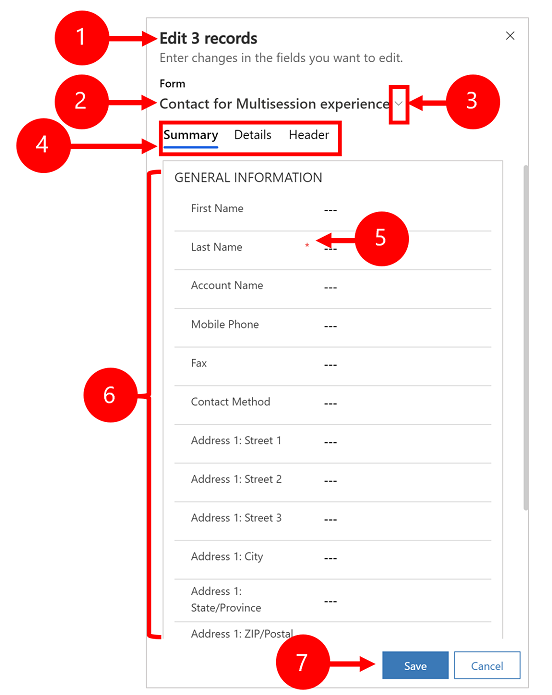

 # Edit multiple rows
 
 [!INCLUDE [cc-beta-prerelease-disclaimer](../includes/cc-beta-prerelease-disclaimer.md)]
 
You can edit multiple rows in model-driven apps at once and update several columns of data in a single action. This is useful in scenarios when you need to update the same column in multiple rows such as change a website or phone number for multiple accounts from the same company.

Editing multiple records, or bulk edit now incorporates table forms that you're familiar with and use every day This includes the ability to change the form you want to use when editing multiple rows to help facilitate a quicker and easier process by using the form or forms you use in your daily tasks. Bulk edit is available from the view pages for a table.  

To open the bulk edit dialog, navigate or open the view page with the list of rows that you want to change. Select on two or more rows in the view page and then select **Edit** on the command bar.

The below example demonstrates how to use bulk edit when working with the  table in a model-driven app and can be applied to any table in your application where you need to edit or manage data for more than one record.

When you select on edit the **Edit (number of rows) records** dialog opens with the default form for the table.

> [!div class="mx-imgBorder"]
> 

Legend

1. Shows the number of rows that you're editing.
2. Shows the form title. 
3. Select a tab to edit the columns on the form. The header column is always listed on the last tab.
4. Show the details of the form that you can edit.
5. Save or cancel your changes.

