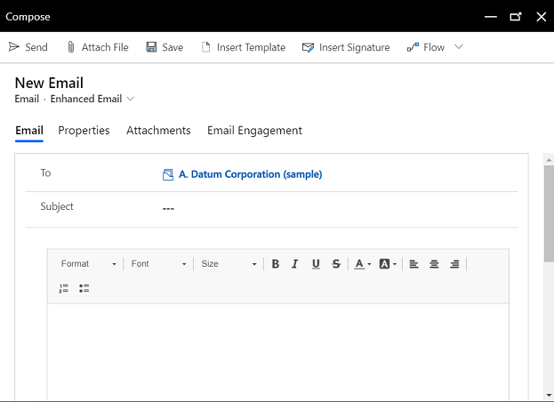

# Send email using the enhanced email experience

The enhanced email experience in model-driven apps allows you to compose an email without leaving the row that you’re working on. With the enhanced email experience, you can:

- Navigate to different pages without losing the email content.
- Minimize the email window to get back to the rows you were working on.
- Expand the email editor pop-up window to see more email options.
- Simultaneously open three email compose pop-up windows.
- Search for and apply a predefined template to an email you're composing.
- Insert attachments to email.

> [!IMPORTANT]
> - System administrators must enable the enhanced email experience before you can use it.
> - [!INCLUDE[cc_preview_features_definition](../includes/cc-preview-features-definition.md)]  
> - [!INCLUDE[cc_preview_features_expect_changes](../includes/cc-preview-features-expect-changes.md)]
> - [!INCLUDE[cc-preview-features-no-ms-support](../includes/cc-preview-features-no-ms-support.md)]

Compose an email using the enhanced experience:

1. In the **Timeline** section of a row, select **+** and then under **Activities**, select **Email**.

   A new email pop-up window opens. 

   > [!div class="mx-imgBorder"]
   > 

   The **From** and **To** columns are automatically populated based on the user and the account and contact of the original row.

2. Write your email from scratch or select **Insert Template** to search for and apply a template. For more information on inserting an email template, see [Insert an email template](insert-email-template.md).

3. Select **Attach file** if you want to add attachments.

4. Select **Insert signature** to search for and add your signature.

5. When you're done, select **Send**. 

> [!IMPORTANT]
> - The enhanced email experience is available only for email activities created from the **Timeline** section of a model-driven app. 
> - The enhanced email pop-up window opens only when the height and width of your screen size is at least 400 x 650 pixels or greater. If lower, you will be taken to the standard form instead of the enhanced email experience. 

### See also

[Set up enhanced email](/power-platform/admin/system-settings-dialog-box-email-tab) 
[Insert an email template](insert-email-template.md)

[!INCLUDE[footer-include](../includes/footer-banner.md)]