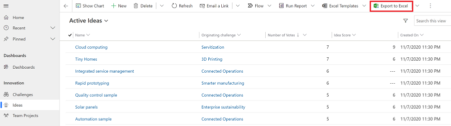

# Export data to Excel

Export data from your model-driven app to Excel. You can export up to 100,000 rows of data at a time.

1. From the left nav, select a table that you want to export data from.
2. On the command bar, select **Export to Excel**.

   > [!div class="mx-imgBorder"] 
   > 
3. When the download is complete, navigate to the location of the downloaded file.
  
   > [!NOTE]
   > When you download a worksheet it should automatically save to your computer. However, if it doesn't then make sure that you save it before you open and edit it. Otherwise, you might get this error message: **Excel cannot open or save any more documents because there is not enough available memory or disk space.**  
   > 
   > Follow these steps to fix the issue:  
   > 
   >    1. Open Excel and go to **File** > **Options** > **Trust Center** **Settings Center Settings** > **Protected View**.  
   >    2. In **Protected View**, clear all three items.  
   >    3. Select **OK** > **OK**.  
   >     
   >    We still strongly recommend that you save and then open the data file rather than disabling protected view, which might put your computer at risk.  
  
4. Open the saved Excel file.
  
5. If you see the security warning **External Data Connections have been disabled**, select **Enable Content**.  

   > [!div class="mx-imgBorder"] 
   >  

The data is exported in the same format that you see in your app. Text will remain text, numbers will remain numbers, and dates will remain dates. However, when you export data from your app to Excel, some cell formats might change. The following table summarizes how you’ll see the data in apps and how the cell format changes when you export the data to Excel.  
  
  
| Data format in model-driven apps |                                            Cell format in Excel                                             |
|----------------------------------------------------------------------------|-----------------------------------------------------------------------------------------------------------------------------------------------------------------|
|            Text, Ticker Symbol, Phone, Options set, and Look Up            |                                                       Shows as Text and option set becomes drop-down list                                                       |
|                                 Email, URL                                 |                                                                        Shows as General                                                                         |
|                                   Number                                   |                                                             Shows as Number without group separator                                                             |
|                                  Currency                                  |                                                         Shows as Number and does not include dollar sign ($)                                                         |
|                          Date only, Date and Time                          |                                                                       Shows as Date only                                                                        |
|                       Calculated and Roll-up columns                        | Editable in Excel but can’t be imported back to Power Apps |
|                               Secured columns                               | Editable in Excel but can’t be imported back to Power Apps |
  
## Export options

There are other export options such as Excel Online, Static Worksheet, Dynamics Worksheet, or Dynamics PivotTable.

> [!div class="mx-imgBorder"] 
> 

The table below summerizes the different options. Pick the one that works best for you.
  
|                                                                                                               Task                                                                                                                |                                              Learn more                                               |
|-----------------------------------------------------------------------------------------------------------------------------------------------------------------------------------------------------------------------------------|-------------------------------------------------------------------------------------------------------|
|   Do an *ad-hoc* or *what if* analysis without modifying app data. Or, quick bulk edits to multiple rows.   | [Open app data in Excel Online](export-to-excel-online.md) |
|                                                                   Get a snapshot of the data at the current date and time or if you want to share the data with others.                                                                    |           [Export to an Excel static worksheet](export-excel-static-worksheet.md)           |
| Get the most up-to-date information and be able to refresh it in Excel and match what you see in your app at any time. |          [Export to an Excel dynamic worksheet](export-excel-dynamic-worksheet.md)          |
|                                                                      View your app data in a pivot table.                                                                      |                 [Export to an Excel PivotTable](export-excel-pivottable.md)                 |

## Known issues

1. You can export your app data to Excel (.xlsx format) and use the file as a template to add more data and import back into your app. However, if you add or modify columns in the Excel file and then import the file back into your app, the import will fail. This happens because columns were added or modified and those columns don’t map to tables in your app. When you import an Excel file into your app make sure that columns and tables are mapped correctly otherwise the import will fail. For more information on mapping, see [Review mapping](import-data.md#review-mapping). 
  
2. If you’re using Excel 2010, you might get this error message when you export data from the Accounts area: `The file is corrupt and cannot be opened.`  
  
   The error message occurs due to a setting in Excel. To fix the issue, do this:  
  
    1. Open Excel 2010 and go to **File** > **Options** > **Trust Center** > **Trust Center settings**.  
  
    2. Select **Protected view** and then clear the check boxes for the first two options.  
  
    3. Select **OK** and then close the **Options** dialog box.  

### See also

[Troubleshoot export to excel](export-excel-dynamic-worksheet.md#refresh-all-doesnt-work)  

[!INCLUDE[footer-include](../includes/footer-banner.md)]
