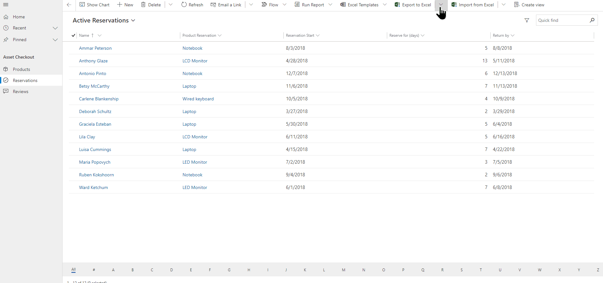
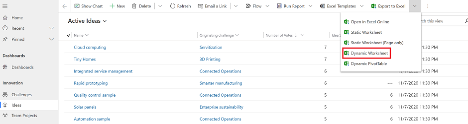
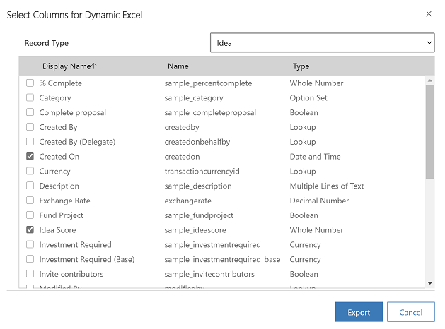
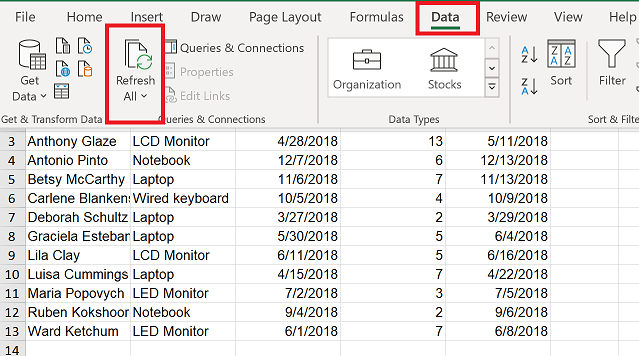

# Export data to an Excel dynamic worksheet

Export your app data to an Excel dynamic worksheet to get the most up-to-date information from your app. When you export your data to an Excel dynamic worksheet and then make changes to your data in the app, you can use the refresh feature in Excel to get the latest information from the app.

In the example below, we downloaded an Excel dynamic worksheet then went back to the app and changed the **Reserve for days** column from **5** days to **10**. Then opened the Excel worksheet and refreshed the data to get the latest information from the app.

A few things to note:

- You can export up to 100,000 rows at a time. You can’t export data to a dynamic worksheet in Excel for all tables. If you don’t see the option for a table, then it’s not available for that table.
- You can email a dynamic Excel file or store it as a shared file if the recipients are in the same domain as you. When recipients open the dynamic file, they only see the data that they have permission to view.   
- Some system views can be exported only to a static Excel worksheet.    
- Currency values are exported to Excel as numbers. To format the data as currency after you have completed the export, see [Format numbers as currency](https://support.microsoft.com/office/format-numbers-as-currency-0a03bb38-1a07-458d-9e30-2b54366bc7a4).
- The date and time values that you see in the app show up only as Date when you export the file to Excel, but the cell actually shows both the date and time.    
- If you're an app maker, you can use the Microsoft Power Apps Excel Add-in to download your app data and make edit in Excel and then save the data back to your app. For more information, see [Open table data in Excel](../maker/data-platform/data-platform-excel-addin.md).

## Export a dynamic worksheet

1. On the left nav, select a table.

2. On the command bar, select the **Export to Excel** menu and then select **Dynamic Worksheet**.

   > [!div class="mx-imgBorder"] 
   > 
  
3. Select the columns to export and then select **Export**.  

   > [!div class="mx-imgBorder"] 
   > 
  
4. When the download is complete, navigate to the location of the downloaded file.
  
   > [!NOTE]
   > When you download a worksheet it should automatically save to your computer. However, if it doesn't then make sure that you save it before you open and edit it. Otherwise, you might get this error message: **Excel cannot open or save any more documents because there is not enough available memory or disk space.**  
   > 
   > To fix the issue:  
   > 
   >    1. Open Excel and go to **File** > **Options** > **Trust Center** **Settings Center Settings** > **Protected View**.  
   >    2. In **Protected View**, clear all three items.  
   >    3. Select **OK** > **OK**.  
   >     
   >    We still strongly recommend that you save and then open the data file rather than disabling protected view, which might put your computer at risk.  
  
5. Open the saved Excel file.
  
6. If you see the security warning **External Data Connections have been disabled**, select **Enable Content**.  

   > [!div class="mx-imgBorder"] 
   >  

7. Go back to your app and update your app data.
8. To see your updates in the Excel dynamics worksheet, in Excel go to **Data** > **Refresh All**. If this doesn't work, see [Refresh All doesn't work](export-excel-dynamic-worksheet.md#refresh-all-doesnt-work).

   > [!div class="mx-imgBorder"] 
   >  
  

## Refresh All doesn't work

If selecting **Data** > **Refresh All** causes data to disappear with a blank workbook after export to a dynamic worksheet, see [Troubleshoot: Refresh All doesn't work after exporting app data to a dynamic worksheet](/troubleshoot/power-platform/power-apps/create-and-use-apps/export-dynamic-worksheet-refresh-all).

[!INCLUDE[footer-include](../includes/footer-banner.md)]
