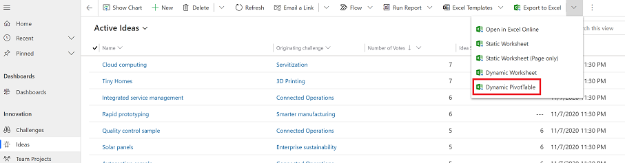
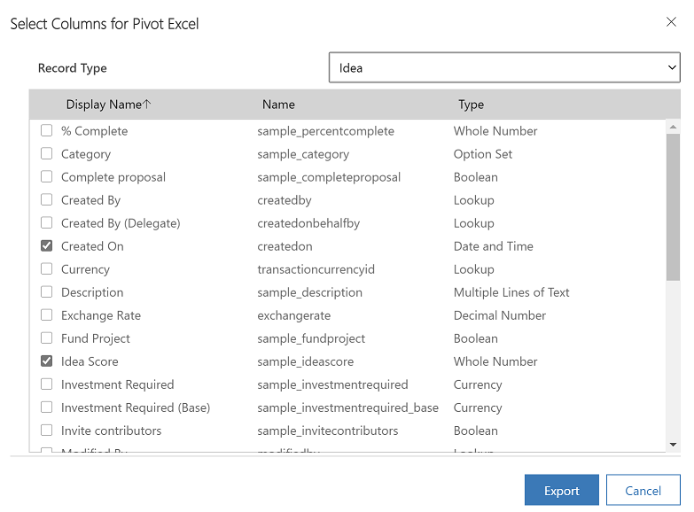

# Export to an Excel PivotTable

You can export app data to an Office Excel PivotTable to see patterns and trends in data. An Excel PivotTable is a great way to summarize, analyze, explore, and present your app data. You can export up to 100,000 rows at a time.  

A few things to note: 
  
- The option to export data to an Excel PivotTable isn’t available in all row types. If you don’t see the option, it’s not available for that row.  
- Currency values are exported to Excel as numbers. After you complete the export, see the Excel Help topic “Display numbers as currency" to format the data as currency. 
- The date and time values that you see in the app show up only as Date when you export the file to Excel, but the cell actually shows both the date and time.  

## Export data to a PivotTable

1. On the left nav, select a table.
2. On the command bar select the **Export to Excel** menu, and then select **Dynamic PivotTable**.  

   > [!div class="mx-imgBorder"] 
   > 
  
3. In the **Select Columns for Pivot Excel** dialog box, select the column settings and then select **Export**.

   > [!div class="mx-imgBorder"] 
   > 

  
   By default, the **PivotTable Column List** includes only columns that are displayed in the **Select Columns for Pivot Excel** list.  
  
4. When the download is complete, navigate to the location of the downloaded file.
  
   > [!NOTE]
   > When you download a worksheet it should automatically save to your computer. However, if it doesn't then make sure that you save it before you open and edit it. Otherwise, you might get this error message: **Excel cannot open or save any more documents because there is not enough available memory or disk space.**  
   > 
   > To fix the issue:  
   > 
   >    1. Open Excel and go to **File** > **Options** > **Trust Center** **Settings Center Settings** > **Protected View**.  
   >    2. In **Protected View**, clear all three items.  
   >    3. Select **OK** > **OK**.  
   >     
   >    We still strongly recommend that you save and then open the data file rather than disabling protected view, which might put your computer at risk.  
  
5. Open the saved Excel file.
  
6. If you see the security warning **External Data Connections have been disabled**, select **Enable Content**.  

   > [!div class="mx-imgBorder"] 
   >  

   > [!NOTE]
   > If don't see any data and you get an error, see [Refresh all doesn't work](export-excel-dynamic-worksheet.md#refresh-all-doesnt-work).
 
7. To add a PivotTable, on the **Insert** tab, select **PivotTable**.

    > [!Note]
    > You must complete this step to insert the PivotTable.  The PivotTable is not created automatically.
  
8. Drag the columns from the PivotTable Column List to the PivotTable. For more information, see [Overview of PivotTables and PivotCharts](https://support.microsoft.com/office/overview-of-pivottables-and-pivotcharts-527c8fa3-02c0-445a-a2db-7794676bce96).  
  

 

[!INCLUDE[footer-include](../includes/footer-banner.md)]
