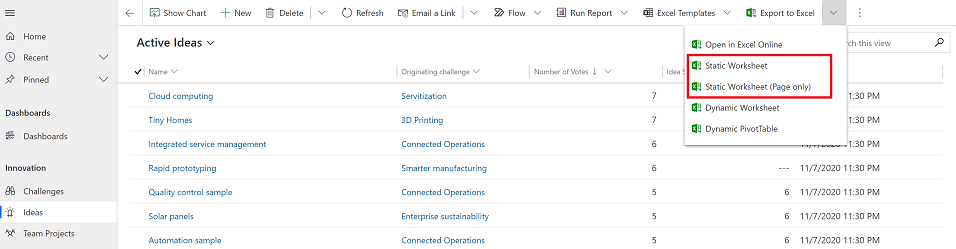

# Export to an Excel static worksheet

When you want to present information about the data in your app to an individual who doesn’t have access to the app, or you have data that doesn’t change often, consider exporting the app data to an Excel static worksheet.

You can export up to 100,000 rows at a time. By default, a model-driven app lists up to 50 rows per page. 

There is two types of static worksheets that you can export. 

- **Static worksheet**: Exports all the pages in the current view.
- **Static worksheet (Page only)**: Exports the data from the current page only.
  
You may have the option to export data to an Excel static worksheet in all row types. However, in some cases the format might be old, or the data might not be filtered by what you see in the app.  
  
1. To export data, on the left nav, select a table.
2. On the command bar select the **Export to Excel**, and then choose **Static worksheet** or **Static worksheet (Page only)**.  

   > [!div class="mx-imgBorder"] 
   > 
  
3. When the download is complete, navigate to the location of the downloaded file.

By default, an exported worksheet includes the columns that are displayed in the list, using the same column order, sorting, and column widths.  
  

  
## Tips  

- When you save an Excel static worksheet it should automatcially save to your computer. However, if it doesn't save then make sure you save it bfore you open and edit it. Otherwise, you might get this error message: **Excel cannot open or save any more documents because there is not enough available memory or disk space.** To fix the issue do this:  

  1. Open Excel and go to **File** > **Options** > **Trust Center** > **Settings Center Settings** > **Protected View**.  
  2.  In **Protected View**, clear all three items.  
  3.  Select **OK** > **OK**.  
 
  We still strongly recommend that you save and then open the data file rather than disabling protected view, which might put your computer at risk.  
  
- You can email a static exported worksheet to anyone or store it in a shared file. Anyone who opens the file will see all the data in the file.
  
- You can’t change the columns for a system view. You must either customize the view, which requires the System Administrator or System Customizer security role, or use Advanced Find to create your own view based on the current view.  
    
- Currency values are exported to Excel as numbers. After you have completed the export, see [Format numbers as currency](https://support.microsoft.com/office/format-numbers-as-currency-0a03bb38-1a07-458d-9e30-2b54366bc7a4?ui=en-US&rs=en-US&ad=US).
  
- The date and time values that you see in the app show up only as Date when you export the file to Excel, but the cell actually shows both the date and time.  
  
- If you’re going to make changes and import the data file back into the app, remember that secured, calculated, and composite columns (such as Full Name) are read-only and can’t be imported into the app. You’ll be able to edit these columns in Excel but when you import the data back into the app, these columns will not be updated. If you want to update these columns, such as a contact’s name, then it’s recommended that you use that view to export your data, update it in Excel, and import it back to the app for changes.  
  

[!INCLUDE[footer-include](../includes/footer-banner.md)]
