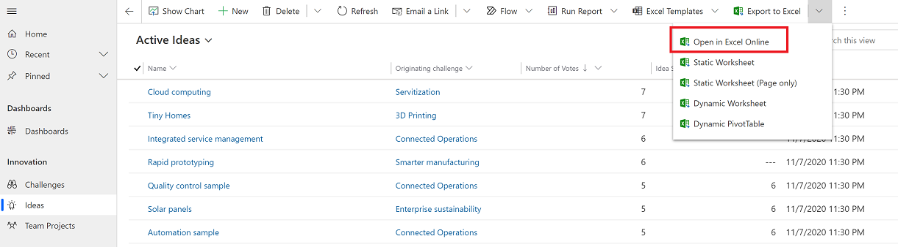
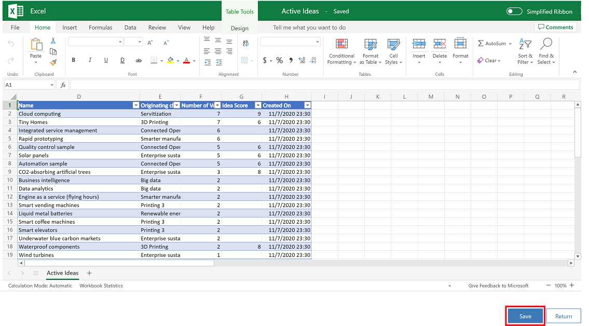
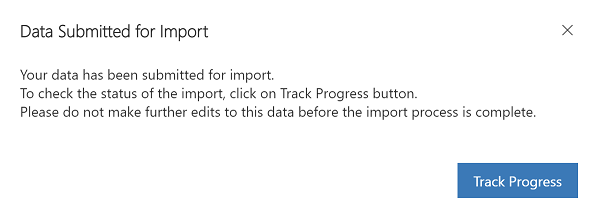

# Open your app data in Excel Online 

Open your app data in Excel Online and make quick edits or do a ad-hoc analysis. You can make changes to your app data in Excel Online and then save the updated information back your app. 

This feature requires that you have an Office 365 subscription or a subscription to an online service such as SharePoint Online or Exchange Online and a Microsoft account. 

A few things to note:

- The data for an *ad-hoc* analysis with Excel Online is stored temporarily. Any additions, such as charts, graphs, calculations, columns, and colors won’t be saved back to the app from the ad-hoc analysis in Excel Online. Keep the existing format of the Excel cells to prevent problems when you save the file. The file import might fail if you make a lot of changes. 
- Updated data in an app isn't immediately reflected in Excel Online if the same view was opened in the last two minutes in Excel Online. After that time frame, any updated data should show in Excel Online.
- The option to open data in Excel Online isn’t available for all tables. If you don’t see the option for a table, then it’s not available for that table.
  
   
## Export to Excel Online   

1. On the left nav, select a table.

3. On the command bar select the **Export to Excel** menu and then select **Open in Excel Online**. 

   > [!div class="mx-imgBorder"] 
   > 

3. Make your edits in the Excel Online file and when you're done select **Save**.

   > [!div class="mx-imgBorder"] 
   > 
   
4. Your changes are submitted for import. To track the progress of the import, select **Track Progress**.

   > [!div class="mx-imgBorder"] 
   > 

 > [!NOTE]
 > By design, you can’t do a File > **Save As** in Excel Online. If you do, you’ll get a **Can’t Save Workbook** error message.
   

  

 

[!INCLUDE[footer-include](../includes/footer-banner.md)]
