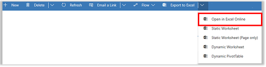

# Export your data to Excel Online 

You can quickly to a ad-hoc analysis of your data that is in PowerApps by exporting the data from your app to Microsoft Excel Online.
  
 When you make changes to your data in Microsoft Excel Online, you can save the updated information in PowerApps. Remember to keep the existing format of the Excel cells to prevent problems during import. Adding additional information to the spreadsheet, such as graphs, charts, or colors, will not be saved.  
  
## Prerequisites  
  
- This feature requires that you have an Office 365 subscription or a subscription to an online service such as SharePoint Online or Exchange Online.
  
- You need a Microsoft account.    
  
## Open PowerApps data in Excel Online  

 The option to open data in Excel Online isn’t available in all record types. If you don’t see the option, it’s not available for that record.  
  
> [!NOTE]
>  Updated data in PowerApps won’t immediately be reflected in Excel Online if the same view was opened in the last two minutes in Excel Online. After that timeframe, any updated data should show in Excel Online.
  
To open a list of records in PowerApp, on the command bar click **Export to Excel** menu and then click **Open in Excel Online**.  
  
   

  
## Save your data and import it back to PowerApps  
  
1. Once you are done making any changes, click **Save**.  
  
   > [!NOTE]
   > - The data for *ad-hoc* analysis with Excel Online is stored temporarily. Any additions, such as charts, calculations, and columns won’t be saved from the ad-hoc analysis that you do in Excel Online back to PowerApps.  
   > 
   > - The file import might fail if you made a lot of changes. If you need to make lots of changes to your data and import it back to PowerApps, it’s recommended that you export the worksheet in Excel instead.  
   > 
   > - By design, you can’t do a **File** > **Save As** in Excel Online. If you do, you’ll get a **Can’t Save Workbook** error message.  
  
2. On the **Data Submitted for Import** dialog box, click **Close**.  
  

  

 
