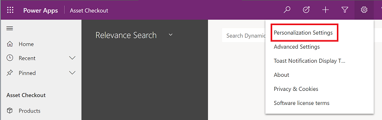
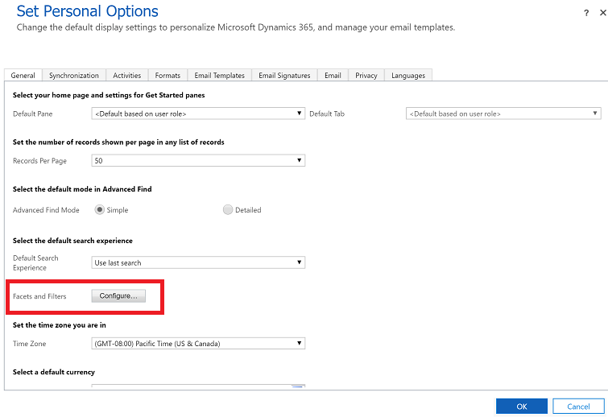

# Configure facets and filters

With Microsoft Dataverse, you can refine your search results by using facets and filters. Facets and filters let you drill into and explore the results of your current search without having to repeatedly refine your search terms.

In the **Set Personal Options** dialog box, you can personalize the facets for a table.

> [!NOTE]
> Your admin can use the quick find view to define which fields appear as default facets when you use Dataverse search. The first four view columns that include data types other than **Single line of text** or **Multiple lines of text** are displayed as default facets in the result. You can override this setting in your [personalization settings](set-personal-options.md#to-set-personal-options). At any time, you can select up to four fields as facets.
  
1. In the upper-right corner, select **Settings**, and then select **Personalization Settings**.  
  
   > [!div class="mx-imgBorder"]
   > 
  
2. On the **General** tab, in the **Select the default search experience** section, for **Facets and Filters**, select **Configure**.  

   > [!div class="mx-imgBorder"]
   >   
  
3. In the **Configure Facets and Filters** dialog box, specify the facets you'd like to see for a table: 
  
   - In the **Select Table** drop-down list, select the table you want to configure facets for. This drop-down list contains only the tables that are enabled for Dataverse search.  
  
   - For the selected table, select up to four facet columns. By default, the first four "facet-able" columns in the quick find view for the selected table are selected in the list. At any time, you can only have four columns selected as facets.  
  
You can update multiple tables at a time. When you select **OK**, the changes for all tables that you've configured are saved. To revert to the default behavior for a table that you previously configured, select **Default**.  
  
> [!NOTE]
> If a system customizer deletes a column or makes it no longer searchable, and you've saved a facet for that column, it will no longer show up as a facet. You'll only see the columns that exist in the default solution and have been configured as searchable by your system customizer.

### See also

[What is Dataverse search?](relevance-search-benefits.md) 
[Search for tables and rows by using Dataverse search](relevance-search.md) 
[Frequently asked questions about Dataverse search](relevance-faq.md)

[!INCLUDE[footer-include](../includes/footer-banner.md)]

