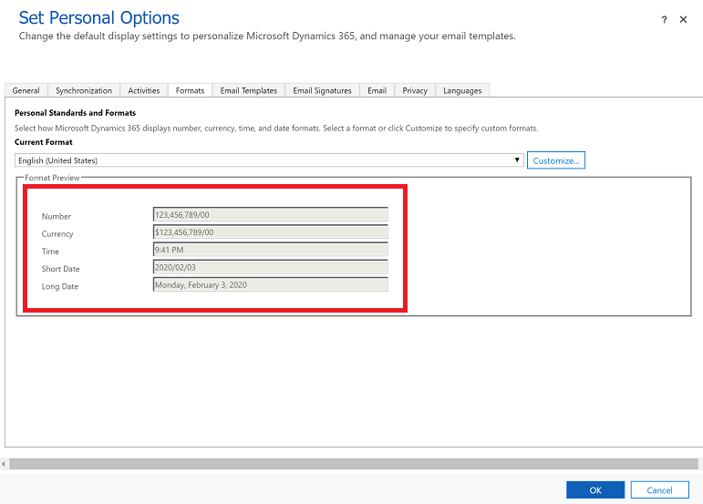

# FAQs and known issues about grids and views

[!INCLUDE [cc-beta-prerelease-disclaimer](../includes/cc-beta-prerelease-disclaimer.md)]

## How many levels of related table columns can I add to a view using **Edit columns** option on a grid page?

Currently, you can explore and add **one** level of related table columns using the [**Edit columns**](grid-filters-advanced.md#column-editor) option on a grid page.

## How many levels of related table columns can I use to add nested conditions to a view using **Edit filters** option on a grid page?

Currently, you can add up to 10 levels of related table conditions using the [**Edit filters**](grid-filters-advanced.md#filter-editor) option on a grid page.

## Known issues

- If you change the default display format for number, currency, time, or date and then filter data on a grid, the filter won't show your selected display format. The filters will still be displayed in the system default format, and in some cases filtering might not work at all. 

  To fix the issue, set the display format for number, currency, time, and date back to the default setting. 

   1. In the upper-right corner, select the gear icon , and then select **Personalization Settings**.

   2. On the **Formats** tab, change the number, currency, time, and date value back to the default setting.

      > [!div class="mx-imgBorder"] 
      > 
    
   We're working on this issue, check back for information about the availability of a fix.

- The advanced filter option on the Queues table does not work and displays this error message: _We are unable to display the filter conditions for this view._
- Public views created in Power Apps that include **Contains data** or **Does not contain data** filters will not appear in the list of saved views in legacy Advanced Find.
- If your administrator has enabled modern advanced find experience, you can hide, share, assign, delete or activate/deactivate one view at a time. For more information, see [Manage and share personal views](grid-filters-advanced.md#manage-and-share-personal-views)

## See also

[Explore data in a view on a grid page](grid-filters.md) 
[Create and manage personal views on a grid page](grid-filters-advanced.md) 
[Advanced find](advanced-find.md)

[!INCLUDE[footer-include](../includes/footer-banner.md)]
