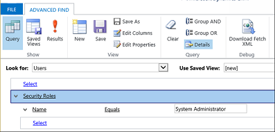

# Find your administrator or support person 

You may occasionally run across issues that require consultation with your administrator. If you don’t know who your administrator is, you can use Advanced Find to find your administrator.  
  
1. Open your app.  
  
2. On the command bar select the **Advanced Find** button.
  
3. On the Advanced Find page, in the **Look for** list, select **Users**.  
  
4. Point to **Select**, and then select **Security Roles** from the list.  
  
5. Under **Columns**, select **Names**.  
  
6. Enter **System Administrator** in the box that says **Enter Text**. At this point, your screen should look like this:  
     
   > [!div class="mx-imgBorder"]
   >   
  
7. Choose the **Results** button on the ribbon.  
  
   You should see a list of one or more system administrators.  
  

[!INCLUDE[footer-include](../includes/footer-banner.md)]